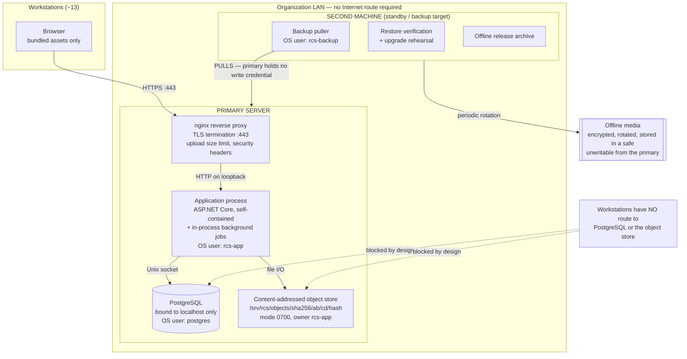
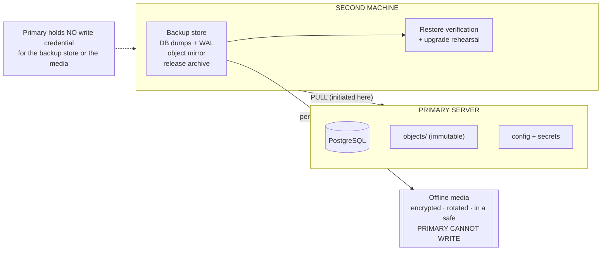
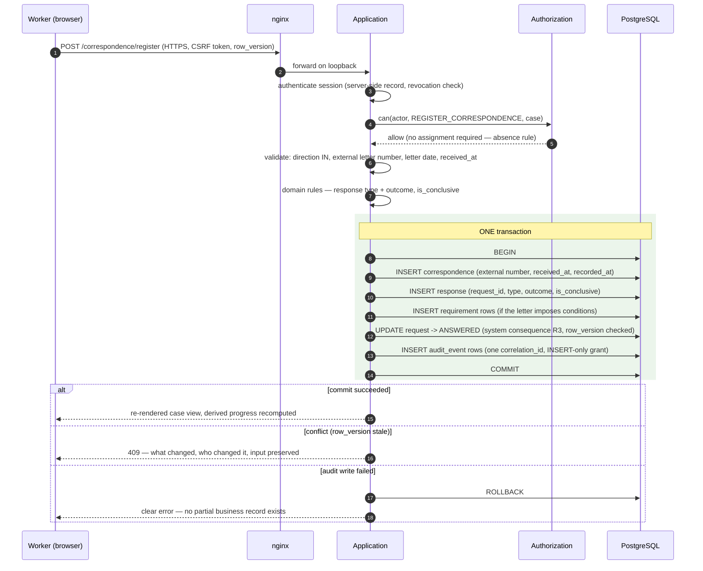
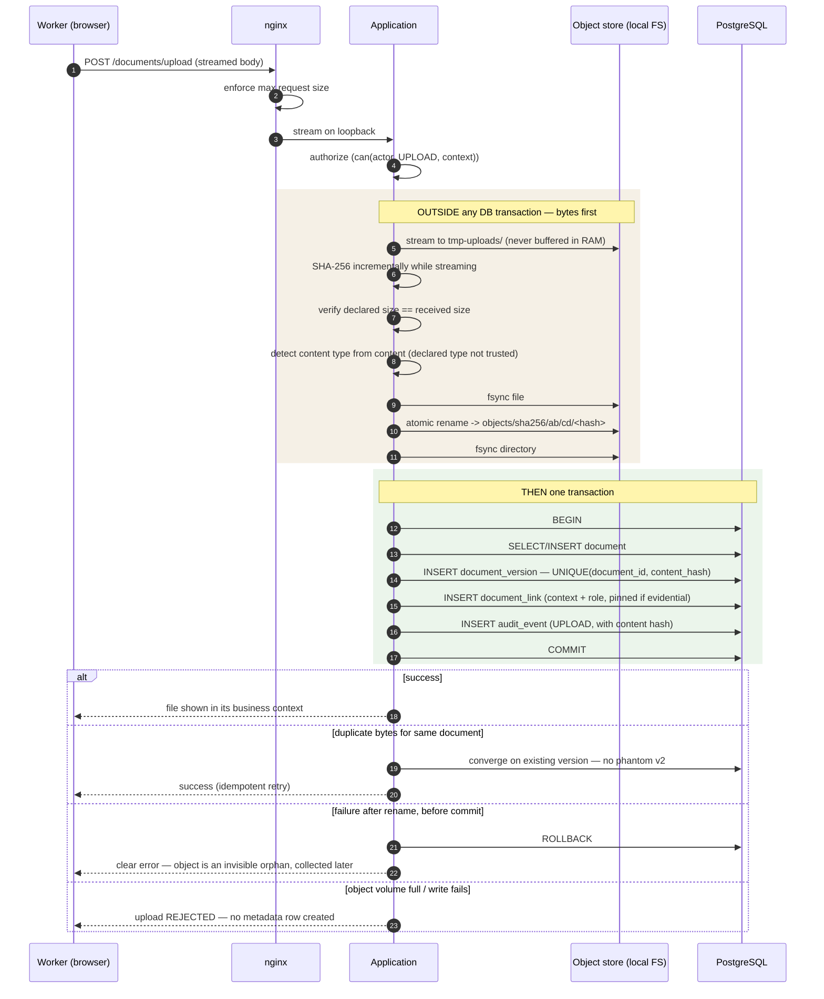

# RCS — Technical Architecture

**Status:** Draft v1 (design only — no code, no migrations, no scaffolding, no packages installed)
**Authoritative inputs (all frozen v1):** `/docs/PROJECT.md`, `/docs/DOMAIN_MODEL.md`,
`/docs/WORKFLOW.md`, `/docs/PERMISSIONS.md`, `/docs/DOCUMENT_MODEL.md`, `/docs/SECURITY.md`.
**Records decisions in:** `/docs/DECISIONS.md` (not written by this task — see §22).

---

## 1. Purpose

Design the **smallest architecture** that is reliable, secure, understandable, recoverable, deployable
offline, and maintainable for ten or more years by a small municipal IT team — for approximately 13
users on one LAN with no Internet.

Everything here is a design recommendation. Nothing is built, scaffolded or installed.

### 1.1 The governing constraint

The hardest requirement is not load. It is **who maintains this in 2035**.

Thirteen users generate a workload any modern laptop handles without effort. The real risks are a
dependency that cannot be rebuilt offline, a framework whose ecosystem has moved on, an operator who
cannot explain what the system does, and a recovery procedure nobody has tested. **Every choice below is
optimised for those risks, not for throughput.**

### 1.2 What this document must not become

| Not doing | Because |
|---|---|
| Designing for hypothetical scale | 13 users; §20 states exactly what would justify revisiting |
| Presenting ten options and no decision | §3 gives one recommendation, and §3.1 says why it is proportionate |
| Adopting infrastructure that is fashionable but unowned | a Kafka nobody can operate is a liability, not an asset |
| Choosing a stack the organization cannot staff | §5.5 — the honest caveat that outranks my technical preference |

---

## 2. Architectural principles

| # | Principle | Consequence |
|---|---|---|
| A1 | **Boring beats clever** | mature, widely-documented technology with long support cycles; nothing whose main virtue is novelty |
| A2 | **Fewest moving parts that meet the requirement** | one application process, one database, one filesystem tree, one proxy. Each additional service must earn its place |
| A3 | **The database enforces what the database can enforce** | constraints are authoritative; application bugs must not be able to violate invariants (§7.4) |
| A4 | **Failure must be visible, never silent** | a rejected upload beats metadata with no bytes (§19) |
| A5 | **Offline is a first-class requirement, not a deployment mode** | nothing may require a network fetch to build, install, run or recover (§16) |
| A6 | **Recoverability is part of the design** | backup topology and a standby machine are architecture, not operations (§15) |
| A7 | **One place for authorization** | a single policy component, called from every entry point (§11.2) |
| A8 | **Layers only where they pay for themselves** | no ceremony that adds indirection without removing risk (§9.2) |
| A9 | **The stack must not force the OS choice** | local IT skills decide the OS; the application runs on either (§6) |
| A10 | **Additive extension paths** | AD, OCR, preview and search improvements must be addable without redesign (§11.1, §13.4) |

---

## 3. Recommended V1 architecture

> **This is the architecture I recommend for V1.**

| Layer | Recommendation |
|---|---|
| **Style** | **Modular monolith** — one deployable application, internally partitioned into modules (§9.1) |
| **Backend** | **ASP.NET Core (current LTS), C#**, published **self-contained** (no runtime install on the server) |
| **Frontend** | **Server-rendered HTML** (Razor Pages/MVC) with a **small vendored progressive-enhancement JS layer**. **No SPA framework, no npm build in the production pipeline** |
| **Database** | **PostgreSQL** (current stable major with a long remaining support window), local, **UTF-8**, ICU collation (§7.6 — one pre-schema decision) |
| **Data access** | **Hand-written SQL migrations are authoritative.** ORM maps to that schema; ORM **never** generates it. Focused SQL for read models (§7.4, §7.5) |
| **Server OS** | **Linux (a stable, long-support distribution)** preferred technically — **subject to local IT skills** (§6) |
| **Reverse proxy** | **nginx** (or IIS if Windows Server is chosen), terminating TLS with an internal-CA certificate |
| **Document store** | **Local content-addressed filesystem**, `sha256/ab/cd/<hash>`, owned by the application OS user (§8) |
| **Background processing** | **In-process hosted service** with a **DB-backed job/lock table**. No separate worker, no broker in V1 (§14) |
| **Search** | **PostgreSQL-native** — normalized columns and indexes. No external search engine (§13) |
| **Deployment** | **Native OS services** (systemd), **not containers** (§16.4), from an **offline release bundle** |
| **Backup** | **Pull-based** to a **second machine**, plus an **offline copy the primary cannot write** (§15) |
| **Testing** | Domain, workflow, permission, DB-integration, storage and concurrency tests against **synthetic data only** (§18) |

### 3.1 Why this is proportionate to 13 users

| Requirement | How this architecture meets it without excess |
|---|---|
| ~13 concurrent users | A single process on modest hardware. Peak realistic load is a few requests per second; this is three orders of magnitude below where any of these components strain |
| 10-year maintainability | Two ecosystems to know (C#/.NET and PostgreSQL) instead of five. No npm dependency tree to re-resolve in 2032 |
| Offline deployment | A self-contained publish plus PostgreSQL packages and an nginx binary — no runtime install, no package resolution at deploy time (§16) |
| Recoverability | One database to restore, one immutable file tree to copy, one artifact to redeploy. A junior admin can follow the procedure |
| Security requirements | Maps 1:1 onto `SECURITY.md`: one process as one unprivileged OS user, DB on localhost, store at `0700`, TLS at the proxy |
| Takeover by another developer | Server-rendered pages, explicit SQL, one process. The system can be understood by reading it, not by assembling a mental model of five services |

### 3.2 The one decision that outranks my recommendation

**If the people who will maintain this are Python developers, build it in Django instead** (§5.5), and
if they are Java developers, build it in Spring Boot. The ranking in §5 is technical; **a stack nobody
on site can maintain is worse than a less-preferred stack they can.** Everything else in this document
— topology, storage, backup, authorization boundaries, transaction rules, offline packaging — is
stack-independent and survives that substitution unchanged.

---

## 4. Component topology

### 4.1 Deployment diagram



### 4.2 What runs where

| Service | Location | Listens on | Reachable from workstations |
|---|---|---|---|
| nginx | primary | **:443** (and optional :80 redirect) | **yes** — the only one |
| Application (Kestrel) | primary | loopback only | **no** |
| Background jobs | **inside the application process** | — | no |
| PostgreSQL | primary | **localhost / Unix socket only** | **no** (`SECURITY.md` invariant 2) |
| Object store | primary | filesystem, `0700` | **no** (`SECURITY.md` invariant 3) |
| Backup puller | **second machine** | initiates outbound to primary | no |
| Restore verification / rehearsal | second machine | — | no |
| Offline media | a safe, different room | — | no |

### 4.3 Exposed ports — the complete list

| Port | Purpose | Source |
|---|---|---|
| 443/tcp | HTTPS application | workstation subnet |
| 80/tcp | redirect to 443 only, optional | workstation subnet |
| administrative (SSH or console) | maintenance | a named admin workstation or the physical console |
| **everything else** | **default-deny inbound** | — |

The backup connection is **initiated by the second machine**, so it needs no inbound port on the primary
beyond the administrative one it already uses. This is the direction that makes `SECURITY.md` §14.2
work: the primary holds no credential that can write to or delete backups.

---

## 5. Technology stack

### 5.1 Backend — recommendation and reasoning

**Recommended: ASP.NET Core (current LTS) with C#.**

Assessed against what this specific application needs:

| Criterion | Why ASP.NET Core fits |
|---|---|
| **Offline deployment** | `publish --self-contained` produces a directory that runs with **no runtime installed on the server**. This single property removes the largest offline-deployment risk (§16) |
| **Long-term support** | LTS releases with multi-year support and a predictable cadence; upgrades are planned events, not emergencies |
| **Static typing** | The domain has exclusive arcs, temporal assignments, version pinning and invariants that must survive a decade of edits by different people. A compiler that catches a mis-typed state transition is worth a great deal here |
| **PostgreSQL support** | Npgsql is a mature, first-class driver with full support for `uuid`, `timestamptz`, `jsonb`, arrays and ranges — all of which `DOMAIN_MODEL.md` uses |
| **Streaming uploads** | First-class streaming request bodies; hashing while streaming without buffering whole files (§12.3, `DOCUMENT_MODEL.md` §7) |
| **Background work in-process** | Hosted services are a built-in, well-understood pattern — no broker needed (§14) |
| **OS independence** | Runs equally on Linux and Windows Server, so the OS decision stays with local IT skills rather than being forced by the stack (A9) |
| **Boring** | The patterns used here — controllers, Razor views, DI, `IHostedService` — have been stable for years and are heavily documented |

### 5.2 Backend alternatives, honestly assessed

| Option | Verdict |
|---|---|
| **Java / Spring Boot** | **Close second.** Fat-JAR deployment solves offline equally well; the ecosystem is exceptionally long-lived. Marked down only for configuration surface and framework "magic" that a lone maintainer years later must reverse-engineer. If the team is a Java team, choose this without hesitation |
| **Python / Django** | **A legitimate choice and genuinely good at this class of application** — mature, boring, batteries included, excellent migrations. Marked down for: offline dependency bundling is fiddlier (wheels, C extensions, interpreter version), no compile-time type checking over a long-lived domain, and a separate WSGI/ASGI server plus process manager to operate. **One specific caution:** Django's admin site bypasses the application's own authorization model, so it would have to be disabled outright in production — `PERMISSIONS.md` §14.1 admits no second access path |
| **Node.js / TypeScript** | **Not recommended here.** The transitive dependency count and ecosystem churn are precisely the ten-year maintenance risk this system cannot absorb, and vendoring a large `node_modules` for offline rebuild in 2032 is an unattractive commitment |
| **PHP / Laravel or Symfony** | Workable and widely staffed; marked down for the same long-horizon dependency concerns, less so than Node |

### 5.3 Frontend — recommendation and reasoning

**Recommended: server-rendered HTML with a small vendored progressive-enhancement JavaScript layer.
No SPA framework. No npm build step in the production pipeline.**

| Reason | |
|---|---|
| **Removes the largest maintenance liability** | An SPA brings a build toolchain, a dependency tree and a framework major-version treadmill. In ten years that toolchain is the part most likely to be unbuildable — and it would be unbuildable *offline*, which is when it matters |
| **Authorization becomes simpler and safer** | The server renders only what the user may see, calling the same policy component as the endpoint (§11.2). An SPA duplicates permission logic in the client for UI purposes, and duplicated rules drift |
| **Offline bundling is trivial** | CSS and a small JS file ship as static assets. No CDN, no fonts fetched at runtime (`SECURITY.md` §18.3) |
| **Fewer concepts for the next developer** | One language for pages, one for logic, one template system |
| **The UI is not actually SPA-shaped** | It is forms, tables, an expandable tree and file uploads — the classic strengths of server rendering |

**Where interactivity is genuinely needed**, a small vendored JS layer handles it:

| Need | Approach |
|---|---|
| Expanding the nested Request → Response → Requirement tree (`WORKFLOW.md` §6, `PROJECT.md` §18) | server-rendered HTML partials swapped into the page |
| Upload with progress and cancellation (§12.3) | `fetch`/XHR against a streaming endpoint |
| Search-as-you-type filters (`PROJECT.md` §16) | small JSON endpoints returning rows |
| Concurrency conflict messages (§12.4) | server re-renders the form with the conflict explained |

A single small library (an htmx-style HTML-over-the-wire helper, ~15 KB, one vendored file) or plain
modern JavaScript is sufficient. **The test to apply: could one developer, offline, rebuild the frontend
from the repository in 2035?** With this choice, yes.

**Challenged deliberately:** would a React SPA serve the Case workspace better? It would make a
*client-side* nested tree marginally smoother — and in exchange would add a build pipeline, a
dependency tree, a second authorization surface, and an API layer that exists only to feed it. For 13
users on a LAN, that trade is clearly not worth taking.

### 5.4 The rest of the stack

| Concern | Recommendation | Note |
|---|---|---|
| Database | PostgreSQL, current stable major | §7 |
| Data access | ORM for entity CRUD (mapped to a hand-authored schema) + focused SQL for read models | §7.4 |
| Migrations | Plain, ordered, **hand-written SQL files** applied by a simple versioned runner | §7.5 |
| Reverse proxy | nginx (Linux) / IIS (Windows) | §4.2, §6.3 |
| Background jobs | In-process hosted service + DB job/lock table | §14 |
| Object store | Local content-addressed filesystem | §8 |
| Testing | xUnit/NUnit-class framework + a real PostgreSQL for integration tests | §18 |
| Packaging | Self-contained publish + offline release bundle | §16 |

### 5.5 The caveat that outranks the recommendation

> **The single most important input to the stack decision is not in this document: who will maintain the
> system?**

If the organization's developer or contractor works in Python, **Django is the right answer** despite
being second in my technical ranking. If they work in Java, Spring Boot is. A well-chosen stack that
nobody on site can debug at 09:00 on a Monday is a worse outcome than a second-choice stack that they
can.

This is recorded as an **open question requiring an answer before implementation begins**
(§23, OQ-A1) and as the first ADR candidate (§22).

---

## 6. Server and operating system

### 6.1 Recommendation

**Preferred technically: Linux**, a stable long-support distribution (Debian stable or an Ubuntu LTS /
RHEL-family equivalent).

| Criterion | Linux | Windows Server |
|---|---|---|
| **PostgreSQL operation** | the primary platform; best-documented, best-tooled | fully supported, less commonly deployed |
| **Filesystem permissions** | POSIX ownership and modes map **exactly** onto `SECURITY.md` §12.4 (`0700` store, separate service users) | ACLs can express the same intent, but the mapping must be translated carefully and is easier to get subtly wrong |
| **Service management** | systemd units — simple, restart policy, journald logging | Windows Services — mature and adequate |
| **Offline package handling** | a local package mirror or a downloaded package set is routine | offline servicing is workable but heavier |
| **Certificate handling** | file-based; nginx reads a key and a chain | certificate store integration, convenient if an internal CA already exists on Windows |
| **Backup tooling** | standard, scriptable, well-understood | good tooling, often licensed |
| **Resource footprint** | lower; matters on modest hardware | higher baseline |

### 6.2 The operational caveat

> **If the organization's IT staff administer Windows and not Linux, deploy on Windows Server.**

A server nobody on site can patch, restart, inspect or recover is a bigger risk than any advantage in
the table above. The recommended stack runs on both, deliberately (A9), so this choice is genuinely
free of stack consequences.

**Dependency stated:** the organization's actual IT capability is unknown here and is
**OQ-A2** (§23). It should be answered before the server is built, not after.

### 6.3 What changes if Windows is chosen

| Aspect | Adjustment |
|---|---|
| Reverse proxy | IIS (with ARR) or nginx-for-Windows instead of nginx |
| Service accounts | dedicated Windows service accounts rather than POSIX users |
| Permissions | NTFS ACLs granting **only** the application account access to the object store — the same intent as `0700`, expressed differently. This must be verified explicitly at the go-live gate (`SECURITY.md` G-04) |
| Paths | drive-letter paths in configuration; storage volume separation still applies (§8.4) |
| Everything else | unchanged — application, database, storage model, backup topology, offline bundle |

---

## 7. PostgreSQL architecture

### 7.1 Deployment

**On the primary server, alongside the application.** For 13 users, a separate database host would add a
machine, a network hop, a TLS requirement between app and database, and another thing to patch and back
up — for no benefit. Co-location also makes the Unix-socket connection possible, which is both faster
and easier to secure than TCP.

**Binding: Unix socket / localhost only.** Never reachable from workstations
(`SECURITY.md` invariant 2, verified at go-live gate G-03).

### 7.2 Roles

Per `SECURITY.md` §12.2 — four roles, least privilege:

| Role | Privileges | Used by |
|---|---|---|
| `rcs_app` (runtime) | DML on business tables; **`INSERT` + `SELECT` only on `audit_event`**; **no DDL**; not superuser | the running application |
| `rcs_migrate` | DDL on the application schema | deployment only, never at runtime |
| `rcs_backup` | `SELECT` / replication as the backup method needs | the backup process (from the second machine) |
| `rcs_admin` | superuser | a human, interactively, rarely |

The runtime role's inability to execute DDL is what stops a compromised application process from
dropping a table or removing an audit constraint. The `INSERT`-only audit grant is what makes
"ordinary users cannot modify audit history" a **database guarantee** rather than an application promise
(`SECURITY.md` §9.2).

### 7.3 Connection pooling

**Built-in driver pooling only. No PgBouncer.** Thirteen users produce at most a few dozen concurrent
connections; a modest pool (e.g. 20–50) is ample. PgBouncer would add a process, a failure mode and a
set of transaction-pooling caveats to solve a problem this system does not have.

### 7.4 Schema strategy and where authority lives

| Concern | Owner |
|---|---|
| **Table structure, constraints, indexes** | **Hand-written SQL migrations.** Authoritative |
| **`CHECK (num_nonnulls(...) = 1)` exclusive arcs, partial unique indexes, `EXCLUDE` constraints, FK `ON DELETE RESTRICT`** | **the database**, always (A3) |
| Entity CRUD, mapping rows to objects | the ORM, mapped to the existing schema |
| Complex reads (Case workspace, search, dashboards) | **focused hand-written SQL** (§17) |
| Business rules and workflow | the application's domain layer (§9.2) |

> **The ORM maps to the schema. The ORM never generates the schema.**

This is not a stylistic preference. `DOMAIN_MODEL.md` specifies constraints that mainstream ORM
migration generators cannot express and will silently omit or drop when regenerating: exclusive-arc
`CHECK` constraints with `num_nonnulls`, partial unique indexes (`WHERE status = 'ACTIVE'`), and an
`EXCLUDE` constraint over a `tstzrange` for non-overlapping assignments. An auto-generated migration
that "tidies up" one of those would silently remove a guarantee the whole model depends on. Hand-written
SQL, reviewed like code, removes that failure mode entirely.

**Single schema**, one database, one logical namespace. No schema-per-module: the domain is heavily
interconnected (`DOMAIN_MODEL.md` §3) and cross-schema foreign keys would add friction for no isolation
benefit in a single-tenant system.

### 7.5 Migrations

| Principle | |
|---|---|
| **In source control**, reviewed as code, named with an ordered version prefix | |
| **Forward-only.** No automatic down-migrations: a "rollback" that drops a column destroys data. **Recovery from a bad migration is restore-from-backup, then fix forward** — which is why the pre-migration backup below is mandatory, not advisory | |
| **Applied by an explicit runner** under the `rcs_migrate` role, recording what was applied and when | |
| **Never generated at runtime**, never applied automatically on application start | an application that migrates itself at startup can corrupt a database during a rolling restart, and gives the runtime role DDL rights it must not have |
| **Rehearsed on the second machine** against a copy of production before production is touched (§15.3, §16.5) | |
| **Production backup taken and verified immediately before** any migration | |
| **Additive-first style**: add a column, backfill, switch reads, drop later in a separate release — so a migration and its rollback point are never the same deployment | |

### 7.6 Encoding, collation and extensions — the pre-schema decisions

**Encoding: UTF-8. Non-negotiable.** Azerbaijani (`ə ğ ı ö ş ü ç`) and Russian Cyrillic must both be
stored losslessly, together, in the same columns (`PROJECT.md` §16).

**Collation — this must be decided before the production database is created**, because
`LC_COLLATE`/`LC_CTYPE` and the default collation provider are fixed at `CREATE DATABASE` and changing
them afterwards requires a dump and reload.

| Recommendation | |
|---|---|
| **Use the ICU collation provider** rather than a libc locale | ICU behaviour is consistent across operating systems and does not shift when the OS's C library is upgraded — a genuine long-term stability advantage for a system expected to outlive several OS upgrades |
| **Use a deterministic ICU collation as the database default**, with case/accent-insensitive comparison applied **per column or per query** where searching needs it, not globally | a non-deterministic database-wide collation constrains indexing and has surprising effects |
| **Use `C` collation for machine-identifier columns** — `content_hash`, codes, UUID-as-text if any | byte comparison is correct and faster for values that are never sorted linguistically |
| **The exact ICU locale must be tested before the database is created** | whether `az`, `und` (root), or another locale sorts and matches real organization names acceptably **is an empirical question**, and the test data is the department's own organization list |

> **This is the one genuine pre-schema blocker in this document** (§23, PS-1). It must not be guessed:
> the wrong choice is invisible until someone notices that the alias list sorts oddly or that a search
> for an organization misses it, by which time the database is full of live cases.

**Extensions policy: default none.** Add only what a frozen requirement demands.

| Extension | Status |
|---|---|
| **`btree_gist`** | **Required.** `DOMAIN_MODEL.md` §2.7 specifies an `EXCLUDE` constraint over `(case_id WITH =, tstzrange(valid_from, valid_until) WITH &&)` to enforce non-overlapping responsible assignments, and that constraint cannot be created without it. This is a frozen dependency, not a preference |
| `pg_trgm` | **Future decision, not automatic** (§13.3). It is a standard contrib module with low operational risk, but it is not adopted until fuzzy matching is shown to be needed |
| `pgcrypto` | not needed — password hashing happens in the application (`SECURITY.md` §6.2) |
| `uuid-ossp` | not needed — UUIDv7 is generated in the application or by a built-in function where the server version provides one (§7.7) |
| anything else | requires an ADR |

### 7.7 UUIDv7 generation

`DOMAIN_MODEL.md` §1.4 specifies time-ordered UUIDv7 primary keys. Depending on the PostgreSQL major
version chosen, `uuidv7()` may be available server-side; if not, **the application generates it** — the
format is the commitment, not the generator. Either way the column is a plain `uuid` and nothing else in
the model changes. Which applies is a small implementation decision (§23).

---

## 8. Document storage

Implements `DOCUMENT_MODEL.md` §6 exactly. Nothing here changes that model.

### 8.1 Layout

```
/srv/rcs/                          owner root,     mode 0755
├── app/                           owner deploy,   mode 0755   application binaries — NOT writable by rcs-app
├── config/                        owner rcs-app,  mode 0700   configuration
│   └── secrets/                   owner rcs-app,  mode 0600   DB password, session key (§16.6)
├── objects/                       owner rcs-app,  mode 0700   ← the content-addressed store
│   └── sha256/
│       └── ab/
│           └── cd/
│               └── abcd…64hex               immutable object, never modified
├── tmp-uploads/                   owner rcs-app,  mode 0700   same volume as objects/ (§8.3)
└── logs/                          owner rcs-app,  mode 0750   technical logs (§17.2)
```

| Property | Value |
|---|---|
| Storage root | configured, not hard-coded — `storage_volume_code` resolves to it (`DOCUMENT_MODEL.md` §6.5) |
| Object path | `sha256/ab/cd/<full_hash>` — derived from content alone (`DOCUMENT_MODEL.md` §6.2) |
| Permissions | **`0700`, owned by the application OS user.** No group access, no other-user access, **no network share** |
| Access | **only** the application process. Workstations reach documents through the application (`SECURITY.md` invariant 3) |
| Mutability | objects are **never modified after creation**; the only deletion V1 performs is orphaned temporaries (`DOCUMENT_MODEL.md` §12.4) |

### 8.2 No object-storage abstraction

**No MinIO, no S3-compatible gateway, no NAS abstraction layer, no distributed filesystem.** A directory
tree on a local disk is the correct implementation of the frozen model: it needs no service, no
credentials, no network, no version upgrades, and it is restorable with ordinary file tools by anyone —
including in 2035, and including by someone who has never seen this system.

An S3-style abstraction "in case we move to cloud later" would add a dependency to serve a future that
`PROJECT.md` §2 explicitly forbids.

### 8.3 Temporary uploads must share the object volume

`tmp-uploads/` is on the **same filesystem volume** as `objects/`, because the final step of the upload
protocol is an **atomic `rename(2)` within one filesystem** (`DOCUMENT_MODEL.md` §7.3). A cross-device
move is a copy, which can be interrupted and leave a truncated object at a path asserting a hash the
bytes do not have — the single worst failure mode available in this subsystem.

This is a **storage layout requirement, not a preference**, and §8.4 respects it.

### 8.4 Volume layout

Logical separation with practical, not enterprise, granularity:

| Volume | Contents | Why separate |
|---|---|---|
| **V1 — system** | OS, application binaries, configuration | a full data volume must never make the OS unbootable |
| **V2 — database** | PostgreSQL data **and WAL** | isolates database growth and I/O; a full document volume must not stop the database from committing |
| **V3 — documents** | `objects/` **and** `tmp-uploads/` **together** | the atomic-rename requirement (§8.3). This is the volume that grows |
| **V4 — logs / local backup staging** | technical logs, staging for the pull | log growth must never fill the database or document volume |

**Underlying disks: mirrored (RAID1) SSD/NVMe.** A mirror protects against single-disk failure, which is
the most likely hardware event over ten years. **A mirror is not a backup** (`PROJECT.md` §20) — it is
availability, and §15 provides the backup.

On a small server these may be logical volumes on one mirrored pair rather than four physical devices.
The separation that genuinely matters is **V2 from V3 from V4**: independent growth, independent
exhaustion, independent monitoring (§17.3).

**Do not** introduce SAN, iSCSI or clustered filesystems.

### 8.5 Integrity process

`DOCUMENT_MODEL.md` §11, implemented as background jobs (§14.2):

| Check | Cadence | Action on failure |
|---|---|---|
| Object exists + size matches | frequent (nightly) | **critical** — alert an administrator; modify nothing |
| Full re-hash, rolling by oldest `integrity_checked_at` | continuous background sweep, throttled, off-hours | **critical** — alert; modify nothing |
| Orphan scan (objects with no metadata row) | occasional | informational |
| **Full verification after every restore** | on restore | gate before declaring the system usable (§15.5) |

**The sweep repairs nothing automatically.** An automatic "fix" for a hash mismatch means either
overwriting metadata to match corrupted bytes or deleting the object — both destroy the evidence that
something went wrong (`DOCUMENT_MODEL.md` §11.2).

### 8.6 Storage monitoring

Free space on V3 is a **first-class health signal** (§17.3). When the document volume approaches full,
uploads must **fail loudly and refuse to create metadata** (§19) — never write a row whose bytes are
missing. Thresholds are configuration, alerting to a person is the requirement.

---

## 9. Backend architecture

### 9.1 Modular monolith — the modules and their boundaries

**One deployable application.** Microservices are rejected: they would add network calls, partial-failure
handling, distributed transactions and multiple deployment units to a system where the entire domain
fits in one process and 13 users share one database. `DOMAIN_MODEL.md`'s causal chain
(Request → Response → Requirement → child Request) is transactional and heavily interconnected;
splitting it across services would turn foreign keys into eventual consistency for no gain.

Modules are **namespaces with rules**, not processes:

| Module | Owns | Depends on |
|---|---|---|
| **Authentication** | credentials, sessions, login/lockout | Users |
| **Users & Roles** | `user`, `role`, `user_role`, account lifecycle | — |
| **Organizations** | `organization`, `organization_alias` (master data) | — |
| **Cases** | `case`, `case_state_change`, `assignment`, `case_access_grant`, closure/reopen rules | Users, Organizations |
| **Correspondence** | `correspondence` registration | Cases, Organizations, Documents |
| **Requests** | `request`, lifecycle, dispatch linkage | Cases, Correspondence, Organizations |
| **Responses** | `response`, supersession, classification | Requests, Correspondence |
| **Requirements** | `requirement`, `requirement_evidence`, lifecycle | Responses, Requests, Documents |
| **Final result** | `final_result`, issue/supersede/revoke | Cases, Documents |
| **Documents** | `document`, `document_version`, `document_link`, upload protocol, object store | — (used by many) |
| **Search** | query construction, read models | most read models |
| **Audit** | `audit_event` writer and reader | all (write), Users (read policy) |
| **Authorization** | the `can()` policy (§11.2) | Users, Cases |
| **Administration** | user management, configuration, health, diagnostics | Users, Audit |
| **Background jobs** | scheduler, job/lock table, job implementations | Documents, Audit, Administration |

**Boundary rules that keep the modularity real:**

| Rule | |
|---|---|
| A module exposes an explicit **application-service interface**; other modules call that, never each other's internals or repositories | |
| **No module writes another module's tables.** Requirements does not `UPDATE request`; it asks the Requests module | |
| **Cross-module reads are allowed** through purpose-built read models (§17) — reporting must not force artificial service hops | |
| **Audit and Authorization are cross-cutting** and may be called from anywhere; nothing else may be | |
| Dependencies flow toward the domain; **no cycles between modules** | |

If a module ever genuinely needs to become a separate process, these boundaries are where it would
split. That is an available future, not a V1 goal.

### 9.2 Layers — enough structure, no ceremony

| Layer | Contains | Explicitly does **not** contain |
|---|---|---|
| **Presentation** | Razor pages/controllers, view models, HTML partials, request binding, CSRF, output encoding | business rules, SQL, authorization *decisions* (it **asks**, §11.2) |
| **Application** | use cases ("register response", "close case"), **transaction boundaries**, authorization calls, audit calls, orchestration | SQL details, HTTP concerns |
| **Domain** | entities, state machines from `WORKFLOW.md`, invariants, `WAIVED`/`VOID`/`FAILED` semantics, closure guards | I/O of any kind |
| **Infrastructure** | ORM mappings, SQL, object-store I/O, audit writer, hashing, configuration, background scheduler | business decisions |

**Anti-ceremony rules**, because Clean Architecture theatre is a real cost:

- **One project (assembly) per module at most** — very likely **one project for the whole application**
  in V1, with folders per module and per layer. Four projects per module would give thirteen modules ×
  four = fifty-two projects to open, build and navigate, for no benefit at this size.
- **No interface for a class with one implementation** unless it is being substituted in tests or
  crosses a genuine boundary (the object store and the clock qualify; a repository used by one service
  does not).
- **No mapping between three near-identical DTOs** on the way from database to screen. Map where the
  shape genuinely differs.
- **No generic repository abstraction over the ORM.** The ORM is already that abstraction.

The test for any proposed layer: *does it remove a risk, or only add a file?*

### 9.3 Where specific responsibilities live

| Responsibility | Layer / module |
|---|---|
| Business rules and state transitions | Domain |
| **Transaction boundary** | **Application** — one use case, one transaction (§12.1) |
| **Authorization decision** | **Authorization module**, called from Application (and from Presentation only to decide what to render) |
| **Audit write** | Application, inside the same transaction (§12.1) |
| Persistence | Infrastructure |
| **File bytes** | Infrastructure, **outside the transaction and before it** (§12.2) |
| Configuration, secrets | Infrastructure |
| Health, diagnostics | Administration module |

---

## 10. Frontend architecture

### 10.1 Client model

**Browser-based, no installed desktop client.** Thirteen workstations that each need a separate
installation, update path and OS compatibility matrix is a maintenance burden with no compensating
benefit: the application is forms, tables and documents, all of which a browser renders natively. A
browser client also means a workstation can be replaced in an hour with no application deployment step.

**All assets served locally.** No CDN, no remote fonts, no runtime fetches
(`SECURITY.md` §18.3, invariant 17). This is verified empirically at go-live by disconnecting the
uplink (`SECURITY.md` G-14).

### 10.2 Page composition

| Screen | Composition |
|---|---|
| **Case workspace** (`PROJECT.md` §17) | server-rendered shell + independently-loaded partials for header, workflow tree, documents and activity — so one slow section never blocks the page |
| **Dependency tree** (`PROJECT.md` §18) | server-rendered nested HTML, expandable; collapsed sections fetched as partials on demand |
| Search and lists | server-rendered with form-based filters; optional JSON endpoint for type-ahead |
| Forms | standard form posts, server-side validation, server re-render on error **and on conflict** (§12.4) |
| Upload | streaming `fetch`/XHR to a dedicated endpoint with progress and cancellation (§12.3) |
| Dashboards | server-rendered from the derived-progress rules (`WORKFLOW.md` §9, §11) |

### 10.3 Authorization-aware UI

The Presentation layer calls the **same** `can()` policy the endpoint will call (§11.2), purely to decide
what to render. **The rendering decision is never the security decision** — every action re-checks
server-side when invoked (`PERMISSIONS.md` §27.1). Hiding a button is a courtesy; the check is the
control.

### 10.4 Conflict handling in the UI

On an optimistic-concurrency conflict (§12.4) the user gets a re-rendered form stating plainly **what
changed, who changed it and when**, with their own input preserved so nothing is retyped. Never a silent
overwrite, never a bare error code.

---

## 11. Authentication and authorization integration

### 11.1 Authentication boundary

```
Browser ──credentials──▶ Authentication module ──▶ [ credential verifier ]
                                                      ├── LOCAL: hash comparison (SECURITY.md §6.2)
                                                      └── ACTIVE_DIRECTORY: future, additive
                              │
                              ▼
                       server-side session record (SECURITY.md §8.2)
```

| Requirement | |
|---|---|
| **V1 is local authentication, complete and independent.** AD is never required for the system to work | `PROJECT.md` §14 |
| The **credential verifier is the only AD-aware component**. Everything else — sessions, roles, assignments, audit, identity history — is unchanged by the identity source | |
| `user.auth_source` and `directory_identifier` already exist in the frozen model, so **adding AD is additive**: implement a second verifier, set the columns. **No redesign of identity history** (A10) | `DOMAIN_MODEL.md` §2.3 |
| **Authorization never comes from the directory** in V1 — roles and grants stay in `user_role` and `case_access_grant` | `PERMISSIONS.md` |
| A local account with administrative capability must always exist so directory failure cannot lock the department out | `SECURITY.md` §6.6 |

### 11.2 Authorization — one policy component

```
Presentation ──"may I show this?"──┐
Application  ──"may I do this?"────┼──▶  Authorization module
Search       ──"filter to these"───┤     can(actor, action, object)
Downloads    ──"may I serve this?"─┘
```

| Rule | |
|---|---|
| **One component implements `can()`** (`PERMISSIONS.md` §14.2). Role checks are **never** scattered through controllers, views or components (A7) | |
| **Every entry point calls it** — pages, endpoints, search, document metadata, downloads, exports, audit viewer (`SECURITY.md` §7.1) | |
| **Search filters at the query level**, by asking the policy for a scope predicate — never by fetching rows and discarding them (`PERMISSIONS.md` §27.2, `SECURITY.md` §7.4) | |
| **Downloads authorise against the context they were requested through**, every time (`DOCUMENT_MODEL.md` §10.1) | |
| Roles and grants are read **at action time**, not from a login claim (`PERMISSIONS.md` §27.3) | |
| Denials emit a `PERMISSION_DENIED` audit event | |

A single component also means the permission test suite (§18.2) tests **the real thing**, not a
re-implementation.

---

## 12. Transaction and concurrency model

### 12.1 Transaction principle

> **One use case, one database transaction. The business change and its `audit_event` commit together
> or not at all.**

| Workflow | Inside one transaction |
|---|---|
| Create case | `case` + initiating `correspondence` + `assignment` + `case_state_change` + audit |
| Register correspondence | `correspondence` + `document_link` rows + audit |
| Register response | `response` + resulting `requirement` rows + request state consequence (R3) + audit |
| Create requirement | `requirement` + audit |
| Link document | `document` / `document_version` metadata + `document_link` + audit |
| Close case | `case` state + `case_state_change` + audit (after guards) |
| Update assignment | end old row + insert new row + audit — **never an in-place reassignment** |

If the audit write fails, **the business operation fails** (`SECURITY.md` §9.1). There is no path that
commits a change without its audit row.

### 12.2 The file boundary — the one thing that cannot be transactional

Bytes on a filesystem are not part of a PostgreSQL transaction. The frozen ordering
(`DOCUMENT_MODEL.md` §7.1–§7.2) resolves this, and the architecture must not "optimise" it:

```
   OUTSIDE the transaction, FIRST:
     stream to tmp-uploads/ on the object volume
       → hash (SHA-256) while streaming
       → verify completeness (declared vs received size)
       → detect content type
       → fsync file
       → atomic rename into objects/sha256/ab/cd/<hash>
       → fsync directory
   ───────────────────────────────────────────────────────
   THEN one transaction:
     document (create or reuse) + document_version + document_link + audit  → COMMIT
```

| Failure point | Result | Why acceptable |
|---|---|---|
| During streaming or before rename | no object, no rows | nothing happened |
| After rename, before commit | **object with no metadata row** | invisible, harmless, collectable — the benign direction |
| Never | **metadata row with no bytes** | this is the failure this ordering exists to prevent (invariant 11) |

**Idempotency:** the key is `(document_id, content_hash)` (`DOCUMENT_MODEL.md` §7.4), so a retried upload
converges on the same row rather than creating a phantom version 2 — while two *different* documents may
still legitimately share bytes.

### 12.3 Streaming uploads

| Requirement | |
|---|---|
| **Never buffer a whole file in memory.** Stream request body → disk, hashing incrementally | |
| Request-size limits enforced at **both** the reverse proxy and the application | one is a misconfiguration away from useless |
| The maximum size is **configuration**, and the value is a **business input** (§23, OQ-A5) — maps, drawings and scans vary enormously and an arbitrary limit would block legitimate official documents | |
| Cancellation aborts the stream and removes the temporary file | |
| Interrupted uploads leave only an orphaned temporary, collected by age (`DOCUMENT_MODEL.md` §7.6) | |
| Downloads stream too — never read a whole object into memory to serve it | |

### 12.4 Optimistic concurrency

Thirteen people can work on the same case. `DOMAIN_MODEL.md` gives every business table a
`row_version integer`; `PROJECT.md` §21 forbids silent overwrites.

| Aspect | Design |
|---|---|
| **Token** | `row_version`, incremented on every update, included in the audit event as `entity_version` |
| **Flow** | the form carries the version it was rendered from; the update is conditional on it (`WHERE id = … AND row_version = …`); zero rows affected ⇒ conflict |
| **API behaviour** | a distinct conflict response (HTTP 409), never a silent success |
| **UI behaviour** | re-render with what changed, who changed it, when — and the user's input preserved (§10.4) |
| **Never** | last-write-wins, silently |

**Which entities need it:**

| Needs `row_version` checking | Why |
|---|---|
| `case`, `request`, `requirement`, `final_result`, `document`, `organization`, `user`, `assignment` | they have mutable fields or state transitions two people can race |
| `response`, `document_version`, `audit_event`, `case_state_change` | **append-only** — business facts are never edited. Their *status transitions* (`ACTIVE → SUPERSEDED/VOID`) still go through a version check, because two clerks can race to supersede the same row |
| `document_link`, `requirement_evidence` | link/retract transitions are checked; the rows are otherwise append-only |

**State transitions are the real contention point**, not text edits: two people closing the same case, or
both marking the same requirement fulfilled. The version check plus the workflow guards
(`WORKFLOW.md` §1, §3, §5) together make the second attempt fail cleanly and explain why.

---

## 13. Search

### 13.1 PostgreSQL-native, and that is sufficient

**No Elasticsearch, no Meilisearch, no external index.** `PROJECT.md` §31 lists Elasticsearch as a V1
non-goal, and the data volume makes it unnecessary: even at a generous 2,000 cases and 40,000
correspondence rows per year, ten years is well inside the range where a properly indexed PostgreSQL
table answers a filtered query in milliseconds.

An external index would also add a second copy of confidential data, a synchronisation problem, and a
service that must be secured, backed up and restored consistently with the database — three new failure
modes to solve a problem this system does not have.

### 13.2 What search must cover

`DOCUMENT_MODEL.md` §15.1 and `DOMAIN_MODEL.md` §9.5 enumerate the facets; architecturally they fall
into three kinds:

| Kind | Examples | Technique |
|---|---|---|
| **Exact / structured** | case number, letter number, registry number, status, year, requirement status, organization, responsible employee | B-tree indexes, ordinary predicates |
| **Range** | letter date, received date, registered date, upload date | B-tree on `timestamptz` / `date` |
| **Textual** | case title and subject, document title, original filename, **organization names and aliases** | §13.3 |

### 13.3 Textual matching — staged, not decided all at once

| Stage | Technique | When |
|---|---|---|
| **V1** | **Normalized search columns** populated by the application (case-folded, whitespace- and punctuation-normalized), with ordinary indexes, plus prefix/`ILIKE` matching | now — sufficient at this volume |
| **Stage 2** | **`pg_trgm`** for fuzzy/substring matching on organization names and aliases | if exact and prefix matching prove insufficient in real use. Standard contrib module, low risk, **but not adopted automatically** |
| **Stage 3** | PostgreSQL **full-text search** over case subjects and titles | only if justified; note that a built-in Azerbaijani dictionary is not something to assume (§13.5) |
| **Never in V1** | external search engine | §13.1 |

### 13.4 Where normalization lives

> **Normalization belongs in a dedicated, testable component and is materialized into database columns —
> not scattered as ad-hoc lowercase/replace calls at each call site.**

| Rule | Why |
|---|---|
| One normalization function, applied when a row is written, storing the result in a normalized column | a query and an insert must never normalize differently — that is how records become unfindable |
| Normalized columns are **derived cache**, rebuildable by a background job (§14.2) | when the rules improve, rebuild; no migration of business data |
| Queries match against the normalized column, having normalized the input with the **same** function | |
| Organization aliases are already rows (`DOMAIN_MODEL.md` §2.2) with an `alias_language`, so alias matching is a join, not a heuristic | |

### 13.5 Azerbaijani and Russian

`PROJECT.md` §16 requires both to be findable. Architecturally:

| Concern | Position |
|---|---|
| Storage | **UTF-8 throughout** (§7.6) — settled |
| Sorting | ICU collation (§7.6) — **pre-schema decision PS-1** |
| Case folding | Azerbaijani has the well-known **dotted/dotless i** behaviour (`i/İ`, `ı/I`) where naïve lowercasing gives the wrong result. The normalization component must handle this deliberately rather than calling a default lowercase |
| Transliteration between scripts | an organization written in Cyrillic and in Latin is **two alias rows**, not an algorithm. The frozen model already handles this correctly |
| Exact linguistic rules | **not finalized here** — `DOMAIN_MODEL.md` OQ-15 leaves the matching technology open, and the rules need testing against the department's real organization list (§23, OQ-A6) |

The architectural commitment is narrow and safe: **make correct matching possible** (no free-text
organization names anywhere, aliases as rows, normalization in one place, UTF-8, ICU). The linguistic
rules themselves are a later, additive decision.

### 13.6 OCR and file-content search — deliberately not load-bearing

V1 searches **metadata only**. No OCR, no text extraction, no parsing of uploaded files — which is also a
security requirement, since parsing untrusted documents is a primary RCE vector
(`SECURITY.md` §10.1, §11.5).

**Extension path, if it is ever wanted:**

```
background job → isolated, unprivileged extractor (no network, no DB credentials, resource limits)
              → extracted text stored in a NEW table keyed by document_version_id
              → searched alongside metadata
```

| Property | |
|---|---|
| **Additive.** A new table and a new job; **no change to `document`, `document_version`, `document_link` or any case workflow** | |
| Extracted text is **derivative cache**, regenerable, excluded from evidence and exports (`DOCUMENT_MODEL.md` §9.5) | |
| The extractor must satisfy `SECURITY.md` §11.5's five constraints — which is precisely why it is a **separate process**, and the reason the job architecture anticipates one (§14.4) | |
| **The original file remains authoritative**, always | |

OCR must never become infrastructure the core workflow depends on (A10).

---

## 14. Background jobs

### 14.1 Does V1 need a worker at all?

The honest answer: **it needs background work, but not a separate worker process.**

| Work | Frequency | Duration | Latency-sensitive? |
|---|---|---|---|
| Document integrity sweep (`DOCUMENT_MODEL.md` §11) | continuous, throttled | long (reads bytes) | no |
| Orphaned temp-file cleanup | periodic | seconds | no |
| Backup-health ingestion (`PROJECT.md` §20) | periodic | seconds | no |
| Certificate expiry check (`SECURITY.md` §5.4) | daily | instant | no |
| Clock sanity check (`SECURITY.md` §16.5) | periodic | instant | no |
| `case.last_activity_at` cache rebuild (`DOMAIN_MODEL.md` §2.5) | on demand / rare | minutes | no |
| Search normalization rebuild (§13.4) | on demand / rare | minutes | no |
| Future: preview, OCR, malware scan | — | — | **separate process, §14.4** |

Total: minutes of work per day, none latency-sensitive.

### 14.2 Recommendation

**An in-process hosted service inside the application, driven by a DB-backed job/lock table.**

| Element | Design |
|---|---|
| **Scheduler** | a hosted background service started with the application |
| **Coordination** | a `job_run` table plus a database advisory lock, so a job cannot run twice concurrently (and a future second instance cannot double-run) |
| **Durability** | job state, last run, outcome and error recorded in PostgreSQL — visible on the health page (§17.3) |
| **Isolation of effect** | long jobs throttled and scheduled off-hours; the integrity sweep reads at a rate bound, not flat out |
| **Failure** | a failed job is recorded and surfaced (§17.3); it never fails silently, and it never blocks user requests |

**Why not a separate worker process in V1:** it doubles the deployment units, the service definitions,
the supervision and the failure modes, to run a few minutes of work a day. **Why not a broker:** there is
no cross-service messaging, no fan-out, no back-pressure problem — **no Redis, no RabbitMQ, no Kafka**
(`PROJECT.md` §26, invariant 18). A job table in the database the application already has is the boring,
correct answer.

### 14.3 The honest caveat

A long-running in-process job shares CPU and I/O with request handling. At this scale, with throttling
and off-hours scheduling, that is acceptable — but it is a real trade-off, and it is the reason the
integrity sweep is rate-bound rather than "as fast as possible".

**If it ever becomes a problem**, extracting the scheduler into a second process is a small, contained
change: the job table and locks already make it safe for two processes to coexist. That is the intended
escape hatch, designed in and not used.

### 14.4 The one case that must be a separate process

`SECURITY.md` §11.5 requires that any future document parsing — preview, conversion, OCR, malware
scanning — runs **unprivileged, isolated, with no network and no database credentials**. That cannot be
an in-process job by definition.

So the boundary is already known: **V1 jobs are in-process; document-parsing jobs, if ever added, are a
separate constrained process.** Anticipated, not built.

---

## 15. Backup and standby

Implements `PROJECT.md` §20 and `SECURITY.md` §14 as topology.

### 15.1 The second machine — recommended

**Yes, V1 should have a second machine.** It is the cheapest single improvement to the system's
survivability, and it earns its place several times over:

| Role | Value |
|---|---|
| **Backup target that pulls** | makes `SECURITY.md` invariant 14 achievable — the primary holds no credential that can destroy backups |
| **Restore verification** | a tested restore is required before go-live and periodically after (`SECURITY.md` G-10); it needs somewhere to restore *to* |
| **Upgrade rehearsal / pre-production** | migrations and releases are rehearsed against a real copy before production is touched (§7.5, §16.5) |
| **Emergency replacement server** | manual promotion after total primary loss (§19.6) |
| **Future isolated sandbox** | the constrained environment §14.4 will need if preview/OCR is ever added |
| Security log destination | optional hardening `SECURITY.md` H-10 |

It need not be new or powerful — a modest machine or a decommissioned desktop with adequate disk is
sufficient for all six roles.

### 15.2 Topology



### 15.3 What is backed up, and how

| Item | Method | Note |
|---|---|---|
| **PostgreSQL** | periodic base backup + **continuous WAL archiving** | WAL archiving is what turns a 24-hour RPO into minutes at almost no cost (§15.6) |
| **Document objects** | **incremental file sync** | objects are **immutable and content-addressed**, so sync is append-only, cheap, and can run continuously with no consistency risk — nothing is ever modified in place |
| **Configuration** | versioned copy, secrets **excluded** | secrets follow §15.4 |
| **Secrets** | **not in the automated backup** — sealed, offline, two-person custody | `SECURITY.md` §13.2 |
| **Release artifacts** | archived per release on the second machine and on offline media | §16.3 — this is what makes rebuild-without-Internet possible |
| **Technical logs** | best-effort | not evidence; not a restore dependency |

### 15.4 Ordering — the rule that makes restores consistent

From `DOCUMENT_MODEL.md` §6.7:

> **Back up the object store *before* (or continuously ahead of) the database. Restore the database to a
> point in time, then ensure the object store is at or ahead of that point.**

Safe precisely because objects are immutable: a store "ahead" of the database holds extra files and no
wrong ones. An object with no metadata row is invisible and harmless; a metadata row with no object is a
broken evidence record. **The asymmetry decides the order.**

### 15.5 After any restore

1. Restore database to the chosen point; 2. ensure objects are at or ahead of it; 3. **run the full
integrity sweep** (§8.5) before declaring the system usable; 4. **record the gap** — what period was
lost — outside the restored system, so the note survives the next restore (`SECURITY.md` §9.6).

### 15.6 Proposed RPO / RTO — for discussion, not contractual

> **No business targets have been approved. These are proposals to be confirmed or changed by the
> product owner** (§23, OQ-A3). They are stated so the infrastructure implications are visible, **not
> as commitments.**

| Target | Proposed default | What it implies |
|---|---|---|
| **Database RPO** | **≤ 15 minutes** | continuous WAL archiving to the second machine. Without WAL archiving, a nightly dump alone means **RPO ≈ 24 h** — a full day of registrations re-keyed from paper |
| **Document RPO** | **≤ 1 hour, approaching continuous** | frequent incremental sync; cheap because objects are immutable (§15.3) |
| **RTO — application process failure** | **minutes** | service restart |
| **RTO — restore from backup** | **hours, within one business day** | tested procedure + the second machine |
| **RTO — total primary loss** | **1–2 business days** | manual promotion of the second machine or rebuild from the release archive |
| **Offline copy rotation** | proposed **weekly** | media count and custody (`SECURITY.md` §13.4) |

**Deliberately not proposed: automatic failover.** For 13 users, automatic HA adds clustering,
split-brain risk and a second always-running database to save a few hours of downtime that the
department can absorb by working on paper (§19.2). **Manual promotion is the right trade at this size**
(invariant 14). The department worked on paper before this system existed; it can do so for a day.

---

## 16. Offline deployment and releases

### 16.1 The requirement

> **Production must be deployable, updatable and rebuildable with the Internet physically disconnected.**

No `npm install`, no `pip install`, no `docker pull`, no NuGet restore, no package-manager fetch from a
public registry at deploy time (`PROJECT.md` §25, invariant 8).

### 16.2 The offline release bundle

One archive per release, self-sufficient:

```
rcs-release-<version>/
├── MANIFEST.txt                 version, build date, git tag, SHA-256 of every file
├── app/                         self-contained application publish (runtime included)
├── frontend-assets/             CSS, JS, fonts — already built, no toolchain needed
├── migrations/                  ordered SQL files + the runner
├── config-templates/            configuration templates, NO secrets
├── third-party/                 PostgreSQL + nginx packages for the target OS
├── install/                     install, upgrade, verify and rollback-to-previous scripts
├── docs/                        the frozen /docs set at this version
└── CHECKSUMS.sha256             + a separately-transferred checksum file
```

| Property | |
|---|---|
| Built **once**, on a build machine that may have Internet; **consumed offline** | |
| **Verified by checksum before installation**, with the checksum transferred separately (`SECURITY.md` §18.1) | |
| **Archived**: on the second machine and on offline media. Production can be rebuilt from the archive alone (invariant 15) | |
| Dependencies are **vendored or pinned with integrity hashes** in source control, so the build itself is reproducible later | |

### 16.3 Why "self-contained" matters so much here

A self-contained publish includes the runtime, so **installing the application does not require
installing or matching a runtime version on the server**. Combined with archived OS packages for
PostgreSQL and nginx, this means a total rebuild in 2031 needs: the archive, a blank server, and the
installation procedure. No registry, no Internet, no version archaeology.

This single property is the strongest practical argument for the chosen backend (§5.1).

### 16.4 Containers — evaluated and not recommended

The question `PROJECT.md` poses is operational: **does Docker make deployment and recovery simpler for
the people who will maintain this system?**

| For containers | Against, in this context |
|---|---|
| Reproducible environment | a self-contained publish already provides this without a daemon |
| Easy rollback | so does keeping the previous release directory and switching a symlink |
| Isolation | one application on a dedicated server; the isolation buys little |
| Familiar to many developers | **but the maintainers here are a small municipal IT team, not the development team** |
| | **Adds** a container runtime to patch, image archives (GB per release) to store and load offline, volume and networking semantics to learn, and an extra layer between an operator and a log file |
| | PostgreSQL in a container adds real complexity to backup, restore and tuning — the operations that matter most here |
| | Debugging at 09:00 on a Monday becomes "first, understand containers" |

**Recommendation: native OS services** (systemd units on Linux; Windows Services on Windows), installed
from the offline bundle.

**Honest condition on that recommendation:** if the organization's IT team already runs containers daily
and prefers them, containers are a defensible choice — and then images must be `save`/`load` archived
into the release bundle (§16.2) and PostgreSQL should still run natively. **This is an operational
decision, not an ideological one** (§22, ADR-5). **Kubernetes is rejected outright** in all variants
(`PROJECT.md` §26, and §20.4 below).

### 16.5 Release lifecycle

```
develop → tests pass → build offline bundle → tag + checksum → archive (2nd machine + offline media)
   → deploy to SECOND MACHINE (pre-production) → run migrations there → rehearse + verify
   → BACK UP PRODUCTION (verified) → deploy production → run migrations → health check → record
```

| Rule | |
|---|---|
| **Production is never the first place a migration runs** (§7.5) | |
| **A verified backup exists before every production migration** — it is the rollback plan (§7.5) | |
| Health check after deployment is part of the release, not a follow-up (§17.3) | |
| The previous release directory is retained, so reverting the application (not the schema) is a symlink switch | |
| **CI/CD is not required and must not become a production dependency.** A build machine and a documented script are sufficient; an Internet-hosted CI service must never sit on the recovery path | |

### 16.6 Configuration and secrets

| Category | Where | Backed up? |
|---|---|---|
| DB connection, storage root, base URL, upload limits, session settings, auth mode, environment name, backup-health source | configuration file(s) under `config/`, in source control **as templates**, deployed per environment | yes (as templates) |
| **Secrets** — DB password, session signing key, TLS private key | separate files, **mode 0600**, never in source control (`SECURITY.md` invariant 16) | **no** — sealed offline custody (§15.3) |

**Separation is architectural:** configuration is versioned and reviewable; secrets are neither. No cloud
configuration service, no external secret store (`SECURITY.md` §13.2).

### 16.7 Environments

**Three, not five:**

| Environment | Where | Purpose |
|---|---|---|
| **Development** | developer workstation | synthetic data only (§18.3) |
| **Pre-production / rehearsal** | **the second machine** | migration and upgrade rehearsal, restore verification |
| **Production** | primary server | real cases |

The second machine doubles as pre-production **only when safely isolated**: rehearsals run against a
*restored copy*, never against live data, and the rehearsal instance must not be reachable by ordinary
workstations (it would be a second, unaudited door to real case data). When a rehearsal is not in
progress, the machine is a backup target.

---

## 17. Monitoring and diagnostics

### 17.1 Business audit and technical logs stay separate

| | Business audit (`audit_event`) | Technical log |
|---|---|---|
| Where | PostgreSQL, append-only | files under `logs/` |
| Read by | Workers (their cases), Chief, Head | TechAdmin |
| Governed by | `DOMAIN_MODEL.md` §2.18, `SECURITY.md` §9 | §17.2 |

`SECURITY.md` §16.1. Audit is case content and follows case visibility; the technical log is not.

### 17.2 Technical logging principles

| Rule | |
|---|---|
| **Never log document content, file bytes, or the substance of case text.** A log file is not access-controlled the way a case is — this is the easiest accidental confidentiality breach in the whole system | |
| **Never log credentials, session identifiers, or secrets** | |
| Identifiers (case id, correspondence id, user id) are fine and necessary for support | |
| Every request gets a **correlation id**, surfaced to the user on an error so they can quote it (`SECURITY.md` §10.7) | |
| Levels: errors and warnings always; request logging at a summary level; debug **off** in production | |
| **Rotation by size and age**, on the log volume (§8.4), so logs can never fill the database or document volume | |
| **Local files only. No cloud logging, no external error reporting** (`PROJECT.md` §25) | |

### 17.3 Health page

A simple **local administrative health page** — not Prometheus, not Grafana. For one server and one
application, a page an administrator can read is more useful than a metrics stack nobody tunes.

| Indicator | Source |
|---|---|
| Application healthy / version / uptime | process |
| Database reachable, migration version applied | `SELECT 1` + migration table |
| **Object store writable** | write-and-delete probe in `tmp-uploads/` |
| **Free disk per volume**, with thresholds | OS |
| **Backup age and last verified restore** | `PROJECT.md` §20 requires this on screen |
| **Certificate expiry** | `SECURITY.md` §5.4 — the warning that prevents a surprise outage |
| **Clock sanity / last large jump** | `SECURITY.md` §16.5 |
| **Background job status** — last run, outcome, failures | §14.2 |
| **Integrity sweep status** — coverage, last finding | §8.5 |

**Alerting** for the items that matter (backup failure, integrity failure, disk threshold, certificate
expiry) must reach a **person**, not only the page (`SECURITY.md` §14.5). How — on-screen banner for
TechAdmin and Head at minimum — is an implementation detail; that it reaches someone is a requirement.

### 17.4 Diagnostic bundle

Because remote access is not permitted and confidential data must not leave (`SECURITY.md` §18.4), a
**diagnostic export** lets a maintainer help without seeing case content:

| Included | Excluded |
|---|---|
| Application and schema version, migration history | **any case content** |
| Service status, uptime, restart history | **any document bytes, titles, filenames** |
| **Configuration with secrets redacted** | **any secret** |
| Error summaries and counts by type; recent stack traces **with identifiers scrubbed** | **personal data**, user names |
| Disk free space per volume; database size by table | |
| Backup status, integrity sweep status, job history | |

**Default is exclusion.** Anything containing business content requires a deliberate, authorised,
audited action — it is not what "send diagnostics" means. The bundle is generated locally, reviewed, and
handed over by the organization, not fetched.

### 17.5 Support model

| Situation | Approach |
|---|---|
| Normal support | diagnostic bundle (§17.4) + logs + synthetic reproduction |
| Reproducible bug | reproduce with synthetic data (§18.3) in a developer environment |
| Only reproducible on real data | **on-site**, on the server, under the maintainer's own audited account — **never a copy taken away** (`SECURITY.md` §18.4) |
| Emergency | documented on-site procedure; **no standing remote-access dependency**, no remote-support agent installed "just in case" |

---

## 18. Testing

### 18.1 Levels, weighted by value

Not a coverage target. **High-value tests on the things that would be expensive to get wrong.**

| Level | What it covers | Priority |
|---|---|---|
| **Domain unit tests** | state machines and invariants from `WORKFLOW.md`: request transitions R1–R8, requirement transitions Q1–Q6, `WAIVED`/`VOID`/`FAILED` semantics, closure guards G1–G5, final-result guards D1–D4 | **highest** — these encode the business rules and are cheap to test |
| **Workflow tests** | multi-step scenarios: the §6.2 causal chain end to end; parallel branches progressing independently; a requirement voided by a later response leaving its child request intact | **highest** — this is what the system *is* |
| **Permission tests** | a matrix driven from `PERMISSIONS.md` §26: for each role × action × relationship, assert allow/deny — **against the real `can()` component**, not a re-implementation | **highest** — a silent authorization regression is the worst defect class here |
| **Database integration tests** | against a **real PostgreSQL**: exclusive-arc `CHECK`s reject bad rows, partial unique indexes hold (one `ACTIVE` version per document, one `PRIMARY_LETTER` per correspondence, one `ISSUED` result per case), the `EXCLUDE` constraint rejects overlapping responsible assignments, FKs are `RESTRICT` | **high** — these prove A3, and they are the tests an ORM change would otherwise silently break |
| **Document storage tests** | hash correctness; `(document_id, content_hash)` idempotency (retry does not create v2); two documents sharing bytes is allowed; interrupted upload leaves no metadata; atomic rename; withdrawal does not delete bytes | **high** |
| **Concurrency tests** | two simultaneous updates → one succeeds, one gets a conflict, **never silent overwrite**; two clerks racing to close the same case | **high** |
| **Audit tests** | every audited action writes its event; a failed audit write fails the operation; the runtime role **cannot** `UPDATE`/`DELETE` audit rows | **high** |
| **End-to-end tests** | a handful of critical journeys: register incoming letter → create case; register response → raise requirement → child request → fulfil; close case; restricted-case visibility | **medium**, deliberately few — expensive to maintain |
| **Restore / backup verification** | a procedure, exercised for real (§15.5, `SECURITY.md` G-10) | **operational, not automated in V1** |

### 18.2 The permission test suite deserves special mention

`PERMISSIONS.md` §26 is a matrix with twelve conditional entries, each with a stated rule. That matrix
should be expressed **directly as test cases** — role, action, relationship, expected outcome — so that
the document and the system cannot drift apart silently. It is the highest-value test suite in the
project and the cheapest insurance against a permissions regression during a refactor years from now.

### 18.3 Test data — synthetic, always

> **Real production cases are never copied into development or test** (`SECURITY.md` §18.4,
> invariant 16).

A **seed dataset** must make development and testing possible without any production data:

| Seed content | Purpose |
|---|---|
| ~10 fake organizations, with AZ and RU alias variants and one renamed authority | organization master data, alias search, §13.5 |
| ~10 users across all four roles, including a deactivated one and a temporary-cover arrangement | authorization and assignment testing |
| ~20 fake cases across all five lifecycle states, including reopened and cancelled | lifecycle coverage |
| Fake incoming/outgoing correspondence with plausible external numbers and dates, **registered days after the business date** | business-time vs system-time (`PROJECT.md` §1.1) |
| Fake site/land references in case subjects | realistic search targets |
| **A full nested dependency chain**: request → response → requirement → child request → response → evidence → fulfilment → final result | the causal spine (`WORKFLOW.md` §6.2) |
| **At least one restricted case** with an access grant, plus a user who must not see it | the single most important security test (`SECURITY.md` G-07) |
| Small synthetic documents of each handled type, including one deliberately mislabelled extension and one duplicate-bytes pair | document model, type detection, dedup |
| A conflicting-response pair and a failed requirement | exception paths (`WORKFLOW.md` §4.5, §5.4) |

The seed is **generated by a script in source control**, deterministic, and contains nothing
confidential.

---

## 19. Failure modes

**Principle: failure must be visible, never silent corruption** (A4).

| # | Failure | Behaviour | Users can… | Recovery |
|---|---|---|---|---|
| F1 | **Reverse proxy down** | browser cannot connect — unambiguous | work on paper | restart the proxy service; check certificate and config |
| F2 | **Application process down** | proxy returns a clear error page, not a blank | work on paper | service restart (auto-restart policy); check logs |
| F3 | **PostgreSQL unavailable** | application health shows DB unreachable; **requests fail clearly, no partial writes** | work on paper | restart; if corrupt → F5 |
| F4 | **Document volume full** | **uploads rejected with an explicit error before any metadata is written.** Reads continue | continue everything except uploading | free space / extend volume; the health page should have warned first (§17.3) |
| F5 | **PostgreSQL corruption** | errors surface; **do not attempt repair-in-place first** | paper register | restore from backup + WAL to the latest safe point (§15.4); then integrity sweep (§15.5) |
| F6 | **Object store corruption / missing objects** | integrity sweep reports **critical**; downloads of affected versions **fail with an integrity error, never serve wrong bytes** | everything except the affected documents | restore objects from backup — **verifiable**, because content addressing means a restored object is either byte-identical or not the object |
| F7 | **Ransomware on a workstation** | limited to that user's authority through the application; **cannot reach the store or the database** (`SECURITY.md` §14.4) | continue on other workstations | clean the workstation; revoke sessions; review audit |
| F8 | **Ransomware / compromise on the server** | severe | paper register | **restore from the offline copy the primary cannot write** (§15.2) — this is the scenario that justifies the whole backup topology |
| F9 | **Backup stale or failing** | **health page shows backup age; alert reaches a person** (§17.3) | work normally — but unprotected | fix the backup **before** the next migration or any risky change |
| F10 | **Certificate expired** | browsers refuse or warn; **the health page warned in advance** (§17.3) | paper until reissued | issue a replacement from the internal CA; reload the proxy. **Never downgrade to HTTP** (`SECURITY.md` §5.4) |
| F11 | **Clock wrong** | large jump warned as a security event; **`event_seq` keeps audit ordering correct regardless** (`SECURITY.md` §16.5) | continue — **the application does not refuse to run** | correct the clock; note the affected period |
| F12 | **Background jobs stopped** | health page shows last-run times going stale; **no user-facing impact** | everything | restart the application; investigate the failing job |
| F13 | **Total primary-server loss** | system down | paper register | promote the second machine or rebuild from the release archive + backups (§15.1, §16.3); target 1–2 business days (§15.6) |

**In every row the rule holds:** the system says what is wrong rather than continuing in a degraded state
that writes incorrect records. The specific case `PROJECT.md` calls out — F4 — is explicit: **if bytes
cannot be durably stored, the upload is rejected and no metadata row is created** (invariant 11).

### 19.1 Paper fallback

The department operated on paper before this system. During F1–F5, F8 and F13 it can keep a manual
register and enter the events afterwards — and the frozen model supports exactly that, because business
time and system time are separate columns and correspondence is **always** recorded after the fact
(`PROJECT.md` §1.1). **Late data entry is the normal mode of this application, not an exception**, which
makes the paper fallback genuinely workable rather than theoretical.

---

## 20. Capacity and scaling limits

### 20.1 Capacity estimate — ranges, with assumptions stated

**Real case volume is unknown** (§23, OQ-A4). The following are illustrative ranges, not predictions:

| Assumption | Low | Mid | High |
|---|---|---|---|
| Cases per year | 300 | 1,000 | 2,500 |
| Correspondence per case | 6 | 12 | 25 |
| Documents per case | 8 | 20 | 50 |
| Average document size | 0.5 MB | 2 MB | 5 MB |
| **Documents per year** | 2,400 | 20,000 | 125,000 |
| **Document storage per year** | ~1 GB | ~40 GB | ~600 GB |
| **Ten-year document storage** | ~12 GB | **~400 GB** | ~6 TB |
| **Database rows per year** (all tables incl. audit) | ~10⁵ | ~10⁶ | ~10⁷ |
| **Ten-year database size** | < 5 GB | **~20–50 GB** | ~200 GB |

**The mid column is the planning basis.** Note the asymmetry: the **database stays small for a decade**
(tens of GB — comfortably cached in RAM), while **document storage dominates and grows linearly**. This
is why §8.4 separates the document volume and §17.3 monitors free space per volume: the growth is
predictable, and the one that will eventually need more disk is V3.

### 20.2 Hardware sizing

| | **Baseline (adequate)** | **Comfortable (recommended)** |
|---|---|---|
| CPU | 4 cores | 8 cores |
| RAM | 16 GB | 32 GB |
| System volume | 100 GB SSD | 250 GB SSD |
| Database volume | 200 GB SSD | 500 GB NVMe |
| **Document volume** | **1 TB** mirrored | **2–4 TB** mirrored, expandable |
| Redundancy | **RAID1 mirror** | RAID1 mirror (or RAID10) |
| Network | 1 GbE | 1 GbE |
| Power | **UPS with clean shutdown** | UPS + tested shutdown |

**Deliberately not overspecced.** Thirteen users generate a peak of a few requests per second; the
database working set fits in RAM for a decade. The comfortable column buys **headroom for document
growth and the integrity sweep's I/O**, not request throughput.

The **second machine** needs far less: enough disk for backups plus one restored copy, and enough CPU to
run a rehearsal. A decommissioned desktop with a large disk is adequate.

### 20.3 What would require architectural change

The modular monolith holds until one of these becomes true:

| Trigger | What it would force |
|---|---|
| **A second department / multi-tenancy** | tenancy in the domain model — a frozen-model change (`DOMAIN_MODEL.md` scope is one department), not just architecture |
| **~100+ concurrent users** | still likely one process, but connection pooling, caching and read replicas enter the conversation |
| **Multi-terabyte document corpus** | tiered storage, archival volumes, longer integrity-sweep cycles — storage architecture, not application architecture |
| **Large full-text corpus with OCR** | a dedicated index becomes defensible (§13.6); it is additive |
| **24/7 availability with minutes of RTO** | automatic HA, streaming replication, failover — a different operational model (§15.6) |
| **RPO in seconds** | synchronous replication |
| **External integrations** (e.g. the government correspondence system) | an integration module and its own security review; explicitly out of V1 scope (`PROJECT.md` §1.1) |

**Until one of these is real, adding the corresponding infrastructure is cost without benefit.**

### 20.4 Things V1 must not include

Explicitly rejected unless a requirement changes, with an ADR:

| Rejected | Rejected |
|---|---|
| Microservices | Kubernetes / container orchestration |
| Cloud database | Cloud object storage |
| Redis (no demonstrated need) | Message broker (Kafka, RabbitMQ) |
| Elasticsearch / external search | Automatic HA cluster |
| Any public Internet dependency | Cloud authentication |
| Cloud OCR | External telemetry / error reporting |
| Complex event bus | Distributed filesystem / SAN |
| GraphQL (no justification here) | PgBouncer (§7.3) |
| Separate worker process in V1 (§14.2) | CI/CD as a production dependency (§16.5) |

---

## 21. Repository structure

Conceptual only — **no directories are created by this task.**

```
/
├── docs/                          ← the frozen design set (this document lives here)
│   ├── PROJECT.md  DOMAIN_MODEL.md  WORKFLOW.md  PERMISSIONS.md
│   ├── DOCUMENT_MODEL.md  SECURITY.md  ARCHITECTURE.md
│   └── DECISIONS.md               ← ADRs (§22)
├── src/
│   ├── Rcs.Web/                   presentation: pages, views, static assets, endpoints
│   ├── Rcs.Application/           use cases, transaction boundaries, authorization calls
│   ├── Rcs.Domain/                entities, state machines, invariants
│   └── Rcs.Infrastructure/        persistence, object store, audit writer, jobs, config
├── db/
│   ├── migrations/                ordered, hand-written SQL — authoritative schema (§7.5)
│   └── seed/                      synthetic seed data script (§18.3)
├── tests/
│   ├── Rcs.Domain.Tests/          state machines, invariants
│   ├── Rcs.Permissions.Tests/     the PERMISSIONS.md matrix (§18.2)
│   ├── Rcs.Integration.Tests/     real PostgreSQL: constraints, transactions, concurrency
│   ├── Rcs.Storage.Tests/         upload protocol, hashing, idempotency
│   └── Rcs.EndToEnd.Tests/        a few critical journeys
├── deploy/
│   ├── install/                   install, upgrade, verify scripts
│   ├── config-templates/          configuration templates — NO secrets
│   └── service-units/             systemd units / service definitions
└── build/                         offline bundle assembly (§16.2)
```

**Four source projects, not fifty-two.** Modules (§9.1) are folders and namespaces inside these
projects; the project split follows the *layer* boundary, which is where the build actually needs to
enforce a dependency direction.

### 21.1 Repository principles

| Rule | |
|---|---|
| Source, docs, migrations, tests, deployment assets and seed data **in the repository** | |
| **No production secrets, ever** (`SECURITY.md` invariant 16) — templates only | |
| **No confidential production documents or case data**, ever | |
| **Release tags** matching the version in the offline bundle manifest (§16.2) | |
| Dependencies **pinned with integrity hashes**; vendored where needed for offline rebuild | |
| The `docs/` set is versioned with the code, so a release can be read against the design it implements | |

---

## 22. ADR candidates

To be recorded in `/docs/DECISIONS.md` — **not written by this task.**

| # | Decision | Status here | Depends on |
|---|---|---|---|
| ADR-1 | **Backend stack** — ASP.NET Core / C# | recommended (§5.1) | **OQ-A1** — who maintains it (§5.5) |
| ADR-2 | **Frontend approach** — server-rendered + small vendored JS, no SPA | recommended (§5.3) | ADR-1 |
| ADR-3 | **Server OS** — Linux preferred | recommended (§6.1) | **OQ-A2** — local IT skills |
| ADR-4 | **Deployment** — native services from an offline bundle | recommended (§16) | ADR-3 |
| ADR-5 | **Containers vs native** — native | recommended (§16.4) | operational, not ideological |
| ADR-6 | **Reverse proxy** — nginx (IIS if Windows) | recommended (§4, §6.3) | ADR-3 |
| ADR-7 | **Database encoding and collation** — UTF-8 + ICU, exact locale to be tested | **BLOCKING pre-schema** (§7.6) | **PS-1** |
| ADR-8 | **Required extensions** — `btree_gist` only; `pg_trgm` deferred | recommended (§7.6) | — |
| ADR-9 | **Data access** — hand-written SQL migrations authoritative; ORM maps, never generates | recommended (§7.4) | ADR-1 |
| ADR-10 | **Authentication mode** — local first; AD additive later | recommended (§11.1) | `PROJECT.md` §14 |
| ADR-11 | **Internal hostname and TLS** — internal CA, no ACME, no external DNS | recommended (§4, `SECURITY.md` §5.4) | **OQ-A7** — internal DNS availability |
| ADR-12 | **Search normalization strategy** — normalized columns, one component; `pg_trgm` staged | recommended (§13.3, §13.4) | **OQ-A6** |
| ADR-13 | **Background jobs** — in-process + DB job table, no broker | recommended (§14.2) | — |
| ADR-14 | **Backup topology** — pull-based second machine + offline copy | recommended (§15.2) | **OQ-A8** — second machine availability |
| ADR-15 | **Backup software** | **deferred** — chosen when the second machine exists | ADR-14 |
| ADR-16 | **RPO/RTO targets** | **proposed only** (§15.6) | **OQ-A3** — business approval |
| ADR-17 | **Maximum upload size** | **deferred** — needs a business input (§12.3) | **OQ-A5** |
| ADR-18 | **API style** — server-rendered HTML + partials; JSON only where needed; no GraphQL, no public API in V1 | recommended (§10.2) | ADR-2 |

---

## 23. Open questions

### 23.1 Pre-schema / pre-deployment — must be answered before the database is created

> These are the only items in this document that **block** work. Everything else can proceed.

**PS-1 — Database encoding and collation.** UTF-8 is settled. **The collation provider and locale must
be chosen and tested before `CREATE DATABASE`**, because changing them later requires a dump and reload
of live data (§7.6). *Recommended:* ICU provider, deterministic default collation, `C` collation for
hash/code columns. **Required action:** test sorting and matching of the department's **real
organization name list** — Azerbaijani Latin with `ə ğ ı ö ş ü ç`, Russian Cyrillic, and mixed-script
aliases — against the candidate locales before deciding. **Do not guess this.**

**PS-2 — Server OS.** Determines paths, service accounts, permission mechanics and proxy choice (§6.2).
Needed before the server is built, not before the schema — but before deployment scripting.

### 23.2 Product / business questions

| # | Question | Impact if unanswered |
|---|---|---|
| **OQ-A3** | **Approve or revise the proposed RPO/RTO** (§15.6) | the proposals are **not contractual**; WAL archiving vs nightly-only is the concrete consequence |
| **OQ-A4** | **Expected case volume per year** | sizing only (§20.1). The mid-range assumption is safe; confirmation refines disk purchase |
| **OQ-A5** | **Maximum upload size** | a limit invented without business input would block legitimate official documents (§12.3) |
| **OQ-A9** | Retention (carried: `DOMAIN_MODEL.md` OQ-9, `DOCUMENT_MODEL.md` OQ-D1) | storage grows without bound until answered; not blocking |

### 23.3 IT / infrastructure questions

| # | Question | Impact |
|---|---|---|
| **OQ-A1** | **Who will build and maintain this — and in which language?** | **the single highest-impact input**; may change ADR-1/ADR-2 (§5.5) |
| **OQ-A2** | **Which OS does local IT actually administer?** | ADR-3 (§6.2) |
| **OQ-A7** | **Does the organization operate internal DNS?** | if yes, an internal DNS record; if not, a hosts-file entry on 13 workstations is a documented, workable fallback — and **`.local` must not be used** (`PROJECT.md` §2) |
| **OQ-A8** | **Is a second machine available?** | §15.1. Without it, backup independence, restore verification and upgrade rehearsal all degrade — this is the most consequential infrastructure question after OQ-A1 |
| **OQ-A10** | Server room, UPS, safe for media (carried: `SECURITY.md` OQ-S8) | §15, §20.2 |
| **OQ-A11** | Who owns certificate renewal, backup rotation, secret custody (carried: `SECURITY.md` OQ-S2) | unowned controls decay |

### 23.4 Deferred to implementation

| Question | Why it can wait |
|---|---|
| **OQ-A6** — exact Azerbaijani/Russian normalization rules | §13.4 fixes *where* normalization lives; the rules are additive and rebuildable (carried: `DOMAIN_MODEL.md` OQ-15) |
| UUIDv7 generated by the server or the application | §7.7 — the format is the commitment |
| Migration runner tool | §7.5 fixes the principles |
| Specific JS helper library | §5.3 fixes the constraint: small, vendored, no build pipeline |
| Logging library, log format | §17.2 fixes the content rules |
| Test framework choice | §18 fixes the levels |
| Session store mechanism | `SECURITY.md` §8.2 fixes that it must be server-side and revocable |
| Exact ORM (EF Core vs Dapper vs both) | §7.4 fixes the binding rule: **it must not own the schema** |
| Health-page presentation, alert delivery | §17.3 fixes the indicators |

---

## 24. Final architectural invariants

Any future change that breaks one of these requires a decision record in `DECISIONS.md`.

| # | Invariant | Guaranteed by |
|---|---|---|
| **1** | One deployable modular monolith is sufficient for V1 | §9.1 — modules are namespaces with boundary rules, not processes |
| **2** | PostgreSQL remains the authoritative structured datastore | §7 |
| **3** | Document bytes remain outside PostgreSQL | §8.1 — no `bytea`, no large objects |
| **4** | The object store is local and content-addressed | §8.1–§8.2 — no S3, MinIO, NAS or distributed filesystem |
| **5** | Workstations reach business data only through the application | §4.2, §8.1 |
| **6** | PostgreSQL is not exposed to workstations | §4.3, §7.1 — localhost/socket binding |
| **7** | No production cloud dependency exists | §20.4 |
| **8** | Production works with the Internet physically disconnected | §16.1–§16.3, verified at go-live |
| **9** | Authorization is centralized in one policy component | §11.2 |
| **10** | Audit writes occur inside the business transaction | §12.1 |
| **11** | A file upload never produces a DB row without durable bytes | §12.2 — bytes fsynced and renamed before the transaction opens |
| **12** | Optimistic concurrency prevents silent lost updates | §12.4 — `row_version`, 409, no last-write-wins |
| **13** | Backup infrastructure is independent of the primary's write authority | §15.2 — pull-based plus an offline copy |
| **14** | A second machine is sufficient; automatic HA is not required | §15.1, §15.6 — manual promotion |
| **15** | Production can be rebuilt from locally archived release artifacts | §16.2–§16.3 |
| **16** | Real production data is never required for development or testing | §18.3 — synthetic seed dataset |
| **17** | Search requires no external search engine | §13.1 |
| **18** | No message broker is required | §14.2 |
| **19** | The architecture stays maintainable by a small IT/development team | §1.1, §5, §9.2, §16.4 |
| **20** | Failure is visible rather than silently corrupting records | §19, A4 |

---

## Appendix A — Request flow: registering a received official response

The clerk has the authority's letter in hand; it was received through the **external** government system
(`PROJECT.md` §1.1). This records it.



**The three points that matter:** the letter already existed before this request; the audit row commits
with the business rows or nothing does; and the request's `ANSWERED` state is a **system consequence**
of registering the letter — there is no second "mark as answered" click (`WORKFLOW.md` §3.3).

## Appendix B — Document upload flow



**The invariant this flow exists to protect:** there is no path that produces a `document_version` row
without durable bytes behind it (invariant 11). The benign failure — an object with no row — is
invisible and collectable; the malign one is prevented by ordering.

---

## Appendix C — Self-review

| # | Question | Answer | Mechanism |
|---|---|---|---|
| 1 | Can all 13 users work simultaneously without architectural stress? | **Yes** | one process, a small connection pool, a working set that fits in RAM (§20.1–§20.2) — three orders of magnitude of headroom |
| 2 | Can it operate for a week with no Internet? | **Yes** | no runtime fetches, bundled assets, internal CA with no Internet revocation URLs (§16.1, `SECURITY.md` §18.3) |
| 3 | Can the primary server be rebuilt without downloading packages? | **Yes** | the offline release bundle carries the self-contained app, frontend assets, migrations, PostgreSQL and nginx packages, and install scripts (§16.2–§16.3) |
| 4 | Can an update be rehearsed before touching production? | **Yes** | the second machine as pre-production, migrations run there first, against a restored copy (§16.5, §16.7) |
| 5 | Can database and documents be restored consistently? | **Yes** | objects backed up ahead of the database; restore DB to a point, objects at or ahead; integrity sweep afterwards (§15.4–§15.5) |
| 6 | Can one server fail without permanently losing the system? | **Yes** | second machine + offline copy; manual promotion, 1–2 business days (§15.1, §19 F13) |
| 7 | Is there a backup the primary cannot destroy? | **Yes** | pull-based (the primary holds no write credential) plus an offline copy (§15.2) |
| 8 | Can a developer understand it without knowing five platforms? | **Yes** | two ecosystems (C#/.NET, PostgreSQL), one process, server-rendered pages, explicit SQL (§3.1, §9.2) |
| 9 | Does the stack avoid technologies unnecessary at this scale? | **Yes** | §20.4 lists 18 rejected technologies with reasons; no broker, no Redis, no external search, no orchestration, no PgBouncer |
| 10 | Can the Case page load its nested workflow efficiently without distribution? | **Yes** | several focused queries assembled in the application, independently-loaded partials, purpose-built read models — no CQRS infrastructure (§10.2, §9.1) |
| 11 | Can uploads stream without loading files into RAM? | **Yes** | streamed to disk with incremental hashing, size-limited at proxy and application (§12.3) |
| 12 | Can the DB enforce invariants even if application code has a bug? | **Yes** | hand-written migrations own the schema; exclusive-arc `CHECK`s, partial unique indexes, the `btree_gist` `EXCLUDE` constraint and `RESTRICT` FKs are database-enforced, and the ORM is forbidden from generating schema (§7.4, A3) |
| 13 | Can AD be added later without redesigning identity history? | **Yes** | the credential verifier is the only AD-aware component; `auth_source` and `directory_identifier` already exist; roles and grants stay local (§11.1) |
| 14 | Can OCR/search enhancement be added without redesigning case workflow? | **Yes** | a new table plus an isolated extractor process; no change to `document`, `document_version`, `document_link` or any workflow entity (§13.6) |
| 15 | Is there one clear V1 recommendation rather than ten unresolved choices? | **Yes** | §3 states one architecture; §5.5 names the single condition that would change it, and §23 separates the two genuinely blocking items from the rest |

No answer fails, so no revision was required by this review.

---

## Appendix D — Tension with the frozen documents

**No contradiction was found.** All six frozen documents are unmodified, and every architectural choice
here implements rather than reinterprets them.

Two places where a frozen requirement **drove** an architectural decision, worth recording so they are
not later "simplified" away:

| # | Frozen requirement | Architectural consequence |
|---|---|---|
| 1 | `DOMAIN_MODEL.md` §2.7 specifies an `EXCLUDE` constraint over a `tstzrange` for non-overlapping responsible assignments | **`btree_gist` is a required PostgreSQL extension**, not an optional one (§7.6). The otherwise-default "no extensions" policy has exactly one documented exception |
| 2 | `DOMAIN_MODEL.md` specifies exclusive-arc `CHECK`s, partial unique indexes and that `EXCLUDE` constraint | **The ORM may not own the schema** (§7.4). Mainstream ORM migration generators cannot express these and would silently drop them on regeneration — so hand-written SQL migrations are authoritative, and this is a hard architectural rule rather than a preference |

One decision is **blocked** on an input this document must not guess: **PS-1, database collation**
(§7.6, §23.1). It is a genuine pre-schema blocker and requires testing against the department's real
organization names.

---

*End of document. No application code, database migrations, project scaffolding, package installations
or framework initialisation are contained in or implied by this design.*
