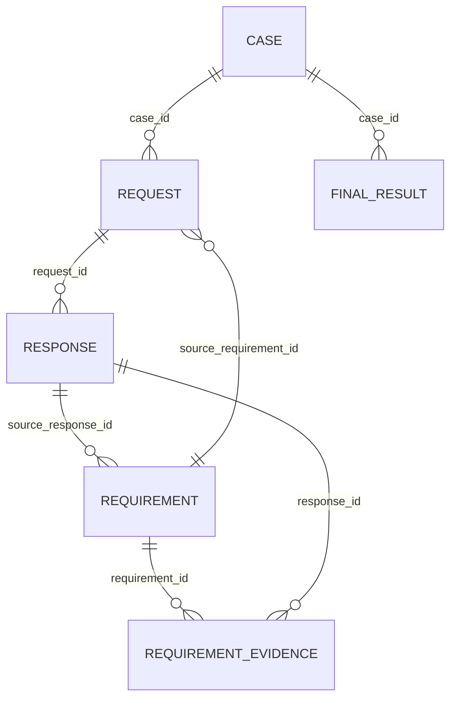

# RCS — Domain Model

**Status:** **Domain Model v1.1 — approved / stable.** Reconciled against `PROJECT.md` (PROJECT SPEC v1);
decisions C-1, C-2 and C-3 accepted and recorded in §12.2. Design only: no schema, no migrations, no
code. Structural changes from here require a decision record.
**Post-review amendments (2026-09-17):** the independent architecture review found three implementation
blockers caused by contradictions across the frozen set. They are resolved by amendments **A-1 … A-8**;
the pre-schema pass added **A-9** (document version reinstatement) and **A-10** (response supersession
retraction, closing OQ-16). All are recorded with their reasons in
[§12.7](#127-post-review-amendment-record-v11), and the decisions themselves in `/docs/DECISIONS.md`.
Everything not named there is unchanged v1.
**Target database:** PostgreSQL
**Scope:** Fully local / on-premise LAN case management and interagency workflow system for a municipal urban-planning department (~13 users).

---

## Source-of-truth note (must be read first)

The authoritative source of truth for this document is **`/docs/PROJECT.md` (PROJECT SPEC v1)**.
This model has been **reconciled against it field by field** — see
[12. Conformance to PROJECT.md v1](#12-conformance-to-projectmd-v1), which records every mapping, every
deliberate refinement, and the three decisions (C-1, C-2, C-3) that the product owner has now confirmed.

Where this document and `PROJECT.md` ever disagree, **`PROJECT.md` wins** and this document is the one
that must change.

Related documents that own what is deliberately *not* decided here (per `PROJECT.md` §28):
state transitions in detail → `WORKFLOW.md`; authorization rules → `PERMISSIONS.md`; storage layout and
document operations → `DOCUMENT_MODEL.md`; audit chaining and threat model → `SECURITY.md`; stack and
infrastructure → `ARCHITECTURE.md` / `DECISIONS.md`.

Everything that could not be answered from `PROJECT.md` is recorded in
[10. Open Questions](#10-open-questions) rather than guessed (`PROJECT.md` §29.9).

---

## 1. Domain Overview

### 1.1 What this model is

RCS records the **official paper trail** of an urban-planning department: what was asked of it, whom
it asked in turn, what came back, what extra conditions were imposed along the way, which files prove
it, who was responsible at each moment, and what was finally decided.

The model is built around one central dossier — the **Case** — and four kinds of fact hanging off it:

| Layer | Entities | Nature |
|---|---|---|
| **Master data** | `organization`, `organization_alias`, `user`, `role`, lookup tables | Slowly changing reference data. Never duplicated per-transaction, never deleted. |
| **The dossier** | `case`, `assignment`, `case_state_change`, `internal_record`, `final_result` | The administrative container and its responsibility/lifecycle history. |
| **The workflow spine** | `request`, `response`, `requirement` | Causality. Why anything happened. This is where the branching, non-linear process lives. |
| **The paper** | `correspondence`, `document`, `document_version`, `document_link` | Official communication events and the files that evidence them. |
| **Accountability** | `audit_event` | Append-only record of who did what, when, to which row, with what before/after state. |

### 1.2 Four ideas that shape everything else

**(a) Tracking units are separate from paper.**
A `request` is an *obligation we are tracking* ("Architecture Authority owes us an opinion, due 14
April"). A `correspondence` is a *physical official letter* that went out or came in. They are not the
same thing and their cardinality is not 1:1 in either direction:

- one outgoing letter may carry **several** requests (we asked one authority for two things at once);
- one incoming letter may constitute **several** responses (one authority answered two of our
  requests, possibly across two cases, in a single letter).

So `request → correspondence` and `response → correspondence` are both **N:1**. This is the single
most important structural decision in the model — it removes the need for a `case ↔ correspondence`
M:N junction in V1 (see §2.8) and keeps deadlines, statuses and requirements attached to the thing
they actually belong to (the tracked obligation), not to a sheet of paper.

**(b) The database stores meaning, not letter text.**
The authoritative wording of any official act is the **signed document** (PDF/scan) in
`document_version`. The database stores structured, queryable *business meaning* around it (who, whom,
when, what kind, what outcome, what deadline). The model must never be read as an attempt to replace
the document with database columns.

**(c) Append, do not overwrite.**
Responses, document versions, assignments, decisions and state changes are **appended**. Records leave
active use through a state (`WITHDRAWN`, `SUPERSEDED`, `VOID`, `INACTIVE`, `ENDED`) plus a
**who/when/why triple**, never through `DELETE` and never by overwriting the previous value.

**(d) Operational progress is derived, not typed in.**
The only stored lifecycle values are small, closed state machines that a human genuinely decides
(`case`, `request`, `requirement`, `document_version`, `final_result`). Everything an observer would
call "progress" — *"waiting for Architecture Authority"*, *"2 of 3 responses received"*, *"1 open
requirement"*, *"ready for final result"* — is **computed** from those rows at read time. See §9.

### 1.3 Entity decisions: what was kept, split, merged, or not created

| Decision | Outcome | Why |
|---|---|---|
| `Correspondence` vs `Document` | **Kept separate** | One official letter legitimately carries a main PDF plus Excel, map, drawing, annexes. Merging them would force one row per file and destroy the identity of the communication event (its letter number, its date, its sender). |
| `Document` vs `DocumentVersion` | **Kept separate** | `document` is the stable business identity ("the utility communication map from the Utility Authority"); `document_version` is an immutable stored file. A revision must not destroy the original. |
| `DocumentLink` | **Added (new entity)** | The same file may legitimately belong to an incoming letter *and* be evidence for a requirement *and* be re-sent as an annex of our outgoing letter. Without a link table the only options are attaching everything to the Case (forbidden) or duplicating files (forbidden). |
| `Response` vs `ResponseVersion` | **`ResponseVersion` NOT created** | Each incoming letter is its own official act with its own number and date. A "revised response" is a *new letter*, not a new version of an old one. Modelled as immutable `response` rows plus `response_supersession` edges (§2.21 — one later response may supersede several earlier ones; amendment A-1). Full rationale in §5.3. |
| `RequirementResolutionCorrection` | **Added (amendment A-2)** | A terminal requirement state recorded in error must stop counting without erasing that it was recorded. A correction record plus one narrow transition does this; a replacement requirement would break the causal chain (§2.22). |
| `Requirement` | **Kept as a first-class entity** | It is the branch point of the whole workflow: it is raised by a response, it owns a deadline and a lifecycle, and it spawns child requests. Flattening it into a request field would make "why does this request exist?" unanswerable. |
| `RequirementEvidence` | **Added (new entity)** | A requirement may be satisfied by a response, by a supplied document, or by an internal act — and the same evidence may satisfy two requirements from two authorities. M:N is real here. |
| `Assignment` | **Kept as a table, not an FK** | `case.responsible_user_id` would destroy reassignment history. Temporal assignment rows preserve it and additionally model temporary absence cover. |
| Requester / Supplier / Authority tables | **NOT created** | A single `organization` master table. The role an organization plays is *contextual*, determined by which column references it (`case.requesting_organization_id`, `request.target_organization_id`, `correspondence.sender_organization_id`, …). The department itself is an `organization` row flagged `is_own_organization`. |
| `FinalResult` vs `Case` fields | **Kept separate** | A decision has its own approval metadata, its own dispatch letter, its own documents, and can be superseded (correction, appeal outcome). Inlining it would bloat `case` and make revision history impossible. |
| `Decision` vs `FinalResult` | **Merged into one entity** (`final_result`) | The supplied context names them as alternatives, not as two distinct things. One entity with a `decision_type` vocabulary covers approval, refusal, partial approval, termination. |
| `CaseStateChange` | **Added (recommended)** | Business reporting (time in `ON_HOLD`, reopening, cycle time) should not depend on parsing `audit_event` JSONB. Audit exists for accountability; this exists for business questions. |
| `InternalRecord` | **Added** | The context list for documents includes "supporting records" — internal notes, phone calls, site visits, internal memos. Without this entity such files would have no lawful home other than the Case, which is forbidden. |
| `OrganizationAlias` | **Added** | Authorities are renamed and reorganised; old letters must stay findable under the old name without creating a second organization row. |
| `UserRole` (temporal) | **Added** | Role grants change; the audit trail must be able to say what role someone held at the time they acted. |
| Workflow engine / JSON graph | **NOT created** | Causality is expressed with explicit foreign keys (`request.source_requirement_id`, `requirement.source_response_id`, `response.request_id`). See §6. |

### 1.4 Modelling conventions

These conventions apply to every entity in §2 and are not repeated there.

**Identifiers**
- Every table has `id uuid PRIMARY KEY`, generated as **UUIDv7** (time-ordered, so it behaves well in
  B-tree indexes and keeps insert locality; a random UUIDv4 would fragment indexes for no benefit
  here). If the deployed PostgreSQL version lacks native `uuidv7()`, generate it in the application or
  via a small SQL function — the *format* is the commitment, not the generator.
- Rejected alternative: `bigint GENERATED ALWAYS AS IDENTITY`. It is cheaper, but sequential integers
  leak volume and make record identity guessable in URLs on a shared LAN, and they complicate any
  future export/merge of dossiers between systems. If it is ever chosen, a separate public `uuid`
  column becomes mandatory.
- Foreign keys are named `<referenced_entity>_id`, with role prefixes where a table references the
  same entity twice (`sender_organization_id`, `recipient_organization_id`).

**Business numbers are never primary keys**
- `case.case_number`, `correspondence.registry_number`, `correspondence.letter_number`,
  `request.request_number`, `final_result.result_number` are human-facing identifiers with their own
  unique constraints. They are **never** used as foreign keys. Their format and their yearly reset
  rules may change by decree without touching a single relationship. (Numbering rules themselves are
  OQ-7.)
- `letter_number` is the *counterparty's* number as printed on their letter; `registry_number` is
  *our* internal registration number. They are different columns and neither is unique on its own
  across all time (OQ-7).

**Time: business time vs system time**
- All timestamps are `timestamptz`. Dates that exist on paper without a time (a letter's own date) are
  `date`.
- `occurred_at`-family columns record **when the business fact happened** (letter signed, letter
  received at the front desk, opinion given, responsibility handed over). They are entered by a human
  and may be in the past.
- `recorded_at`-family columns record **when the system learned about it** (`DEFAULT now()`, never
  editable).

| Entity | Business time (`occurred_at` family) | System time (`recorded_at` family) |
|---|---|---|
| `case` | `registered_at`, `closed_at` | `created_at`, `updated_at` |
| `correspondence` | `letter_date`, `sent_at`, `received_at` | `registered_at`, `created_at` |
| `request` | `sent_at` (from dispatch letter), `due_at` | `created_at` |
| `response` | `received_at`, `response_date` | `recorded_at` |
| `requirement` | `raised_at`, `due_at`, `resolved_at` | `created_at` |
| `document_version` | `document_date` (date on the file, if any) | `uploaded_at` |
| `assignment` | `valid_from`, `valid_until` | `recorded_at` |
| `final_result` | `decided_at`, `issued_at` | `created_at` |
| `audit_event` | `occurred_at` | `recorded_at` |

**Vocabularies: `CHECK`-constrained text vs lookup table**

A deliberate rule, applied consistently:

- **Closed state machines the application branches on** → `text` column + `CHECK (col IN (…))`.
  These are `case.lifecycle_state`, `request.status`, `requirement.status`, `response.status`,
  `document_version.status`, `final_result.status`, `correspondence.status`, `assignment.status`,
  `correspondence.direction`. Adding a value is a code change anyway, so a lookup table would give
  false flexibility; `text` + `CHECK` keeps dumps readable and avoids native-enum ordering and
  drop-value pitfalls.
- **Open vocabularies that clerks classify with and that will evolve** → **lookup tables**
  (`code`, `label`, `description`, `sort_order`, `is_active`, `valid_from`, `valid_to`).
  These are: `correspondence_kind`, `response_type`, `response_outcome`, `requirement_origin_type`,
  `document_link_role`, `document_kind`, `organization_type`, `case_type`, `closure_type`,
  `assignment_role`, `assignment_end_reason`, `decision_type`, `deadline_basis`,
  `internal_record_type`, `void_reason`, `withdrawal_reason`.
  Lookup rows are **deactivated, never deleted** — historical rows must keep resolving.

**No hard delete**
- No business row is ever physically deleted. Retirement is a state plus a who/when/why triple:
  `*_at`, `*_by_user_id`, `*_reason_code`, `*_note`.
- All business foreign keys are `ON DELETE RESTRICT` (or `NO ACTION`). **No `ON DELETE CASCADE`
  anywhere in the business schema.** Physical deletion, if ever permitted, is a retention-policy
  operation outside this model (OQ-9).

**Common columns on every business table**
`created_at timestamptz`, `created_by_user_id uuid`, `updated_at timestamptz`,
`updated_by_user_id uuid`, `row_version integer` (optimistic concurrency; also written into
`audit_event.entity_version` so an audit entry can be tied to an exact row state).

**Exclusive arcs instead of generic polymorphism**
Three tables (`document_link`, `assignment`, `requirement_evidence`) attach to one of several possible
parents. They do **not** use `entity_type text + entity_id uuid`. They use several nullable, real
foreign-key columns plus `CHECK (num_nonnulls(a_id, b_id, …) = 1)` and a `scope`/`role` discriminator.
This keeps real referential integrity, real indexes and real joins. The **only** place generic
`entity_type + entity_id` is permitted is `audit_event`, and that exception is justified in §2.18.

**Denormalised scope columns**
`requirement.case_id` and `audit_event.case_id` are denormalised for permission filtering and
dashboards. They are caches of an authoritative path and must never contradict it; the invariant is
stated with the entity. `response_supersession.request_id` (§2.21) is also carried, but it cannot drift:
composite foreign keys tie it to both responses. No other denormalisation is authorised in V1.

---

## 2. Entity List

Each entity is described as **Purpose / Key fields / Owns / References / Invariants**.
"Owns" = rows that have no meaning without this row. "References" = master data or peers it points at.

### 2.1 `organization`

**Purpose.** Master data for every external (and one internal) party: state authorities, utility
companies, municipal departments, legal entities — and the department itself. An organization's *role*
is never stored on the organization; it is implied by the relationship that references it.

**Key fields.**
`id`, `official_name`, `short_name`, `organization_type_id` → `organization_type`,
`registration_code` (national registry/tax code, nullable, unique when present),
`parent_organization_id` (nullable self-FK — a directorate inside an authority),
`is_own_organization boolean NOT NULL DEFAULT false`,
`postal_address`, `email`, `phone` (nullable — contact detail, not identity),
`is_active boolean NOT NULL DEFAULT true`, `deactivated_at`, `deactivated_by_user_id`,
`deactivation_reason_note`, `notes`.

**Owns.** `organization_alias` rows.
**References.** `organization_type`, itself (`parent_organization_id`).
**Invariants.**
- Exactly one row may have `is_own_organization = true` → partial unique index. This row is the
  department; it is the sender of every outgoing letter and the recipient of every incoming one.
- Deactivation (`is_active = false`) blocks *new* references only. Existing cases, letters and requests
  keep pointing at it forever.
- No duplicate rows per role. The Architecture Authority that answers a request is the *same row* as
  the Architecture Authority that later raises a requirement.
- `PROJECT.md` §3 and §5.2 describe the parties as government bodies and organizations, so V1 models
  parties as organizations only. Whether a private individual can ever be the requesting party is the
  residual **OQ-1**.

### 2.2 `organization_alias`

**Purpose.** Former names, abbreviations, transliterations and common misspellings, so a letter filed
in 2019 under an old authority name is still findable and is not re-keyed as a new organization.

**Key fields.** `id`, `organization_id`, `alias`, `alias_type` (`FORMER_NAME` | `ABBREVIATION` |
`TRANSLITERATION` | `MISSPELLING`), `alias_language` (nullable — Azerbaijani and Russian naming
variations must both be findable, `PROJECT.md` §16), `valid_from date`, `valid_to date` (nullable),
`is_active`.

**References.** `organization`.
**Invariants.** An alias never migrates to a different organization; if an authority is split, the new
organization gets its own row and the alias records the historical relationship on the old one.

### 2.3 `user`

**Purpose.** An employee of the department who can act in the system. Users are **deactivated, never
deleted**, so that every audit entry, upload, assignment and decision keeps resolving to a real
identity.

**Key fields.**
`id`, `username` (unique, login identity), `employee_number` (nullable, unique),
`full_name`, `display_name`, `job_title`, `email_internal`, `phone_internal`,
`status` (`ACTIVE` | `SUSPENDED` | `DEACTIVATED`),
`auth_source` (`LOCAL` | `ACTIVE_DIRECTORY`) and `directory_identifier` (nullable) — **identity mapping
only**, so that either local accounts or an existing internal Active Directory can back the same `user`
row (`PROJECT.md` §14). No AD integration is designed or implied here; this is a domain/infrastructure
compatibility requirement so that adopting AD later is a configuration and authentication change, not a
domain change. No external or cloud identity provider is representable,
`deactivated_at`, `deactivated_by_user_id`, `deactivation_reason_note`,
`created_at`, `created_by_user_id`.

**Owns.** `user_role` rows.
**References.** itself (`deactivated_by_user_id`).
**Invariants.**
- `DEACTIVATED` users cannot receive new assignments and cannot authenticate, but remain referenced by
  history.
- Authentication secrets (password hash, lockout counters, session records) are **deliberately not
  modelled here**; they belong to the security design and must live in a separate table so that this
  table can be read freely for display purposes.

### 2.4 `role` and `user_role`

**Purpose.** Conceptual roles only: `WORKER`, `CHIEF`, `HEAD`, `TECH_ADMIN`. No permission engine is
designed here — permissions belong to `/docs/PERMISSIONS.md`.

**`role` key fields.** `id`, `code` (unique), `name`, `description`, `rank smallint`, `is_active`.
**`user_role` key fields.** `id`, `user_id`, `role_id`, `valid_from`, `valid_until` (nullable = current),
`granted_by_user_id`, `revoked_by_user_id`, `revocation_reason_note`, `recorded_at`.

**Invariants.**
- Role grants are **temporal**, so audit can answer "what role did this person hold when they acted?".
- A user may hold more than one role at a time (a Chief who also acts as a Worker on their own cases).
- **What future authorization will need, and which this model already provides:** the acting user's
  roles at time *t* (`user_role`), whether the user is currently assigned to the case
  (`assignment`), whether the case is restricted (`case.is_restricted`), the case's owning
  organizational context, and the entity's own lifecycle state. Nothing in this model forces
  permissions to be role-only.

### 2.5 `case`

**Purpose.** The **dossier**. One official incoming request from one requesting organization, and
everything the department did about it. It is a thin administrative header — deliberately small.

**What belongs directly on `case`.**

| Field | Notes |
|---|---|
| `id` | UUIDv7 PK |
| `case_number` | business-facing, unique, never an FK |
| `title` | short human label for lists and screens |
| `subject` | what is actually being asked for (longer, searchable) |
| `case_type_id` | → `case_type` lookup (nullable if the department does not classify) |
| `requesting_organization_id` | → `organization`; **required**, the party the case is for |
| `applicant_reference` | the requester's own reference, if they quote one |
| `lifecycle_state` | `REGISTERED` \| `ACTIVE` \| `ON_HOLD` \| `CLOSED` \| `CANCELLED` — the only stored status |
| `hold_reason_note`, `hold_until` | meaningful only while `ON_HOLD` |
| `registered_at` | business time the case was opened |
| `statutory_due_at` | the department's own deadline for the whole case (nullable; see OQ-5) |
| `is_restricted` | boolean; restricted dossier flag |
| `restriction_reason_note`, `restricted_by_user_id`, `restricted_at`, `restriction_lifted_at` | restriction metadata |
| `closed_at`, `closed_by_user_id`, `closure_type_id`, `closure_note` | closure metadata **of the most recent closure**; the current closure only while `lifecycle_state = CLOSED`. Earlier closure episodes live in `case_state_change` (§2.6) |
| `notes` | free-text case notes (`PROJECT.md` §5.1); structured notes, calls and site visits go to `internal_record` |
| `last_activity_at` | **maintained cache**, not a business fact — see below |
| `merged_into_case_id` | nullable self-FK, set only with `closure_type = MERGED` |
| `created_at`, `created_by_user_id`, `updated_at`, `updated_by_user_id`, `row_version` | conventions |

**What must never live directly on `case`.**

| Anti-field | Correct home | Why |
|---|---|---|
| `responsible_user_id` | `assignment` | A mutable FK destroys reassignment history (principle 13) |
| `architecture_response_status`, `utility_response_status`, … | `request` + `response` rows | Per-authority columns make the schema change every time a new authority is involved |
| `open_requirements_count`, `progress_text`, `percent_complete` | derived at read time (§9) | Stored progress drifts and becomes a lie |
| `file_path`, `main_document_id`, `attachments` | `document_link` | Files must carry their real business context (principle 9) |
| `requesting_organization_name` (text) | `organization` FK | Free-text org names are forbidden (principle 12) |
| `final_decision_text`, `decision_date` | `final_result` | Decisions are supersedable and separately approved |
| `deadline_for_architecture`, … | `request.due_at` | Deadlines belong to the obligation they constrain |
| the incoming letter's text/attachments | `correspondence` + `document` | The letter is an event with its own identity |

**Does the case need an "original incoming correspondence"?** Yes, but **not as a column on `case`**.
It is `correspondence` with `direction = 'IN'`, `correspondence_kind = 'INITIATING'` and
`case_id = this case`, constrained by a **partial unique index on `correspondence(case_id) WHERE
correspondence_kind = 'INITIATING'`**. This guarantees *at most one* initiating letter per case without
creating a circular `case ↔ correspondence` foreign-key pair that every insert would have to defer.

**Does the case need a "final result" pointer?** Same treatment: no column on `case`. `final_result`
rows point at the case, with a **partial unique index on `final_result(case_id) WHERE status =
'ISSUED'`**, so at most one result is in force while superseded ones remain.

**`last_activity_at` — the one authorised cache column.** `PROJECT.md` §19 requires *"Recently updated
Cases"* and *"Cases with no activity for N days"*. Deriving that from every child table on every
dashboard query is wasteful. So this column exists, under three explicit conditions:

1. **It is not authoritative business history.** No business rule, no lifecycle transition and no
   closure check may read it. Losing it must cost nothing but a recomputation.
2. **It is rebuildable** at any time from the activity/audit record (`audit_event.recorded_at` grouped
   by `case_id`, restricted to whichever actions the eventual definition counts).
3. **It is never user-editable.**

**What counts as "activity" is deliberately left open (OQ-13).** It is a workflow/dashboard question,
not a domain one, and answering it arbitrarily now would bake a guess into a column that reporting will
later depend on. Because the value is rebuildable by definition, fixing the rule later is a
recomputation — not a migration and not a data loss. Until then no production rule is assumed.

**Owns.** `assignment`, `case_state_change`, `request`, `requirement`, `correspondence`,
`internal_record`, `final_result`, `case_access_grant` rows.
**References.** `organization` (requester), `case_type`, `closure_type`, `user` (closer), itself (merge).
**Invariants.**
- `CLOSED` requires closure metadata (`closed_at`, `closed_by_user_id`, `closure_type_id`). **Whether
  unresolved work may remain is decided by the closure guards of `WORKFLOW.md` §9, which are
  authoritative** (amendment A-3): a **normal** closure passes every guard, so no `request` and no
  *blocking* `requirement` is left non-terminal (a non-blocking requirement may stay open — it holds
  nothing open, §2.11); an **exceptional** closure is a Head override with a mandatory reason, recorded as
  a `case_state_change` row (`reason_code = CLOSURE_GUARD_OVERRIDE`) and an `audit_event`, after which the
  unresolved requests and requirements **keep their true states**. Closure never auto-fulfils,
  auto-voids or auto-fails anything. *Closed with unresolved items* is derived (§9.1), never stored.
  `CANCELLED` remains the state for a dossier that will not be pursued; its open items must first be
  withdrawn or voided individually (§5.1).
- `is_restricted` is a **case-level** flag, as `PROJECT.md` §13 requires; there is no per-document or
  per-letter ACL in V1. Visibility of a restricted case resolves to: its assigned users
  (`assignment`), Chief and Head (`user_role`), and any explicitly authorised users
  (`case_access_grant`, §2.20). The rules themselves belong to `PERMISSIONS.md`; this model only
  guarantees the data those rules need.

### 2.6 `case_state_change`

**Purpose.** Business-readable lifecycle history of a case: time spent `ON_HOLD`, reopening after
closure, who cancelled and why. Deliberately separate from `audit_event`, which exists for
accountability and stores JSONB — unsuitable for routine business reporting.

**Key fields.** `id`, `case_id`, `from_state`, `to_state`, `reason_code`, `note`,
`occurred_at`, `recorded_at`, `actor_user_id`.
**Invariants.** Append-only. `case.lifecycle_state` always equals the `to_state` of the latest row.
**Closure episodes.** Every closure (`to_state = CLOSED`) and every reopening (`CLOSED → ACTIVE`) is its
own row, so a case closed, reopened and closed again shows both closure episodes, each with its actor,
time, reason code and note — and a closure that overrode guards is identifiable by its
`reason_code = CLOSURE_GUARD_OVERRIDE`. This table is the authoritative episode history; no per-episode
field is added. The `case.closed_*` columns describe only the most recent closure and are overwritten by
the next one; the earlier values remain in that transition's `audit_event` (`before_state` /
`after_state`).

### 2.7 `assignment`

**Purpose.** *Who is responsible, for what, from when, until when, and why it changed.* Replaces every
mutable "responsible employee" foreign key in the model.

**Key fields.**
`id`, `scope` (`CASE` | `REQUEST` | `REQUIREMENT`),
`case_id`, `request_id`, `requirement_id` — nullable, **exclusive arc**:
`CHECK (num_nonnulls(case_id, request_id, requirement_id) = 1)` and `scope` must match the non-null one,
`assignee_user_id`, `assignment_role_id` → `assignment_role`
(`RESPONSIBLE` | `CO_WORKER` | `SUPERVISOR` | `TEMPORARY_COVER` | `OBSERVER`),
`covers_assignment_id` (nullable self-FK — the assignment this cover stands in for),
`assigned_by_user_id`, `valid_from timestamptz NOT NULL`, `valid_until timestamptz` (NULL = current),
`end_reason_id` → `assignment_end_reason` (`REASSIGNED` | `ABSENCE_COVER_ENDED` | `CASE_CLOSED` |
`USER_DEACTIVATED` | `CORRECTION`), `reason_note`, `ended_by_user_id`,
`status` (`ACTIVE` | `ENDED` | `VOID`), `recorded_at`.

**References.** `case` / `request` / `requirement`, `user` (assignee, assigner, ender), `assignment_role`.
**Invariants.**
- **Never updated to reassign.** Reassignment = close the current row (`valid_until`, `end_reason`)
  and insert a new one. The old row stays forever.
- At most one `RESPONSIBLE` assignment per scoped entity at any instant — **across the whole timeline,
  not only among current rows.** This enforces *non-overlapping history*, which a simple partial unique
  index on `valid_until IS NULL` would not. **Pre-schema constraint requirement** (amendment A-7):
  - **one exclusion per scope** — separate `EXCLUDE USING gist` constraints for `case_id`, `request_id`
    and `requirement_id`, each `(<scope column> WITH =, tstzrange(valid_from, valid_until, '[)') WITH &&)`
    over rows where that column is non-null and the role is `RESPONSIBLE` (requires `btree_gist`);
  - **`ENDED` rows participate**; only `VOID` rows (recorded in error) are excluded. Filtering to `ACTIVE`
    would let a back-dated or corrected row overlap responsibility that has already ended;
  - **half-open intervals** `[valid_from, valid_until)`, `NULL` upper bound = open-ended, so a handover at
    instant *t* (old row ends at *t*, new row starts at *t*) is not an overlap;
  - `CHECK (valid_until IS NULL OR valid_until > valid_from)` — an empty range overlaps nothing and would
    silently bypass the exclusion;
  - the "role is `RESPONSIBLE`" predicate must be evaluable on the row itself, because a constraint cannot
    join to the `assignment_role` lookup; how that is expressed is a schema decision.
- **Temporary cover does not end the responsible assignment.** A `TEMPORARY_COVER` row coexists with
  it and points at it via `covers_assignment_id`, so the record still shows who the substantive owner
  was during an absence. Whether cover carries the owner's authority is a permissions question, not a
  domain one.
- `request` and `requirement` inherit the case's responsible user by default; they only get their own
  `assignment` row when a *different* person chases them. There is no responsible-user column on
  either.

### 2.8 `correspondence`

**Purpose.** One **official communication event** — a letter that left the department or arrived at
it. It is the registry-level record of the paper, not of the obligation.

**Correspondence vs Request (decision C-1).** A `correspondence` is *the official letter*. A `request`
is *a logical request or work item transmitted by* that letter. One letter may carry several requests,
and one incoming letter may carry several responses. The two concepts are never merged and the link is
always held from the `request` / `response` side — never as a single `related_request_id` column here,
which would cap a letter at one work item. See §2.9 and §2.10.

**Key fields.**
`id`, `case_id` (owning case; `NOT NULL` in V1 — see **OQ-10**), `direction` (`IN` | `OUT`), `correspondence_kind_id` →
`correspondence_kind` (`INITIATING` | `OUTGOING_REQUEST` | `INCOMING_RESPONSE` | `REMINDER` |
`WITHDRAWAL` | `FINAL_RESULT_DISPATCH` | `INFORMATIONAL` | `INTERNAL_MEMO`),
`sender_organization_id`, `recipient_organization_id`,
`letter_number` (counterparty's number as printed), `letter_date date`,
`registry_number` (our registration number), `registered_at`, `registered_by_user_id`,
`sent_at` (OUT), `received_at` (IN), `delivery_method_id` (nullable; courier, post, hand, e-doc),
`subject`, `summary`,
`parent_correspondence_id` (nullable self-FK — the letter this one answers or chases),
`status` (`DRAFT` | `REGISTERED` | `SENT` | `RECEIVED` | `WITHDRAWN` | `SUPERSEDED` | `VOID`),
`supersedes_correspondence_id`, withdrawal/void who-when-why triples,
`created_at`, `created_by_user_id`, `row_version`.

**Owns.** Its `document_link` rows with role `PRIMARY_LETTER` / `ATTACHMENT` / `ANNEX`.
**References.** `case`, `organization` ×2, itself (parent, supersedes), `correspondence_kind`.
**Invariants.**
- `direction = 'OUT'` ⟹ `sender_organization_id` = the `is_own_organization` row;
  `direction = 'IN'` ⟹ `recipient_organization_id` = that row. Both columns are `NOT NULL` — modelling
  the department as an organization removes every nullable-party special case.
- `sender_organization_id <> recipient_organization_id`.
- `sent_at` required once `status = 'SENT'`; `received_at` required once `status = 'RECEIVED'`.
- A letter is **withdrawn** (we recalled it) or **superseded** (a corrected letter replaced it) — never
  edited into a different letter and never deleted.
- **On `PROJECT.md` §5.3's "related Request ID":** the relationship exists but is held from the other
  side — `request.dispatch_correspondence_id` for outgoing letters, `response.request_id` +
  `response.correspondence_id` for incoming ones. Every question that field is meant to answer
  ("which requests does this letter carry?", "which letter carried this request?") is answerable, with
  the correct multiplicity. **Confirmed as decision C-1 (§12.2); no `related_request_id` column exists
  on `correspondence`.**

**Should `correspondence` be M:N with `case`, or keep one primary case relation?**

**Decision for V1: one owning `case_id` (`NOT NULL`), plus a designed-but-not-built escape hatch.**

*Why one owning case:*
- The registry model of a public body is "each registered letter is filed in exactly one dossier".
  The owning case is what the registry number, the paper file and the archive copy follow.
- Every permission check, every list screen and every restricted-case filter becomes a single
  indexed column instead of an EXISTS over a junction.
- "Print the case file" has an unambiguous definition.

*What M:N would buy, and why we do not need it yet:* the genuine multi-case letter is *"one authority
answered two of our requests in one letter"*. That is already handled **without** a junction, because
`response` is per-`request` and `response → correspondence` is N:1: the clerk registers the letter once
and records two `response` rows, which may belong to requests in two different cases. Registering it
once means the attached map is stored once and linked, never copied.

*The residual gap:* a letter that concerns a second case but generates no response there (a pure
cross-reference). For that, `correspondence_case_link (correspondence_id, case_id, relation_type,
note, linked_by_user_id, linked_at)` is specified in Appendix C and left unbuilt in V1.

*Cost of full M:N from day one:* the junction would still need a `is_primary` flag for numbering and
filing, so we would pay for both models at once; every query gains a join; restricted-case filtering
becomes an aggregate. Not worth it before the requirement is proven. Note the deliberate consequence:
`correspondence.case_id` (where the paper is filed) may differ from `response.request.case_id` (which
obligation it discharges). That is allowed and intended.

**Cross-case responses disclose nothing of the letter (amendment A-6).** The letter, its metadata, its
files and the other responses it carries are **always governed by the owning case**
(`correspondence.case_id`) — never by the case of a response that references it. A `response` in case B
belongs to case B and exposes its own facts there (type, outcome, conclusiveness, dates, summary, the
requirements it raised). A case-B viewer who cannot see case A sees nothing of the carrying letter — not
its numbers, subject, files or audit, and no marker that it exists elsewhere. If case B genuinely needs
the file, it is shared by an explicit, authorised, **version-pinned** `document_link` into a case-B
context (`DOCUMENT_MODEL.md` §4.8). No `case ↔ correspondence` junction is introduced for this.

### 2.9 `request`

**Purpose.** An official request **sent by the department to an external authority**, tracked as an
obligation with a deadline and an expected answer. Both top-level and requirement-driven requests are
the same entity.

**Key fields.**
`id`, `case_id` **NOT NULL**, `request_number` (business-facing),
`target_organization_id` **NOT NULL** → `organization`,
`source_requirement_id` **NULLABLE** → `requirement`
&nbsp;&nbsp;• `NULL` = **top-level** request created directly from the case
&nbsp;&nbsp;• set = **child** request created to satisfy that requirement,
`dispatch_correspondence_id` **NULLABLE** → `correspondence` (the outgoing letter that carried it;
NULL while the request is still `DRAFT`),
`subject`, `requested_items_note`,
`due_at` (current response deadline), `original_due_at`, `deadline_basis_id` → `deadline_basis`
(`STATUTORY` | `INTERNAL` | `AGREED`), `deadline_note`,
`status` (`DRAFT` | `SENT` | `ANSWERED` | `CLOSED` | `WITHDRAWN` | `VOID`),
`closed_at`, `closed_by_user_id`, `closure_note`,
withdrawal/void who-when-why triples,
`created_at`, `created_by_user_id`, `row_version`.

**Owns.** `response` rows; its own `assignment` rows (if separately assigned).
**References.** `case`, `organization`, `requirement` (source), `correspondence` (dispatch).
**Invariants.**
- `source_requirement_id IS NOT NULL ⟹ requirement.case_id = request.case_id` (a requirement cannot
  spawn a request in someone else's dossier).
- `dispatch_correspondence_id IS NOT NULL ⟹` that correspondence has `direction = 'OUT'` and
  `recipient_organization_id = request.target_organization_id` and the same `case_id`.
- **N:1 to the dispatch letter is intentional (decision C-1, accepted).** `correspondence` is the
  **official communication** — the letter that was signed, numbered and sent. `request` is a **logical
  request / work item carried inside** that communication. One outgoing letter to an authority may ask
  for a utility map, for information about existing infrastructure, and for an official opinion on
  restrictions: that is **three** requests in **one** letter, each with its own deadline, its own
  status, its own responses and possibly its own requirements. The ordinary case is still one letter →
  one request, and **the model must not depend on that**. Future UI and workflow logic will depend on
  this distinction, so it is stated here rather than left implicit.
- `status = 'SENT'` requires a dispatch correspondence with a `sent_at`.
- **No responsible-employee column** — see §2.7. `PROJECT.md` §5.4 lists a responsible employee on the
  Request; it is represented by a request-scoped `assignment` row, falling back to the case's
  responsible assignment when the request has none. The fact is preserved, the history is not lost.
- **No `sent_at` column** — `PROJECT.md` §5.4's "sent date" is
  `dispatch_correspondence.sent_at`. Storing it twice would let the letter and the request disagree
  about when it left the building.
- `OVERDUE` is **not** a stored status (see §9).

**Closure rule.** A request may move to `CLOSED` only when *all* of the following hold:
1. it has at least one `ACTIVE` `response` flagged `is_conclusive` (or it is being closed as
   `WITHDRAWN` / `VOID`, which are different states, not closure); **and**
2. every **blocking** `requirement` (`is_blocking = true`) whose `source_response_id` belongs to this
   request is in a terminal state (`FULFILLED`, `WAIVED`, `VOID`, `FAILED`); **and**
3. a user with the right to close it records `closed_by_user_id` and `closed_at`.

Condition 2 is the rule that keeps the branching workflow honest: an authority's "final opinion" does
not close our tracking while the blocking conditions it attached are still open. **A non-blocking
requirement holds nothing open** — not its request, not its branch, not readiness for the final result,
not case closure — so `is_blocking` has one meaning at every level (amendment A-3; `WORKFLOW.md` §9.2). It
stays visible wherever open work is listed.

### 2.10 `response`

**Purpose.** One **official answer event** against one request. Append-only. Several responses to the
same request over time are normal and expected.

**Key fields.**
`id`, `request_id` **NOT NULL**, `correspondence_id` **NOT NULL** (the incoming letter carrying it),
`response_type_id` **NOT NULL** → `response_type` — **what kind of communication was received**.
Seeded: (`OPINION` | `CLARIFICATION` | `INFORMATION_REQUEST` | `ADDITIONAL_REQUIREMENT` |
`INFORMATION` | `OTHER`), plus three operational codes the workflow needs
(`ACKNOWLEDGEMENT` | `ADDITIONAL_DOCUMENT` | `DEADLINE_EXTENSION`),
`response_outcome_id` **NOT NULL** → `response_outcome` — **what the result of that communication was**.
Seeded: (`APPROVED` | `REJECTED` | `CONDITIONAL` | `NOT_APPLICABLE` | `UNDETERMINED`),
`is_conclusive boolean NOT NULL` — does this answer discharge the request?
(defaulted from `response_type.is_conclusive_default`, stored on the row because it drives lifecycle),
`summary` (the clerk's structured reading of the letter; **not** a copy of the letter),
`response_date date` (date on the letter), `received_at`, `recorded_at`, `recorded_by_user_id`,
`status` (`ACTIVE` | `SUPERSEDED` | `VOID`), `void_reason_id`, `void_note`, `voided_by_user_id`,
`voided_at`.
*(v1 carried `supersedes_response_id` here. It is replaced by `response_supersession`, §2.21 —
amendment A-1.)*

**Two dimensions, never one (decision C-2, accepted).** *What kind of communication arrived* and *what
it decided* are different facts, and a single mixed field destroys one of them. `PROJECT.md` §5.5's
list mixes both axes — *Approval*, *Rejection* and *Conditional* are outcomes; *Opinion*,
*Clarification*, *Information request* and *Additional requirement* are kinds of act — so the model
separates them and every value of §5.5 is still representable:

| `PROJECT.md` §5.5 value | `response_type` | `response_outcome` |
|---|---|---|
| Approval | `OPINION` (or the type of act that carried it) | `APPROVED` |
| Rejection | `OPINION` (or the type of act that carried it) | `REJECTED` |
| Conditional | `OPINION` / `ADDITIONAL_REQUIREMENT` | `CONDITIONAL` |
| Information request | `INFORMATION_REQUEST` | `NOT_APPLICABLE` |
| Additional requirement | `ADDITIONAL_REQUIREMENT` | `CONDITIONAL` |
| Opinion | `OPINION` | `APPROVED` / `REJECTED` / `CONDITIONAL` |
| Clarification | `CLARIFICATION` | `NOT_APPLICABLE` |
| Other | `OTHER` | any, including `UNDETERMINED` |

The combinations the decision requires are therefore natural, not special cases:
`OPINION + CONDITIONAL`, `CLARIFICATION + NOT_APPLICABLE`, `INFORMATION + NOT_APPLICABLE`,
`ADDITIONAL_REQUIREMENT + CONDITIONAL`.

**An informational letter is not forced to carry a verdict.** Both columns are `NOT NULL`, but the
outcome vocabulary contains two explicit non-verdicts, and they mean different things:

- **`NOT_APPLICABLE`** — this communication was never going to decide anything (a clarification, an
  acknowledgement, a covering letter transmitting a map). The absence of a verdict is the correct,
  final answer.
- **`UNDETERMINED`** — a verdict was expected but is not yet established: the letter is ambiguous, or
  the clerk has registered the letter before it has been read properly.

Modelling both as explicit values rather than as `NULL` is deliberate: `NULL` would conflate "no
decision was due" with "we do not know yet", and the two drive different follow-up work. A dashboard
can legitimately list `UNDETERMINED` responses as needing attention; it must never list
`NOT_APPLICABLE` ones.

**Supersession is structural, not a type.** There is no `REVISION` type code. A revised opinion is a
new `response` with `response_type = OPINION` and a `response_supersession` edge (§2.21) from it to the
earlier row — the relationship carries the fact, so it cannot disagree with a label. Likewise, there is **no
`ResponseVersion` entity** (decision C-2, reaffirmed; rationale in §5.3).

Vocabularies live in lookup tables precisely so they can be refined during workflow design without a
migration. What may **not** change without revisiting this document is the *separation* of the two
axes.

**Owns.** `requirement` rows it raises.
**References.** `request`, `correspondence`, `response_supersession` (as superseding or superseded
response), lookups, `user`.
**Invariants.**
- **Business facts are immutable.** After insert, only the status transitions
  (`ACTIVE → SUPERSEDED`, `ACTIVE → VOID`, and `SUPERSEDED → ACTIVE` when the edge that superseded it is
  retracted — §2.21, amendment A-10) and their who/when/why columns may be written. Every such write is
  audited.
- Supersession is recorded **only** as `response_supersession` edges (§2.21): same `request_id` only, and
  each superseded row moves to `SUPERSEDED` in the same transaction (it is never deleted, never edited,
  and remains fully readable). Recording a supersession between two responses that already exist is an
  edge insert — no response row is rewritten. A non-`VOID` response is `SUPERSEDED` exactly when it has an
  `ACTIVE` incoming edge.
- `correspondence.direction = 'IN'`.
- **N:1 to correspondence is intentional** — one incoming letter may carry several responses, possibly
  against requests in different cases. This is the mechanism that makes a `case ↔ correspondence`
  M:N junction unnecessary (§2.8).
- A `VOID` response's requirements are **not** auto-voided. The application must surface them for
  human review; silently cascading business meaning is exactly the kind of hidden rule this model
  avoids. No database cascade exists.

### 2.11 `requirement`

**Purpose.** Something that must happen before a workflow branch can continue: *provide a communication
map*, *provide an additional reference*, *obtain another authority's opinion*, *submit a supporting
document*. This is the entity that makes the workflow non-linear.

**Key fields.**
`id`, `case_id` **NOT NULL** (denormalised scope — see invariants),
`requirement_origin_type_id` → `requirement_origin_type`
(`RESPONSE` | `INCOMING_REQUEST` | `INTERNAL` | `REGULATION`),
`source_response_id` **NULLABLE** → `response` (**required when origin = `RESPONSE`**),
`raised_by_organization_id` (nullable — the authority demanding it; NULL for internally raised),
`addressed_to_organization_id` (nullable — who is expected to supply it: another authority, or the
requesting organization),
`title`, `description`,
`is_blocking boolean NOT NULL DEFAULT true` — does it block the final result?
`raised_at`, `due_at`, `deadline_basis_id`,
`status` (`OPEN` | `IN_PROGRESS` | `FULFILLED` | `WAIVED` | `VOID` | `FAILED`),
`started_at`,
`resolved_at`, `resolved_by_user_id`, `resolution_note`,
`waiver_authorised_by_user_id`, `waiver_reason_id` (waiver accountability),
`void_reason_id`, `voided_by_user_id`, `void_source_response_id` (nullable — the later response whose
opinion removed the need for this requirement, per `PROJECT.md` §5.6),
`failure_reason_note`,
`created_at`, `created_by_user_id`, `row_version`.

**Owns.** `requirement_evidence` rows; `requirement_resolution_correction` rows (§2.22); child `request`
rows point back at it.
**References.** `case`, `response` (source), `organization` ×2, lookups, `user`.
**Invariants.**
- `requirement_origin_type = 'RESPONSE' ⟹ source_response_id IS NOT NULL`, and
  `source_response.request.case_id = requirement.case_id`. The denormalised `case_id` is justified
  because (a) internally raised requirements have no response path to the case at all, and (b) every
  dashboard and permission filter needs it; it must never contradict the source path.
- **One source response per requirement.** If two authorities independently demand the same map, that
  is **two** requirements — each is separately waivable, separately fulfillable and separately owed to
  a different authority. They may share the *same evidence*, because `requirement_evidence` is M:N.
- A requirement may exist with **no** child request (the requester supplies the document directly) and
  with **several** child requests (the first authority could not supply it, so a second was asked).

**`WAIVED` vs `VOID` — the distinction, aligned to `PROJECT.md` §5.6.**

The spec is explicit: *"Do NOT force every irrelevant requirement to be marked FULFILLED. If a
requirement becomes irrelevant because another authority's opinion removes the need for it, it may be
marked VOID with a reason."* The dividing line is therefore **whether the obligation still applies**,
not whether it was ever genuine.

| | `FULFILLED` | `WAIVED` | `VOID` | `FAILED` |
|---|---|---|---|---|
| Did the obligation apply? | **Yes** | **Yes** | **No** — not any more, or never | **Yes** |
| Was it satisfied? | **Yes** | No — we were **released** from it | Not applicable | **No** — and it could not be |
| What ended it | Evidence accepted | An **authorised decision** to proceed without it | **Irrelevance**: a later authority response removed the need, the source response was superseded or voided, the workflow branch disappeared, or it was created by mistake | The authority refused, or it proved genuinely unobtainable |
| Required metadata | `resolved_at`, `resolved_by_user_id`, ≥1 `ACTIVE` evidence row | `waiver_authorised_by_user_id`, `waiver_reason_id`, `resolution_note` | `void_reason_id`, `voided_by_user_id`, `resolution_note`, plus `void_source_response_id` when a specific later response caused it | `failure_reason_note`, `resolved_by_user_id` |
| Who may do it | Any assigned worker | Chief or Head (`PROJECT.md` §12) | Chief or Head (`PROJECT.md` §12) | Chief or Head records it |
| Counts as an obligation in statistics? | Yes | **Yes** — it was owed and released | **Depends on `void_reason`, not on the state**: `NO_LONGER_REQUIRED` / `SUPERSEDED_BY_RESPONSE` / `BRANCH_REMOVED` are real business outcomes and are reported; `DATA_ENTRY_ERROR` / `DUPLICATE` are corrections and are excluded | Yes — and it is the one that should shape a negative or partial result |
| Typical effect on the case | Branch continues | Branch continues | Branch disappears | Branch is blocked or the result turns negative |

The four are **mutually exclusive and none may stand in for another**. In particular a requirement that
became irrelevant must **never** be recorded as `FULFILLED` to clear the board (`PROJECT.md` §5.6), and
`FAILED` must never be softened into `WAIVED` — nobody released us from a `FAILED` requirement, which is
exactly why it has to be visible when the final result is decided.

A reason is **mandatory** for `WAIVED`, `VOID` and `FAILED` alike, and none of the three may be applied
silently — every transition writes an `audit_event` (`PROJECT.md` §15 lists "Requirement waived" as an
audited action).

### 2.12 `requirement_evidence`

**Purpose.** What actually proves a requirement was met. Separate table because evidence is M:N: one
map may satisfy two authorities' requirements, and one requirement may need several pieces.

**Key fields.**
`id`, `requirement_id` **NOT NULL**,
`evidence_type` (`RESPONSE` | `DOCUMENT` | `INTERNAL_ACT`),
`response_id`, `document_id`, `internal_record_id` — nullable **exclusive arc**,
`document_version_id` (nullable — pins the exact version that was accepted as proof; **required when
`evidence_type = DOCUMENT`**, amendment A-5; see §7),
`note`, `is_primary boolean`,
`recorded_by_user_id`, `recorded_at`,
`status` (`ACTIVE` | `RETRACTED`), `retracted_by_user_id`, `retracted_at`, `retraction_note`.

**Invariants.**
- `CHECK (num_nonnulls(response_id, document_id, internal_record_id) = 1)` and matching `evidence_type`.
- `document_version_id IS NOT NULL ⟹ document_version.document_id = document_id`;
  `evidence_type = 'DOCUMENT' ⟹ document_version_id IS NOT NULL`.
- Evidence is **retracted**, never deleted — a requirement that was wrongly marked fulfilled must show
  that it once was, and why that was withdrawn. The requirement itself is returned to an open state
  through a resolution correction (§2.22); evidence rows are retracted one by one, never cascaded.
- `requirement.status = 'FULFILLED'` requires at least one `ACTIVE` evidence row **or** an explicit
  `resolution_note` (some fulfilments are self-evident from a child request's response, which is
  itself recorded as evidence of type `RESPONSE`).

### 2.13 `document`

**Purpose.** The **stable business identity of a file** — "the utility communication map issued by the
Utility Authority for case 2026/114". It is not the bytes and it is not the letter. It survives
revision.

**Key fields.**
`id`, `document_kind_id` → `document_kind` (`LETTER_BODY` | `MAP` | `DRAWING` | `SPREADSHEET` |
`PHOTO` | `CERTIFICATE` | `PERMIT` | `OTHER`),
`title`, `description`,
`issuing_organization_id` (nullable — who produced it, when that is known and matters),
`document_reference` (the issuer's own reference/number on the file, nullable),
`status` (`ACTIVE` | `WITHDRAWN` | `VOID`), withdrawal/void who-when-why triples,
`created_at`, `created_by_user_id`, `row_version`.

**Owns.** `document_version` rows (its content history) and `document_link` rows (its contexts).
**References.** `document_kind`, `organization` (issuer).
**Invariants.**
- **`document` has no `case_id` and no `correspondence_id`.** All business context comes from
  `document_link`. This is the structural guarantee that "everything is attached to the case" cannot
  happen by accident.
- Every `document` must have **at least one `ACTIVE` `document_link`**, exactly one of which is flagged
  `is_origin` (where the file entered the system). This is an application-enforced invariant with a
  deferred-constraint or trigger option; it cannot be expressed as a plain `NOT NULL`.
- A document with no `ACTIVE` version is still a valid historical row (everything was withdrawn); it is
  not deleted.

### 2.14 `document_version`

**Purpose.** One **immutable stored file**. Metadata in PostgreSQL, **bytes on the local filesystem**.

**Key fields.**
`id`, `document_id` **NOT NULL**, `version_no integer NOT NULL` (1, 2, 3 … per document),
`original_filename` (exactly as the user or authority supplied it — metadata only, never the storage
key, so two documents may share a filename without conflict),
`content_hash` **NOT NULL** + `hash_algorithm` (`SHA256` default) — **the storage address**,
`storage_volume_code` (which configured storage root, so the root can be moved without rewriting rows),
`stored_relative_path` (the content-addressed path, `sha256/ab/cd/<full_hash>` — algorithm-prefixed so a
future hash change does not collide with existing objects — derived from `content_hash` and stored so a
layout change does not require recomputing history),
`byte_size bigint`, `mime_type`, `page_count` (nullable),
`document_date date` (the date printed on the file, if any — business time),
`uploaded_at`, `uploaded_by_user_id` (system time + actor),
`supersedes_version_id` (nullable self-FK),
`status` (`ACTIVE` | `SUPERSEDED` | `WITHDRAWN`),
`withdrawn_at`, `withdrawn_by_user_id`, `withdrawal_reason_id`, `withdrawal_note`,
`integrity_checked_at` (nullable — last time bytes were verified against `content_hash`).

**References.** `document`, `user`, itself.
**Invariants.**
- **No binary column.** No `bytea`, no large object. PostgreSQL stores metadata only.
- A version row is **never updated** except for its status transition and integrity-check timestamp.
  A corrected file is a **new version**, so the original remains retrievable.
- `UNIQUE (document_id, version_no)`.
- `UNIQUE (document_id, content_hash)` — re-uploading identical bytes **to the same logical document**
  does not create a new version. This is what stops a retried upload of the atomic sequence of
  `PROJECT.md` §22 (temp → hash → verify → move → commit metadata → audit) from creating a phantom
  version 2: a retry onto an existing document converges on the same row. It does **not** by itself make
  the whole upload command idempotent — a retried *first* upload has no `document_id` to converge on and
  would create a second document, link and audit trail; command-level retries use a durable operation
  identifier (`ARCHITECTURE.md` §12.6).
  **The constraint is scoped to `document_id` on purpose.** Two *different* documents may legitimately
  reference identical bytes — the same map filed as an attachment of an incoming letter and as an annex
  issued by another authority — and nothing here prevents that. What the constraint forbids is only the
  same document holding the same bytes twice.
- **Content addressing means bytes are shared. Five consequences, all mandatory:**
  1. Identical file bytes **resolve to the same physical stored object** — one file at
     `sha256/ab/cd/<full_hash>`, however many records point at it.
  2. **Logical `document_version` records stay distinct even when their bytes are identical.** Two
     versions under two different documents, each with its own `original_filename`, uploader, upload
     time, status and history, are two rows — not one. The hash is the storage address, never the
     business identity.
  3. **Physical removal must never be triggered by a business action.** Withdrawing, superseding or
     unlinking one `document_version` says nothing about whether the object may go.
  4. **Any physical cleanup must first prove that no `document_version` — active or historical — still
     references that hash.** Historical rows count: they are exactly what the audit trail relies on.
  5. **Business-level withdrawal and physical garbage collection are separate concepts** with separate
     rules, separate triggers and separate authorisation. They must never be implemented as one
     operation. (Whether physical cleanup is ever permitted at all is **OQ-9**.)
- At most one `ACTIVE` version per document at a time → partial unique index on
  `document_version(document_id) WHERE status = 'ACTIVE'`. Superseded and withdrawn versions remain,
  with their bytes.
- **The current version is the `ACTIVE` version — there is no current-version pointer** (amendment A-9).
  A `document.current_version_id` column is rejected: it would form a circular `document ↔
  document_version` foreign-key pair that every first upload must defer (the pattern §2.5 rejects for
  `case ↔ correspondence`), and it would be a second truth beside `status`.
- **Reinstatement (amendment A-9).** When a document has no `ACTIVE` version — normally because its
  `ACTIVE` version was just withdrawn as erroneous or recalled — its **newest version that is not
  `WITHDRAWN`** may be made current again: `SUPERSEDED → ACTIVE`. It is the **same row, the same bytes and
  the same creation facts** (`version_no`, `original_filename`, `content_hash`, `uploaded_at`,
  `uploaded_by_user_id`, `supersedes_version_id` are untouched); nothing is re-uploaded and no version is
  created, so `UNIQUE (document_id, content_hash)` is never in the way. The withdrawn version keeps its own
  withdrawal who/when/why; the reinstatement is a `STATE_CHANGE` audit event with a mandatory reason. To
  reach an older version, the newer one is first reinstated and then withdrawn with its own reason, so
  every step is on the record. Upload, withdrawal of the `ACTIVE` version and reinstatement are serialised
  per document (the `document` row is locked or version-checked); the partial unique index is the database
  backstop. Workflow and authority: `DOCUMENT_MODEL.md` §5.2, §8.2.
- `content_hash` is recorded at upload and is what `audit_event.document_hash` refers to, so an audit
  entry can be tied to exact bytes.
- *Optional:* content addressing already deduplicates implicitly. A separate `storage_object` table
  keyed by `content_hash` (with a reference count) becomes worthwhile only if retention ever permits
  physical deletion — see Appendix C and **OQ-9**.
- Detailed storage layout, upload sequencing and integrity-check scheduling belong to
  `DOCUMENT_MODEL.md`; this section fixes only what the data model must guarantee.

### 2.15 `document_link`

**Purpose.** Attaches a document to its **real business context** — and allows the same file to serve
several contexts without being copied.

**Key fields.**
`id`, `document_id` **NOT NULL**,
`document_version_id` **NULLABLE** — set means "pinned to exactly this version"; NULL means "floating"
— permitted only for non-historical working placements in the document's home case (see the pinning
invariants below, amendment A-5),
`correspondence_id`, `requirement_id`, `request_id`, `response_id`, `final_result_id`,
`internal_record_id`, `case_id` — nullable **exclusive arc**,
`document_link_role_id` → `document_link_role` (`PRIMARY_LETTER` | `ATTACHMENT` | `ANNEX` |
`REQUIREMENT_EVIDENCE` | `FINAL_RESULT_DOCUMENT` | `SUPPORTING` | `WORKING_COPY`),
`is_origin boolean NOT NULL DEFAULT false`,
`ordinal smallint` (display order within a letter),
`linked_by_user_id`, `linked_at`,
`status` (`ACTIVE` | `REMOVED`), `removed_by_user_id`, `removed_at`, `removal_reason_note`.

**Invariants.**
- `CHECK (num_nonnulls(correspondence_id, requirement_id, request_id, response_id, final_result_id,
  internal_record_id, case_id) = 1)`.
- `case_id` as a link target is permitted **only** with role `SUPPORTING` or `WORKING_COPY` — it is the
  narrow, explicitly-labelled exception, not the default dumping ground. A scanned letter attached
  straight to the case with no correspondence is a data-entry error, and the model is arranged so that
  it looks like one.
- At most one `ACTIVE` link per document with `is_origin = true` → partial unique index.
- At most one `ACTIVE` `PRIMARY_LETTER` link per correspondence → partial unique index.
- Links are **removed** (status), never deleted, so "this map used to be filed under that letter" stays
  answerable. **A `REMOVED` link is history only and grants access to nothing** — a wrong placement
  (including a wrong-case link) is corrected by removing it, never kept `ACTIVE` to preserve access.
- **Pinning (amendment A-5).** A link that records what belonged to an official or decided act is
  **pinned**, so a later version can never change what that act is shown to contain:
  - every link to a `correspondence`, whatever its role (`PRIMARY_LETTER`, `ATTACHMENT`, `ANNEX`,
    `SUPPORTING`) → `CHECK (correspondence_id IS NULL OR document_version_id IS NOT NULL)`;
  - every `REQUIREMENT_EVIDENCE` link; every `FINAL_RESULT_DOCUMENT` link no later than issue;
  - every link whose context lies outside the document's **home case** — the case its `ACTIVE`
    `is_origin` link resolves to. Linking into another case is a disclosure of exactly the pinned
    version, nothing more.
- **Floating links** (`document_version_id IS NULL`) exist only for non-historical working placements
  (`SUPPORTING` / `WORKING_COPY`, or the `FINAL_RESULT_DOCUMENT` of a `DRAFT` result) **inside the home
  case**, and **new versions are added only through a context in the home case**. Together these
  guarantee that a floating link never exposes a version introduced under another case. A floating link
  may be frozen once (set to a version it exposes) and is never re-pinned or unpinned.
- **Authorization is per version, not per document.** A user may access a `document_version` only
  through a visible `ACTIVE` link that exposes it: a pinned link exposes exactly its version; a floating
  link exposes the document's versions (all of which entered through the home case). Version history,
  filenames, version metadata, search, exports and downloads all obey the same rule — the full rule is
  `DOCUMENT_MODEL.md` §10.1. Permission scoping resolves *through* links; if that ever becomes slow, add a
  materialised `document_case_visibility` view — never a denormalised `document.case_id`.

### 2.16 `final_result`

**Purpose.** The department's **decision / final result** for a case: what was decided, by whom,
approved by whom, and which letter conveyed it to the requester.

**Key fields.**
`id`, `case_id` **NOT NULL**, `result_number` (business-facing),
`decision_type_id` → `decision_type` (`APPROVAL` | `REFUSAL` | `PARTIAL_APPROVAL` |
`RETURNED_WITHOUT_REVIEW` | `TERMINATED`),
`summary`, `reasoning`,
`decided_at`, `decided_by_user_id`, `approved_by_user_id`, `approved_at`,
`issued_at`, `dispatch_correspondence_id` (nullable → the outgoing letter to the requester),
`status` (`DRAFT` | `ISSUED` | `SUPERSEDED` | `REVOKED` | `VOID`),
`supersedes_final_result_id` (nullable self-FK),
`revoked_at`, `revoked_by_user_id`, `revocation_reason_note`,
`created_at`, `created_by_user_id`, `row_version`.

**Owns.** Its `document_link` rows (the signed decision and its annexes).
**References.** `case`, `decision_type`, `correspondence`, `user` ×3, itself.
**Invariants.**
- At most one `ISSUED` result per case at a time (partial unique index). Superseded and revoked results
  stay, fully readable.
- A correction or appeal outcome is a **new row** with `supersedes_final_result_id` set — never an edit.
- **Replacement issue is one atomic operation (amendment A-4).** `supersedes_final_result_id` may name
  only the case's currently `ISSUED` result. Issuing the replacement moves that result to `SUPERSEDED`
  and the replacement to `ISSUED` in one transaction — old first, so the partial unique index never sees
  two — preserving every document, pin and history of the old one (`WORKFLOW.md` §8.6). An existing
  `ISSUED` result therefore never blocks its own replacement.
- `case.lifecycle_state = 'CLOSED'` does not *require* an issued result (a case may be cancelled or
  withdrawn); whether it should is **OQ-6**.

### 2.17 `internal_record`

**Purpose.** Internal, non-correspondence business events that nevertheless carry documents or
justify decisions: file notes, phone calls, meetings, site visits, internal memos. Without this
entity, such files would have no lawful context except the case, which principle 9 forbids.

**Key fields.**
`id`, `case_id` **NOT NULL**, `internal_record_type_id` → `internal_record_type`
(`NOTE` | `PHONE_CALL` | `MEETING` | `SITE_VISIT` | `INTERNAL_MEMO` | `CALCULATION`),
`subject`, `body`, `occurred_at`, `recorded_at`, `author_user_id`,
`related_request_id`, `related_requirement_id` (both nullable — soft context, not an arc),
`status` (`ACTIVE` | `VOID`), void triple.

**Invariants.** Append-only in practice; corrections are new rows referencing the old one in `body` or
via `audit_event`.

### 2.18 `audit_event`

**Purpose.** Append-only accountability record: *who did what, to which row, when, from what value to
what value*. Designed in from the start, as required.

**Key fields.**
`event_seq bigint GENERATED ALWAYS AS IDENTITY` — **the monotonic event sequence**, the ordering
authority for the whole log,
`id uuid` (stable external identifier),
`occurred_at`, `recorded_at`,
`actor_user_id` (nullable — **the initiating person**; NULL only when no person initiated the event,
i.e. `JOB`), `actor_kind` (`USER` | `SYSTEM` | `JOB`) — **how the change was executed** (amendment A-8):
`USER` = the person's own act; `SYSTEM` = a mechanical consequence executed inside that person's command
(case activation, request issued/answered, requirement started, a result superseded by its replacement),
still attributed in `actor_user_id` to the person whose decision caused it, and marked `SYSTEM` so they are
not recorded as having decided the consequence itself; `JOB` = a scheduled or background run with no
initiating person (integrity sweep, cleanup). A consequence shares the initiating event's
`correlation_id`,
`actor_username_snapshot`, `actor_display_name_snapshot`, `actor_roles_snapshot text[]` — **identity as
it was at the time** (of the initiating person), so later renames or role changes cannot rewrite history,
`session_id`, `client_host` (workstation/IP on the LAN),
`action_code` (`CREATE` | `UPDATE` | `STATE_CHANGE` | `LINK` | `UNLINK` | `UPLOAD` | `DOWNLOAD` |
`WITHDRAW` | `VOID` | `ASSIGN` | `LOGIN` | `LOGOUT` | `EXPORT` | `PRINT` | `PERMISSION_DENIED`),
`entity_type`, `entity_id uuid`, `entity_version integer` (the `row_version` **after** the change),
`case_id` (nullable denormalised scope, so "show this dossier's full history" is one indexed query),
`before_state jsonb`, `after_state jsonb`, `changed_fields text[]`,
`document_hash` (nullable — the `content_hash` of the version involved, for upload/download events),
`reason_note`, `correlation_id uuid` (groups every row written by one user action).

**Invariants.**
- **Append-only**: no `UPDATE`, no `DELETE` granted to the application role.
- `entity_type` + `entity_id` is a **deliberate, documented exception** to the no-polymorphism rule.
  It is justified because: audit must cover *every* entity including ones not yet designed; a real FK
  would make the log depend on business tables and could block archival or retention operations; and
  audit rows must remain meaningful even if an entity type is retired. The exception is confined to
  this one table, and `case_id` is a real FK so the common scoped query stays sound.
- JSONB here is also a deliberate exception to "no giant JSON blobs": this is a log of shapes, not the
  workflow. Workflow causality lives in real foreign keys (§6).
- **Cryptographic chaining is out of scope here** (security design owns it). The table is arranged so
  it can be added without restructuring: `event_seq` provides the total order and the payload columns
  are already immutable. Do not invent a hash-chain format in this document.
- What is **not** in audit: business lifecycle history that staff query routinely — that lives in
  `case_state_change`, `assignment`, `response`, `document_version`, which are business tables.

### 2.19 Lookup tables

All lookups share the same shape: `id`, `code` (unique, stable, uppercase), `label`, `description`,
`sort_order`, `is_active`, `valid_from`, `valid_to`, plus audit columns. **Rows are deactivated, never
deleted.**

`organization_type`, `case_type`, `closure_type`, `correspondence_kind`, `delivery_method`,
`response_type` (+ `is_conclusive_default boolean`), `response_outcome` (+ `is_verdict boolean`, false
for `NOT_APPLICABLE` and `UNDETERMINED`), `requirement_origin_type`,
`deadline_basis`, `assignment_role`, `assignment_end_reason`, `document_kind`, `document_link_role`,
`decision_type`, `internal_record_type`, `withdrawal_reason`, `waiver_reason`, and
`void_reason` — seeded `NO_LONGER_REQUIRED` | `SUPERSEDED_BY_RESPONSE` | `BRANCH_REMOVED` |
`DATA_ENTRY_ERROR` | `DUPLICATE`, each carrying `counts_as_business_outcome boolean` so reporting can
separate a real workflow outcome from a correction without reading free text.

### 2.20 `case_access_grant`

**Purpose.** `PROJECT.md` §13 says a restricted Case is visible to assigned users, Chief, Head **and
"specifically authorized users"**. The first three are already derivable (`assignment`, `user_role`);
the fourth needs somewhere to live. This is that table — and nothing more. It is deliberately *not* a
per-Case ACL matrix, which §13 explicitly rejects for V1: it grants **view access to one restricted
case**, it carries no per-action permissions, and it exists only for cases where `is_restricted` is set.

**Key fields.**
`id`, `case_id` **NOT NULL**, `user_id` **NOT NULL**,
`granted_by_user_id`, `granted_at`, `reason_note` **NOT NULL** (a grant without a stated reason is not
auditable),
`valid_from`, `valid_until` (nullable = open-ended),
`status` (`ACTIVE` | `REVOKED`), `revoked_by_user_id`, `revoked_at`, `revocation_reason_note`.

**References.** `case`, `user` ×3.
**Invariants.**
- **This is not a permission matrix and must never become one.** A grant carries **no per-action
  rights**: it does not say what the user may *do*, only that a restricted case is visible to them.
  Every business action permission continues to come from the role/authorization model
  (`PERMISSIONS.md`). If a future requirement asks for per-case *action* rights, that is a new design
  decision requiring an ADR — not an extra column here.
- Grants are **revoked, never deleted**, so "who could see this restricted case in April?" stays
  answerable.
- A grant is meaningless on a non-restricted case and must not be used to *withhold* access — it only
  ever adds a viewer.
- Granting and revoking are audited actions.
- The authorization rules that consume this table (who may grant, what a grant permits) belong to
  `PERMISSIONS.md`. This model only guarantees the data exists and is historical.

### 2.21 `response_supersession` *(amendment A-1)*

**Purpose.** Records that one response replaces another. It replaces v1's single
`response.supersedes_response_id` column, which could represent only one predecessor — so it could not
record one later official letter replacing two conflicting earlier ones (`WORKFLOW.md` §4.5) — and which
sat on an immutable row, so a supersession between two responses that already exist could not be
recorded without rewriting a business fact.

**Key fields.**
`id`, `superseding_response_id` **NOT NULL** → `response`, `superseded_response_id` **NOT NULL** →
`response`, `request_id` **NOT NULL** (the request both belong to — carried so the same-request rule is a
real constraint), `note` (nullable), `recorded_by_user_id`, `recorded_at`,
`status` (`ACTIVE` | `RETRACTED`), `retracted_by_user_id`, `retracted_at`, `retraction_note` (the same
retraction triple `requirement_evidence` uses — amendment A-10), plus the common columns (§1.4).
Append-only: never deleted; the only write after insert is `ACTIVE → RETRACTED` with its triple.

**References.** `response` ×2, `request`, `user`.
**Invariants.**
- `CHECK (superseding_response_id <> superseded_response_id)` — no self-supersession.
- `UNIQUE (superseded_response_id) WHERE status = 'ACTIVE'` — a response has at most one `ACTIVE`
  incoming edge, which also rules out duplicate edges. One response may supersede **several** (C
  supersedes A **and** B = two rows). Retracted edges stay as history and do not count.
- **Same request only.** Composite foreign keys `(superseding_response_id, request_id)` and
  `(superseded_response_id, request_id)` → `response (id, request_id)` (with `UNIQUE (id, request_id)` on
  `response`). Cross-request supersession is not allowed: one letter replacing answers on two requests is
  two responses, each superseding within its own request.
- **Both responses are `ACTIVE` when the edge is recorded**, and the superseded one moves
  `ACTIVE → SUPERSEDED` in the same transaction. `VOID` and already-`SUPERSEDED` responses take no part in
  new edges.
- **Retraction and restoration — errors only (amendment A-10, closes OQ-16).** An `ACTIVE` edge is
  retracted when it was recorded in error:
  - **by consequence** — voiding the superseding response as a registration error (`WORKFLOW.md` §4.7)
    retracts all of its `ACTIVE` outgoing edges in the same transaction, attributed to the person voiding
    it (`actor_kind = SYSTEM`);
  - **explicitly** — a Chief retracts an edge that was itself recorded in error (e.g. the wrong direction
    chosen when resolving a conflict), with a mandatory `retraction_note`.

  In the same transaction the superseded response, now without an `ACTIVE` incoming edge, returns
  `SUPERSEDED → ACTIVE`. A supersession that was *true* is never retracted to express a later change of
  position — that is a new response superseding the newer one. A superseded response that is itself a
  registration error has its incoming edge retracted first, then is voided.
- **No cycles, by construction.** Edges are recorded only between `ACTIVE` responses, and a response is
  `SUPERSEDED` exactly while its one `ACTIVE` incoming edge exists. In any cycle of `ACTIVE` edges each
  response would have to have been `ACTIVE` when its outgoing edge was recorded, yet `SUPERSEDED`
  continuously since its incoming edge was recorded — so each edge would have been recorded strictly after
  the next edge around the cycle, which is impossible. Restoration does not break this: it removes an edge from the `ACTIVE` set.
  This holds provided status checks, inserts and retractions run under the case-level serialization of
  `ARCHITECTURE.md` §12.5.
- A restored response re-enters its request's evaluation like any `ACTIVE` response (conclusiveness,
  conflict detection, request consequences — `WORKFLOW.md` §3.2, §4.5). Because it changes which answer is
  in force, retraction on a `CLOSED` case is preceded by reopening, as recording a supersession is.

### 2.22 `requirement_resolution_correction` *(amendment A-2)*

**Purpose.** Records that a requirement's terminal state (`FULFILLED`, `WAIVED`, `VOID` or `FAILED`) was
**recorded in error** and has been withdrawn, returning the requirement to `OPEN` or `IN_PROGRESS`. It
resolves the v1 contradiction between "terminal states are final" (§5.4) and the need to correct a
requirement mistakenly marked fulfilled (`PERMISSIONS.md` §24.2) — without erasing the erroneous
resolution, without any terminal-to-terminal shortcut, and without fabricating a replacement requirement
or an official act.

**Key fields.**
`id`, `requirement_id` **NOT NULL**,
`corrected_status` (`FULFILLED` | `WAIVED` | `VOID` | `FAILED`), `restored_status` (`OPEN` |
`IN_PROGRESS`),
**a verbatim snapshot of the requirement's resolution columns as they stood** — `corrected_resolved_at`,
`corrected_resolved_by_user_id`, `corrected_resolution_note`, `corrected_waiver_authorised_by_user_id`,
`corrected_waiver_reason_id`, `corrected_void_reason_id`, `corrected_voided_by_user_id`,
`corrected_void_source_response_id`, `corrected_failure_reason_note`,
`reason_code` (`WRONG_EVIDENCE` | `WRONG_REQUIREMENT` | `CLERICAL_ERROR`) **NOT NULL**, `note` **NOT
NULL**, `corrected_by_user_id`, `corrected_at`, `recorded_at`. Append-only.

**References.** `requirement`, `user`, lookups, `response` (the snapshot's void source).
**Invariants.**
- Written in the **same transaction** as the requirement's correction transition (`WORKFLOW.md` §5.2,
  Q7). The requirement's resolution columns are cleared in that transaction; their prior values survive
  here, and in full in the transition's `audit_event`.
- **Errors only.** The corrected terminal state was false when it was recorded. A terminal state that
  was true when recorded and has since been overtaken by events is still a **new requirement** (§5.4).
- **Evidence is not cascaded.** Each `requirement_evidence` row that was wrong is retracted on its own,
  with its own reason (§2.12); evidence that remains valid stays `ACTIVE`.
- **The causal chain is untouched.** The requirement keeps its id, `source_response_id`, child requests
  and evidence history (§6.4). Several corrections of one requirement over time are several rows.
- The correct terminal state, if any, is then reached by the ordinary transition with its own evidence,
  reason and authority — a mistaken `FULFILLED` that should have been `WAIVED` still needs a waiver.

---

## 3. Relationship Map

Cardinalities below are the designed ones, not the example ones in the brief. Deviations from the
examples are marked **[changed]** and explained underneath.

```
ORGANIZATION  (master data — one row per real party, roles are contextual)
 ├── 1:N  ORGANIZATION_ALIAS
 ├── 0:N  CASE                 (as requesting_organization)
 ├── 0:N  CORRESPONDENCE       (as sender_organization)
 ├── 0:N  CORRESPONDENCE       (as recipient_organization)
 ├── 0:N  REQUEST              (as target_organization)
 ├── 0:N  REQUIREMENT          (as raised_by_organization)
 ├── 0:N  REQUIREMENT          (as addressed_to_organization)
 └── 0:N  DOCUMENT             (as issuing_organization)

USER
 ├── 1:N  USER_ROLE   ──N:1──▶ ROLE          (temporal grants)
 ├── 0:N  ASSIGNMENT  (as assignee, as assigner, as ender)
 ├── 0:N  AUDIT_EVENT (as actor)
 └── 0:N  DOCUMENT_VERSION (as uploader)

CASE  (the dossier)
 ├── 0:1  CORRESPONDENCE            initiating letter  [partial unique index, not an FK on CASE]
 ├── 1:N  ASSIGNMENT                temporal; ≤1 ACTIVE RESPONSIBLE at any instant
 ├── 1:N  CASE_STATE_CHANGE
 ├── 0:N  CASE_ACCESS_GRANT         only meaningful while is_restricted = true
 ├── 1:N  CORRESPONDENCE            every registered letter filed in this dossier
 ├── 0:N  INTERNAL_RECORD
 ├── 0:N  FINAL_RESULT              append-only; ≤1 ISSUED at a time
 ├── 0:N  REQUIREMENT               denormalised scope (incl. internally raised requirements)
 └── 0:N  REQUEST
      ├── N:1  ORGANIZATION         target authority
      ├── N:1  CORRESPONDENCE       dispatch letter      **[changed: N:1, not 1:1]**
      ├── N:1  REQUIREMENT          source_requirement_id — NULL ⇒ top-level request
      ├── 0:N  ASSIGNMENT
      └── 0:N  RESPONSE
           ├── N:1  CORRESPONDENCE  incoming letter      **[changed: N:1, not 1:1]**
           ├── 0:N  RESPONSE_SUPERSESSION  as superseding — may replace several   **[A-1]**
           ├── 0:N  RESPONSE_SUPERSESSION  as superseded — at most one ACTIVE      **[A-1, A-10]**
           └── 0:N  REQUIREMENT
                ├── N:1  RESPONSE           source_response_id (exactly one source)
                ├── 0:N  REQUEST            child requests    **[changed: 0:N, may be zero]**
                ├── 0:N  ASSIGNMENT
                ├── 0:N  REQUIREMENT_RESOLUTION_CORRECTION                         **[A-2]**
                └── 0:N  REQUIREMENT_EVIDENCE
                     ├── N:1 RESPONSE   | 
                     ├── N:1 DOCUMENT   |  exclusive arc (+ pinned DOCUMENT_VERSION, required for DOCUMENT)
                     └── N:1 INTERNAL_RECORD

CORRESPONDENCE  (the paper)
 ├── N:1  CASE                       owning dossier (V1: exactly one)
 ├── 0:1  CORRESPONDENCE             parent_correspondence_id (reply-to / chaser thread)
 ├── 0:1  CORRESPONDENCE             supersedes_correspondence_id
 ├── 0:N  REQUEST                    requests dispatched by this letter
 ├── 0:N  RESPONSE                   responses carried by this letter
 └── 0:N  DOCUMENT_LINK ──▶ DOCUMENT its main body + attachments, each pinned to a version  **[A-5]**

DOCUMENT
 ├── 1:N  DOCUMENT_VERSION           immutable; ≤1 ACTIVE; added only through the home case
 └── 1:N  DOCUMENT_LINK              M:N to business contexts; exactly one ACTIVE is_origin (= home case)

DOCUMENT ◀──M:N──▶ { CORRESPONDENCE | REQUIREMENT | REQUEST | RESPONSE | FINAL_RESULT |
                     INTERNAL_RECORD | CASE(SUPPORTING only) }      via DOCUMENT_LINK

AUDIT_EVENT
 ├── N:1  USER    actor (real FK; plus immutable identity snapshot)
 ├── N:1  CASE    optional denormalised scope (real FK)
 └── ──   entity_type + entity_id   (no FK — documented exception, §2.18)
```

### Why the example cardinalities were changed

| Brief's example | This model | Reason |
|---|---|---|
| `Request 1 → 1 Correspondence` (implied) | **`Correspondence 1 → N Request`** | One outgoing letter may legitimately carry two requests to the same authority. Keeping the deadline/status on the request lets each be answered and closed independently. |
| `Correspondence 1 → 1 Response` (implied) | **`Correspondence 1 → N Response`** | One incoming letter may answer several of our requests — including requests in different cases. This is what removes the need for `Case ↔ Correspondence` M:N in V1. |
| `Requirement 1 → N child Request` | **`Requirement 0 → N child Request`** | Many requirements are satisfied by the requester handing in a document; no child request ever exists. Forcing ≥1 would produce fake requests. |
| `Correspondence 1 → N Document` | **`Correspondence M ↔ N Document` via `document_link`** | The same map may be an attachment of the incoming letter, evidence for a requirement, and an annex of our next outgoing letter. Copying the file three times is forbidden. |
| `Response 1 → N Requirement` | unchanged, but **`Requirement N → 1 Response`, and the source is optional by origin type** | Requirements can also arise internally or from the original incoming request, so the source FK is nullable with a `CHECK` tied to `requirement_origin_type`. |
| `Case 1 → N Request` | unchanged | Correct, and it is what makes parallel authority branches possible. |
| `Request 1 → N Response` | unchanged | Correct, and it is what preserves response history. |

**Where M:N is genuinely required, and why:**
1. `document ↔ business context` (`document_link`) — the same file serves several contexts; duplicating
   bytes or rows would break provenance and hashes.
2. `requirement ↔ evidence` (`requirement_evidence`) — one document can satisfy two authorities'
   requirements; one requirement can need several pieces of proof.
3. `user ↔ role` (`user_role`) — plus temporal validity, so it is M:N *over time*.
4. `case ↔ correspondence` — **not** implemented as M:N in V1 (§2.8); the escape hatch is specified in
   Appendix C.

---

## 4. Mermaid ER Diagram

### 4.1 Full model

Lookup tables are omitted from the diagram for readability; every `*_id` ending in a vocabulary name
(`_kind_id`, `_type_id`, `_role_id`, `_outcome_id`, `_reason_id`, `_basis_id`) references the
corresponding lookup table listed in §2.19.

```mermaid
erDiagram
    ORGANIZATION ||--o{ ORGANIZATION_ALIAS : "is known as"
    ORGANIZATION |o--o{ ORGANIZATION : "is parent of"
    ORGANIZATION ||--o{ CASE : "is requester of"
    ORGANIZATION ||--o{ CORRESPONDENCE : "sends"
    ORGANIZATION ||--o{ CORRESPONDENCE : "receives"
    ORGANIZATION ||--o{ REQUEST : "is asked in"
    ORGANIZATION ||--o{ REQUIREMENT : "raises"
    ORGANIZATION ||--o{ REQUIREMENT : "is expected to supply"
    ORGANIZATION ||--o{ DOCUMENT : "issues"

    USER ||--o{ USER_ROLE : "holds"
    ROLE ||--o{ USER_ROLE : "granted as"
    USER ||--o{ ASSIGNMENT : "is assignee of"
    USER ||--o{ DOCUMENT_VERSION : "uploads"
    USER ||--o{ AUDIT_EVENT : "acts as"
    USER ||--o{ INTERNAL_RECORD : "authors"
    USER ||--o{ CASE_ACCESS_GRANT : "is granted"

    CASE ||--o{ CASE_STATE_CHANGE : "has history"
    CASE ||--o{ CASE_ACCESS_GRANT : "is opened to"
    CASE ||--o{ ASSIGNMENT : "is assigned through"
    CASE ||--o{ CORRESPONDENCE : "files"
    CASE ||--o{ REQUEST : "raises"
    CASE ||--o{ REQUIREMENT : "scopes"
    CASE ||--o{ INTERNAL_RECORD : "contains"
    CASE ||--o{ FINAL_RESULT : "is decided by"
    CASE |o--o{ CASE : "is merged into"

    CORRESPONDENCE |o--o{ CORRESPONDENCE : "is replied to by"
    CORRESPONDENCE |o--o{ CORRESPONDENCE : "is superseded by"
    CORRESPONDENCE ||--o{ REQUEST : "dispatches"
    CORRESPONDENCE ||--o{ RESPONSE : "carries"
    CORRESPONDENCE ||--o{ FINAL_RESULT : "conveys"
    CORRESPONDENCE ||--o{ DOCUMENT_LINK : "attaches"

    REQUEST ||--o{ RESPONSE : "receives"
    REQUEST ||--o{ ASSIGNMENT : "is assigned through"
    REQUEST ||--o{ DOCUMENT_LINK : "references"

    RESPONSE ||--o{ RESPONSE_SUPERSESSION : "supersedes via"
    RESPONSE ||--o{ RESPONSE_SUPERSESSION : "is superseded via"
    RESPONSE ||--o{ REQUIREMENT : "raises"
    RESPONSE ||--o{ REQUIREMENT_EVIDENCE : "proves"
    RESPONSE ||--o{ DOCUMENT_LINK : "references"

    REQUIREMENT ||--o{ REQUEST : "is satisfied by child"
    REQUIREMENT ||--o{ REQUIREMENT_EVIDENCE : "is proven by"
    REQUIREMENT ||--o{ ASSIGNMENT : "is assigned through"
    REQUIREMENT ||--o{ DOCUMENT_LINK : "is evidenced by"
    REQUIREMENT ||--o{ REQUIREMENT_RESOLUTION_CORRECTION : "has corrected resolutions"

    DOCUMENT ||--|{ DOCUMENT_VERSION : "has versions"
    DOCUMENT ||--|{ DOCUMENT_LINK : "is placed by"
    DOCUMENT_VERSION |o--o{ DOCUMENT_VERSION : "supersedes"
    DOCUMENT_VERSION ||--o{ DOCUMENT_LINK : "is pinned by"
    DOCUMENT ||--o{ REQUIREMENT_EVIDENCE : "is evidence in"

    FINAL_RESULT |o--o{ FINAL_RESULT : "supersedes"
    FINAL_RESULT ||--o{ DOCUMENT_LINK : "is documented by"

    INTERNAL_RECORD ||--o{ DOCUMENT_LINK : "carries"
    INTERNAL_RECORD ||--o{ REQUIREMENT_EVIDENCE : "is evidence in"

    ASSIGNMENT |o--o{ ASSIGNMENT : "is covered by"

    ORGANIZATION {
        uuid id PK
        text official_name
        text short_name
        uuid organization_type_id FK
        text registration_code UK
        uuid parent_organization_id FK
        boolean is_own_organization "exactly one true"
        boolean is_active "deactivated never deleted"
        timestamptz deactivated_at
    }

    ORGANIZATION_ALIAS {
        uuid id PK
        uuid organization_id FK
        text alias
        text alias_type
        date valid_from
        date valid_to
    }

    USER {
        uuid id PK
        text username UK
        text employee_number UK
        text full_name
        text job_title
        text auth_source "LOCAL or ACTIVE_DIRECTORY"
        text directory_identifier
        text status "ACTIVE SUSPENDED DEACTIVATED"
        timestamptz deactivated_at
    }

    CASE_ACCESS_GRANT {
        uuid id PK
        uuid case_id FK
        uuid user_id FK
        uuid granted_by_user_id FK
        timestamptz granted_at
        text reason_note
        timestamptz valid_from
        timestamptz valid_until
        text status "ACTIVE REVOKED"
    }

    ROLE {
        uuid id PK
        text code UK "WORKER CHIEF HEAD TECH_ADMIN"
        text name
        smallint rank
    }

    USER_ROLE {
        uuid id PK
        uuid user_id FK
        uuid role_id FK
        timestamptz valid_from
        timestamptz valid_until "null means current"
        uuid granted_by_user_id FK
    }

    CASE {
        uuid id PK
        text case_number UK "business number never an FK"
        text title
        text subject
        uuid case_type_id FK
        uuid requesting_organization_id FK
        text lifecycle_state "REGISTERED ACTIVE ON_HOLD CLOSED CANCELLED"
        timestamptz registered_at "business time"
        timestamptz statutory_due_at
        boolean is_restricted
        text notes
        timestamptz last_activity_at "maintained cache for dashboards"
        timestamptz closed_at
        uuid closed_by_user_id FK
        uuid closure_type_id FK
        uuid merged_into_case_id FK
        integer row_version
    }

    CASE_STATE_CHANGE {
        uuid id PK
        uuid case_id FK
        text from_state
        text to_state
        text reason_code
        timestamptz occurred_at
        timestamptz recorded_at
        uuid actor_user_id FK
    }

    ASSIGNMENT {
        uuid id PK
        text scope "CASE REQUEST REQUIREMENT"
        uuid case_id FK "exclusive arc"
        uuid request_id FK "exclusive arc"
        uuid requirement_id FK "exclusive arc"
        uuid assignee_user_id FK
        uuid assignment_role_id FK "RESPONSIBLE COVER SUPERVISOR"
        uuid covers_assignment_id FK
        uuid assigned_by_user_id FK
        timestamptz valid_from
        timestamptz valid_until "null means current"
        uuid end_reason_id FK
        text status "ACTIVE ENDED VOID"
    }

    CORRESPONDENCE {
        uuid id PK
        uuid case_id FK "owning dossier"
        text direction "IN or OUT"
        uuid correspondence_kind_id FK
        uuid sender_organization_id FK
        uuid recipient_organization_id FK
        text letter_number "counterparty number"
        date letter_date "business date on paper"
        text registry_number UK "our registration number"
        timestamptz sent_at
        timestamptz received_at
        timestamptz registered_at "system time"
        text subject
        uuid parent_correspondence_id FK
        uuid supersedes_correspondence_id FK
        text status "DRAFT REGISTERED SENT RECEIVED WITHDRAWN SUPERSEDED VOID"
    }

    REQUEST {
        uuid id PK
        uuid case_id FK
        text request_number UK
        uuid target_organization_id FK
        uuid source_requirement_id FK "null means top level"
        uuid dispatch_correspondence_id FK "several requests may share one letter"
        text subject
        timestamptz due_at
        timestamptz original_due_at
        uuid deadline_basis_id FK
        text status "DRAFT SENT ANSWERED CLOSED WITHDRAWN VOID"
        timestamptz closed_at
        uuid closed_by_user_id FK
    }

    RESPONSE {
        uuid id PK
        uuid request_id FK
        uuid correspondence_id FK "one letter may carry several responses"
        uuid response_type_id FK "kind of communication received"
        uuid response_outcome_id FK "what it decided - separate axis"
        boolean is_conclusive "drives request closure"
        text summary
        date response_date
        timestamptz received_at "business time"
        timestamptz recorded_at "system time"
        uuid recorded_by_user_id FK
        text status "ACTIVE SUPERSEDED VOID"
    }

    RESPONSE_SUPERSESSION {
        uuid id PK
        uuid superseding_response_id FK
        uuid superseded_response_id FK "unique among ACTIVE edges"
        uuid request_id FK "same request for both responses"
        uuid recorded_by_user_id FK
        timestamptz recorded_at
        text status "ACTIVE RETRACTED"
        uuid retracted_by_user_id FK
        timestamptz retracted_at
    }

    REQUIREMENT {
        uuid id PK
        uuid case_id FK "denormalised scope"
        uuid requirement_origin_type_id FK
        uuid source_response_id FK "required when origin is RESPONSE"
        uuid raised_by_organization_id FK
        uuid addressed_to_organization_id FK
        text title
        text description
        boolean is_blocking
        timestamptz raised_at
        timestamptz due_at
        text status "OPEN IN_PROGRESS FULFILLED WAIVED VOID FAILED"
        timestamptz resolved_at
        uuid resolved_by_user_id FK
        uuid waiver_authorised_by_user_id FK
        uuid void_source_response_id FK "opinion that removed the need"
    }

    REQUIREMENT_RESOLUTION_CORRECTION {
        uuid id PK
        uuid requirement_id FK
        text corrected_status "FULFILLED WAIVED VOID FAILED"
        text restored_status "OPEN IN_PROGRESS"
        timestamptz corrected_resolved_at "verbatim snapshot of the withdrawn resolution"
        uuid corrected_resolved_by_user_id FK
        text reason_code "WRONG_EVIDENCE WRONG_REQUIREMENT CLERICAL_ERROR"
        text note
        uuid corrected_by_user_id FK
        timestamptz corrected_at
    }

    REQUIREMENT_EVIDENCE {
        uuid id PK
        uuid requirement_id FK
        text evidence_type "RESPONSE DOCUMENT INTERNAL_ACT"
        uuid response_id FK "exclusive arc"
        uuid document_id FK "exclusive arc"
        uuid internal_record_id FK "exclusive arc"
        uuid document_version_id FK "pinned version - required for DOCUMENT evidence"
        boolean is_primary
        text status "ACTIVE RETRACTED"
        uuid recorded_by_user_id FK
        timestamptz recorded_at
    }

    DOCUMENT {
        uuid id PK
        uuid document_kind_id FK
        text title
        uuid issuing_organization_id FK
        text document_reference
        text status "ACTIVE WITHDRAWN VOID"
    }

    DOCUMENT_VERSION {
        uuid id PK
        uuid document_id FK
        integer version_no
        text original_filename "metadata only never the storage key"
        text content_hash "SHA-256 content address"
        text hash_algorithm
        text storage_volume_code
        text stored_relative_path "derived sha256/ab/cd/hash on the filesystem"
        bigint byte_size
        text mime_type
        date document_date
        timestamptz uploaded_at
        uuid uploaded_by_user_id FK
        uuid supersedes_version_id FK
        text status "ACTIVE SUPERSEDED WITHDRAWN"
    }

    DOCUMENT_LINK {
        uuid id PK
        uuid document_id FK
        uuid document_version_id FK "pinned - null floats in the home case only"
        uuid correspondence_id FK "exclusive arc"
        uuid requirement_id FK "exclusive arc"
        uuid request_id FK "exclusive arc"
        uuid response_id FK "exclusive arc"
        uuid final_result_id FK "exclusive arc"
        uuid internal_record_id FK "exclusive arc"
        uuid case_id FK "exclusive arc SUPPORTING only"
        uuid document_link_role_id FK
        boolean is_origin
        smallint ordinal
        text status "ACTIVE REMOVED"
    }

    FINAL_RESULT {
        uuid id PK
        uuid case_id FK
        text result_number UK
        uuid decision_type_id FK
        text summary
        text reasoning
        timestamptz decided_at
        uuid decided_by_user_id FK
        uuid approved_by_user_id FK
        timestamptz issued_at
        uuid dispatch_correspondence_id FK
        uuid supersedes_final_result_id FK
        text status "DRAFT ISSUED SUPERSEDED REVOKED VOID"
    }

    INTERNAL_RECORD {
        uuid id PK
        uuid case_id FK
        uuid internal_record_type_id FK
        text subject
        text body
        timestamptz occurred_at
        timestamptz recorded_at
        uuid author_user_id FK
        uuid related_request_id FK
        uuid related_requirement_id FK
    }

    AUDIT_EVENT {
        bigint event_seq PK "monotonic event sequence"
        uuid id UK
        timestamptz occurred_at
        timestamptz recorded_at
        uuid actor_user_id FK
        text actor_username_snapshot "identity frozen at event time"
        text action_code
        text entity_type "no FK by design"
        uuid entity_id "no FK by design"
        integer entity_version
        uuid case_id FK "denormalised scope"
        jsonb before_state
        jsonb after_state
        text document_hash
        uuid correlation_id
    }
```



### 4.2 The causality spine, isolated

The same model, reduced to the chain that answers *"why does this exist?"*. Every arrow is a real
foreign key; nothing here is stored as a graph blob.



The loop `REQUIREMENT → REQUEST → RESPONSE → REQUIREMENT` is what makes the workflow non-linear:
it supports arbitrary depth and any number of parallel branches, while each individual step stays a
plain row with plain foreign keys.

---

## 5. Lifecycle Notes

Every lifecycle below is a **small stored state machine**. Anything that could be computed from other
rows is not a state — it is derived (§9).

### 5.1 Case lifecycle

```
              ┌──────────────┐
              │  REGISTERED  │  letter registered, dossier opened, not yet worked
              └──────┬───────┘
                     │ first request sent, or work started
                     ▼
   ┌────────────▶┌────────┐◀───────────┐
   │             │ ACTIVE │            │ hold lifted
   │             └───┬────┘            │
   │       reopened  │ hold        ┌───┴──────┐
   │       (§10)     ├────────────▶│ ON_HOLD  │
   │                 │             └──────────┘
   │                 │ final result issued / work complete
   │                 ▼
   │           ┌──────────┐
   └───────────┤  CLOSED  │
               └──────────┘
                     ▲
               ┌─────┴──────┐
               │ CANCELLED  │  ← from any non-closed state
               └────────────┘
```

- **`REGISTERED` → `ACTIVE`** happens on the first substantive action; it is not a separate approval.
- **`ON_HOLD`** requires `hold_reason_note` and optionally `hold_until`. Deadlines are not silently
  suspended by it — whether a hold pauses statutory clocks is **OQ-5**.
- **`CLOSED`** requires closure metadata (`closed_at`, `closed_by_user_id`, `closure_type_id`). A
  **normal** closure passes every closure guard of `WORKFLOW.md` §9.2 — no request and no blocking
  requirement left non-terminal. An **exceptional** closure is a Head override with a mandatory reason
  (`WORKFLOW.md` §9.4): the unresolved requests and requirements keep their **true** states — an `OPEN`
  requirement stays `OPEN` — and the case derives as *closed with unresolved items* (§9.1). Forcing
  records to `FULFILLED`, `VOID` or `FAILED` to pass a guard is what this rule exists to prevent; the
  override record is what keeps "open work" reports truthful (amendment A-3).
- **`CANCELLED`** is the administrative escape hatch (withdrawn by applicant, duplicate, merged). It
  requires a `closure_type` and does not require clean branches, but the open requests and
  requirements must each be explicitly `WITHDRAWN` or `VOID` — they are not swept up by a cascade.
- Every transition writes a `case_state_change` row **and** an `audit_event`. `case.lifecycle_state`
  is a cache of the newest `case_state_change.to_state`.
- **Reopening is required** (`PROJECT.md` §10: *"Reopening must be supported"*) and is modelled as
  `CLOSED → ACTIVE` on the **same** case, so the dossier, its number and its whole history stay
  continuous. It requires a mandatory reason on the `case_state_change` row, is restricted to Chief and
  Head (`PROJECT.md` §12), and is an audited action (`PROJECT.md` §15 lists "Case reopened"). Closure
  metadata from the previous closure is retained, not cleared — the `case_state_change` history is what
  shows the case was closed once and reopened, and it keeps every closure episode when the case is closed
  again (§2.6).

### 5.2 Request lifecycle

```
  DRAFT ──dispatch letter sent──▶ SENT ──conclusive ACTIVE response──▶ ANSWERED ──all blocking
                                   │                                      │       source requirements
                                   │                                      │       terminal──▶ CLOSED
                                   ├──we recall the request──▶ WITHDRAWN  │
                                   └──entered in error──────▶ VOID ◀──────┘
```

- `DRAFT` → `SENT` requires a `dispatch_correspondence` with `sent_at` set.
- `SENT` → `ANSWERED` requires at least one `ACTIVE` response with `is_conclusive = true`.
  Non-conclusive responses (acknowledgement, partial answer, clarification, deadline extension) leave
  the request in `SENT` and are visible as *derived* "partially answered".
- `ANSWERED` → `CLOSED` is the closure rule in §2.9: **every blocking requirement raised by any response
  to this request must be terminal**. This is what stops a branch being declared finished while its
  conditions are outstanding; a non-blocking requirement holds nothing open. `WORKFLOW.md` §3.2 defines the
  system consequences that return a request from `CLOSED` when work genuinely reappears under it (R8, R9).
- `WITHDRAWN` needs a withdrawal reason, an actor and normally a withdrawal letter (a
  `correspondence` of kind `WITHDRAWAL` whose `parent_correspondence_id` is the original dispatch).
- `VOID` is for data-entry errors only — the request never really existed.
- **Not states:** `OVERDUE`, `REMINDED`, `AWAITING_RESPONSE`, `PARTIALLY_ANSWERED`. All derived.

### 5.3 Response history — and why there is no `ResponseVersion`

**Decision: each `response` row is immutable; there is no `response_version` table.**

Reasoning:

1. **Each incoming letter is its own official act.** It has its own letter number, its own date, its own
   signatory. A "revised response" from an authority is not a new version of an old letter — it is a
   *new letter that supersedes an older one*. Modelling it as a version would falsify what happened.
2. **Versioning belongs where the artefact is genuinely re-issued in place** — that is the *file*
   (`document_version`), not the *communication event*.
3. **Supersession is a business relationship, not a revision counter.** A `response_supersession` edge
   (§2.21) keeps both rows first-class and independently referenceable, and lets one later letter replace
   several earlier ones: requirements raised by the *old* response
   still point at the old response, which is exactly what is needed to explain why a child request was
   sent before the revision arrived.
4. A `response_version` table would duplicate what `audit_event` (for correction of clerical fields)
   and supersession (for business revision) already cover, and would create the ambiguity of "which
   version raised this requirement?".

How each case in the brief is represented:

| Situation | `response_type` | `response_outcome` | Other |
|---|---|---|---|
| First substantive answer | the kind of act that arrived (`OPINION`, `INFORMATION`, …) | as decided | `is_conclusive` as appropriate |
| Acknowledgement of receipt | `ACKNOWLEDGEMENT` | `NOT_APPLICABLE` | `is_conclusive = false` |
| Clarification asked or given | `CLARIFICATION` | `NOT_APPLICABLE` | new row; the old row is untouched |
| Additional document only | `ADDITIONAL_DOCUMENT` | `NOT_APPLICABLE` | the file is a `document` linked to that response's correspondence |
| Conditions imposed | `ADDITIONAL_REQUIREMENT` | `CONDITIONAL` | raises one or more `requirement` rows |
| Final opinion | `OPINION` | `APPROVED` / `REJECTED` / `CONDITIONAL` | `is_conclusive = true` — the trigger for `ANSWERED` |
| **Revised response** | the kind of act of the *new* letter | as newly decided | new row plus a `response_supersession` edge → each old row it replaces (one or several); each old row becomes `SUPERSEDED`, not deleted, not edited. **There is no `REVISION` type** — supersession is the relationship, not a label |
| Superseded response | unchanged | unchanged | the old row, `status = SUPERSEDED`, still queryable, still the source of any requirements it raised |
| Letter registered but not yet read | as far as known, else `OTHER` | `UNDETERMINED` | flags follow-up work; distinct from `NOT_APPLICABLE` |
| Clerical mistake at data entry | — | — | `status = VOID` + who/when/why, then a corrected new row; never an in-place rewrite of business facts |

The only writable columns after insert are the status transition and its who/when/why triple, and every
one of those writes produces an `audit_event` with `before_state`/`after_state`.

### 5.4 Requirement lifecycle

```
            ┌────────┐  work started / child request sent  ┌──────────────┐
            │  OPEN  │────────────────────────────────────▶│ IN_PROGRESS  │
            └───┬────┘                                     └──────┬───────┘
                │                                                 │
                │      evidence accepted                          │ evidence accepted
                ├─────────────────────────────────────────────────┤
                │                                                 ▼
                │                                          ┌────────────┐
                │                                          │ FULFILLED  │
                │                                          └────────────┘
                │  authorised release          ┌─────────┐
                ├─────────────────────────────▶│ WAIVED  │
                │                              └─────────┘
                │  genuinely unobtainable      ┌─────────┐
                ├─────────────────────────────▶│ FAILED  │
                │                              └─────────┘
                │  never valid / basis removed ┌─────────┐
                └─────────────────────────────▶│  VOID   │
                                               └─────────┘
```

- `OPEN` → `IN_PROGRESS` is triggered by real work: a child request reaching `SENT`, or a caseworker
  explicitly starting it. It is a convenience state, not a decision.
- `FULFILLED` requires at least one `ACTIVE` `requirement_evidence` row (or an explicit
  `resolution_note`), plus `resolved_at` and `resolved_by_user_id`.
- `WAIVED` requires `waiver_authorised_by_user_id` and `waiver_reason_id`, and is restricted to Chief
  and Head (`PROJECT.md` §12). Whether the raising authority's written agreement is also needed is the
  residual **OQ-3**.
- `FAILED` requires `failure_reason_note`. It is a real, unmet obligation and should normally push the
  case toward a negative or partial `final_result` rather than being quietly waived.
- `VOID` requires `void_reason_id`, and `void_source_response_id` when a specific later opinion caused
  it. This is the state `PROJECT.md` §5.6 reserves for a requirement that *became irrelevant* — it must
  never be forced to `FULFILLED` just to clear the board.
- Voiding the source response does **not** cascade: the application must present the affected
  requirements for human decision (`VOID` if the demand disappeared, unchanged if the revised response
  repeats it).
- All four terminal states are final **as business outcomes**; a requirement that must come back because
  circumstances changed is a **new requirement** (optionally noting the previous one in `description`),
  so the historical record of the first one stays intact. There is **no terminal-to-terminal
  transition**.
- **The one exception is an error** (amendment A-2): a terminal state that was false when recorded is
  withdrawn by the correction transition `→ OPEN | IN_PROGRESS` (`WORKFLOW.md` §5.2, Q7), which writes a
  `requirement_resolution_correction` row (§2.22) preserving the withdrawn resolution verbatim, with the
  corrector and a mandatory reason. From then on the requirement is an ordinary open requirement: it
  blocks according to `is_blocking`, counts in progress and overdue, and reaches its correct terminal
  state, if any, by the ordinary transition with that transition's own guards.

### 5.5 Correspondence lifecycle (supporting)

`DRAFT → REGISTERED → SENT` (outgoing) or `REGISTERED → RECEIVED` (incoming); then optionally
`WITHDRAWN` (recalled) or `SUPERSEDED` (a corrected letter replaced it, linked by
`supersedes_correspondence_id`). `VOID` is reserved for registration errors. A registered letter is
never edited into a different letter and its `registry_number` is never reused.

### 5.6 Document version lifecycle

```
   upload ──▶ ACTIVE ──new version uploaded──▶ SUPERSEDED   (bytes retained)
                 │  ▲                               │
                 │  └───────────────────────────────┘  reinstated (A-9): no ACTIVE version remains;
                 │                                     the newest non-withdrawn version; same row, same bytes
                 └──uploaded in error / recalled──▶ WITHDRAWN (bytes retained, reason recorded)
```

- Version rows are **immutable**; a correction is `version_no + 1`, never an overwrite of the file or
  the row. Making an earlier file current again is **reinstatement** of its existing row (§2.14), never a
  re-upload.
- At most one `ACTIVE` version per document; superseded versions remain downloadable to anyone
  entitled to them — that is, to a user with a visible `ACTIVE` link that exposes that version (§2.15).
- A new version is added only through a context in the document's home case (§2.15).
- `WITHDRAWN` needs `withdrawal_reason_id`, `withdrawn_by_user_id`, `withdrawn_at`.
- Bytes are **never** deleted by ordinary business operations. Any physical removal is a retention
  action outside this model (**OQ-9**), and it must leave the metadata row and its hash in place.
- Pinned links are unaffected by versioning: a letter's attachment keeps showing the file that arrived
  with that letter, and an evidence link keeps pointing at the exact file that was accepted as proof.
  Only a floating working placement in the home case presents the newer version as current (§2.15).

### 5.7 Assignment and final result (supporting)

- **Assignment**: `ACTIVE` (`valid_until IS NULL`) → `ENDED` (with `end_reason_id`); `VOID` only for
  assignments recorded in error. Reassignment never updates the assignee column of an existing row.
- **Final result**: `DRAFT → ISSUED` (requires `decided_by`, `approved_by`, `issued_at`); then
  `SUPERSEDED` by a newer result — in the same transaction that issues the replacement (§2.16) — or
  `REVOKED` with reason. `VOID` for entry errors.

---

## 6. Causality / Dependency Model

### 6.1 The three pointers that carry all causality

| Pointer | Meaning | Nullability |
|---|---|---|
| `response.request_id` | this answer belongs to that obligation | `NOT NULL` |
| `requirement.source_response_id` | this condition was imposed by that answer | `NULL` only when `requirement_origin_type <> 'RESPONSE'` |
| `request.source_requirement_id` | this request exists **in order to satisfy** that condition | `NULL` ⟺ top-level request |

Nothing else is needed. There is no workflow table, no step table, no JSON graph. Depth is unbounded
and branching is free, because the three pointers form a cycle at the *type* level
(`REQUEST → RESPONSE → REQUIREMENT → REQUEST`) while every individual row is an ordinary record.

### 6.2 Worked example (the scenario from the brief, as rows)

Case `C-2026/114` — requester: *Applicant Org*; department = the `is_own_organization` row.

| # | Row | Key columns |
|---|---|---|
| 1 | `correspondence` **K-IN-001** | `direction=IN`, `kind=INITIATING`, `sender=Applicant Org`, `case_id=C-2026/114`, `letter_number=55/2026`, `letter_date=2026-03-02`, `received_at=2026-03-03` |
| 2 | `case` **C-2026/114** | `requesting_organization_id=Applicant Org`, `lifecycle_state=REGISTERED → ACTIVE` |
| 3 | `assignment` A1 | `scope=CASE`, `case_id=C-2026/114`, `assignee=Worker 1`, `role=RESPONSIBLE`, `valid_from=2026-03-03`, `valid_until=NULL` |
| 4 | `correspondence` **K-OUT-010** | `direction=OUT`, `kind=OUTGOING_REQUEST`, `recipient=Architecture Authority`, `sent_at=2026-03-05` |
| 5 | `request` **REQ-A** | `case_id=C-2026/114`, `target_organization_id=Architecture Authority`, **`source_requirement_id=NULL` (top-level)**, `dispatch_correspondence_id=K-OUT-010`, `due_at=2026-03-26`, `status=SENT` |
| 6 | `request` **REQ-R** (parallel branch) | `target_organization_id=Roads Authority`, `source_requirement_id=NULL`, `dispatch_correspondence_id=K-OUT-011`, `status=SENT` |
| 7 | `correspondence` **K-IN-020** | `direction=IN`, `kind=INCOMING_RESPONSE`, `sender=Architecture Authority`, `parent_correspondence_id=K-OUT-010`, `received_at=2026-03-20` |
| 8 | `response` **RSP-A1** | `request_id=REQ-A`, `correspondence_id=K-IN-020`, `response_type=ADDITIONAL_REQUIREMENT`, `response_outcome=CONDITIONAL`, **`is_conclusive=false`**, `status=ACTIVE` |
| 9 | `requirement` **REQ'T-1** | `case_id=C-2026/114`, `origin_type=RESPONSE`, **`source_response_id=RSP-A1`**, `raised_by_organization_id=Architecture Authority`, `addressed_to_organization_id=Utility Authority`, `title='Utility communication map'`, `is_blocking=true`, `due_at=2026-04-10`, `status=OPEN` |
| 10 | `correspondence` **K-OUT-030** | `direction=OUT`, `kind=OUTGOING_REQUEST`, `recipient=Utility Authority`, `sent_at=2026-03-23` |
| 11 | `request` **REQ-U** (child) | `case_id=C-2026/114`, `target_organization_id=Utility Authority`, **`source_requirement_id=REQ'T-1`**, `dispatch_correspondence_id=K-OUT-030`, `status=SENT` → `REQ'T-1.status=IN_PROGRESS` |
| 12 | `correspondence` **K-IN-040** | `direction=IN`, `sender=Utility Authority`, `parent_correspondence_id=K-OUT-030`, `received_at=2026-04-02` |
| 13 | `document` **DOC-MAP** + `document_version` v1 | `document_kind=MAP`, `issuing_organization_id=Utility Authority`, `content_hash=…`, `uploaded_by=Worker 1` |
| 14 | `document_link` L1 | `document_id=DOC-MAP`, **`document_version_id=v1` (pinned — a letter placement)**, `correspondence_id=K-IN-040`, `role=ATTACHMENT`, **`is_origin=true`** (home case: C-2026/114) |
| 15 | `response` **RSP-U1** | `request_id=REQ-U`, `correspondence_id=K-IN-040`, `response_type=INFORMATION`, `response_outcome=NOT_APPLICABLE` (the map *is* the answer; no verdict was due), **`is_conclusive=true`** |
| 16 | `requirement_evidence` E1 | `requirement_id=REQ'T-1`, `evidence_type=RESPONSE`, `response_id=RSP-U1`, `is_primary=true` |
| 17 | `requirement_evidence` E2 | `requirement_id=REQ'T-1`, `evidence_type=DOCUMENT`, `document_id=DOC-MAP`, **`document_version_id=v1` (pinned)** |
| 18 | `REQ'T-1` | `status=FULFILLED`, `resolved_at=2026-04-03`, `resolved_by_user_id=Worker 1` |
| 19 | `REQ-U` | `status=ANSWERED → CLOSED` (its own responses raised no requirements) |
| 20 | `correspondence` **K-OUT-050** | `direction=OUT`, `kind=INFORMATIONAL`, `recipient=Architecture Authority`, `parent_correspondence_id=K-OUT-010` |
| 21 | `document_link` L2 | `document_id=DOC-MAP` (**the same document — the file is not copied**), **`document_version_id=v1` (pinned)**, `correspondence_id=K-OUT-050`, `role=ANNEX`, `is_origin=false` |
| 22 | `correspondence` **K-IN-060** + `response` **RSP-A2** | `request_id=REQ-A`, `response_type=OPINION`, `response_outcome=APPROVED`, `is_conclusive=true` |
| 23 | `REQ-A` | `status=ANSWERED`; closure permitted because `REQ'T-1` is terminal → `CLOSED` |
| 24 | `final_result` **FR-1** | `case_id=C-2026/114`, `decision_type=APPROVAL`, `decided_by=Chief`, `approved_by=Head`, `status=ISSUED`, `dispatch_correspondence_id=K-OUT-070` |
| 25 | `case` | `lifecycle_state=CLOSED`, `closure_type=COMPLETED_POSITIVE` |

Note rows 13/14/21: one file, one hash, one set of bytes — attached to the incoming letter where it
arrived, cited as pinned evidence for the requirement, and re-sent as an annex of an outgoing letter.
Three business contexts, zero duplication.

### 6.3 Reconstructing "why does this exist?"

**Upward (origin chain).** Given any request, walk:

```
request.source_requirement_id
   → requirement.source_response_id
       → response.request_id
           → request.source_requirement_id …
```

repeating until a request with `source_requirement_id IS NULL` is reached. That request is the **root**
of the branch, and its `case_id` is the dossier. The walk is a recursive traversal over indexed foreign
keys; it terminates because every step moves to a strictly earlier row in the causal order.

Applied to **REQ-U** in the example, the answer is fully reconstructable and human-readable:

> **REQ-U** exists because **REQ'T-1** ("utility communication map") had to be satisfied.
> **REQ'T-1** exists because **RSP-A1** (Architecture Authority's letter of 2026-03-20, carried by
> **K-IN-020**) imposed it.
> **RSP-A1** answers **REQ-A**, which is a top-level request of case **C-2026/114**, itself opened by
> incoming letter **K-IN-001** from the Applicant Org.

The same walk answers *"why does this requirement exist?"* — start one step in, at
`requirement.source_response_id`.

**Downward (impact chain).** From a case: its requests → their responses → the requirements those
raised → the child requests satisfying them → recursively. This is the query behind "what is this case
still waiting for" (§9).

**Sideways (the paper trail).** For any node, its letters are reachable through
`request.dispatch_correspondence_id`, `response.correspondence_id`, and the
`parent_correspondence_id` thread, and every letter's files through `document_link`.

### 6.4 Rules that keep the chain sound

1. **`source_requirement_id` is never back-filled or cleared.** A request's reason for existing is
   established when it is created; if it was wrong, the request is `VOID` and a new one is created.
2. **A requirement has exactly one source.** Two authorities demanding the same thing is two
   requirements (§2.11) that may share evidence.
3. **No cycles.** A requirement may not, directly or transitively, be its own ancestor. The database
   cannot express this cheaply, so it is an application check performed on creation of a child request
   (walk the ancestry, reject if the target requirement is already in it). It is listed here so it is
   not forgotten.
4. **Same-case constraint.** `request.source_requirement_id` must reference a requirement in the same
   case. Cross-case dependencies, if ever needed, are a deliberate future feature — not an accident.
5. **Optional cached columns** (`request.root_request_id`, `request.chain_depth`) may be added later
   purely as read caches for display. They must be derived from the pointers above, never authored by
   users, and never treated as the source of truth.

---

## 7. Document Relationship Model

### 7.1 Four concepts, stated plainly

| Concept | It is… | It is **not**… | Example |
|---|---|---|---|
| **Case** | the **dossier** — the administrative container for one incoming matter | a folder of files, and not the default home of documents | "Case 2026/114 — connection of site X to utilities" |
| **Correspondence** | one **official communication event**: a letter that left or arrived, with its own number, date, sender and recipient | a file, and not one row per attachment | "Our letter №12-45 of 2026-03-05 to the Architecture Authority" / "Their reply №7/119 of 2026-03-20" |
| **Document** | the **business identity of a file** — what it *is*, independent of revision | the bytes, and not the letter that carried it | "Utility communication map for site X, issued by the Utility Authority" |
| **DocumentVersion** | one **immutable stored file**: exact bytes, hash, size, MIME type, original filename, uploader, upload time | a business concept — it has no opinion about *why* the file exists | "map_v1.pdf, 4.2 MB, sha256 ab12…, uploaded by Worker 1 on 2026-04-02" |
| **DocumentLink** | a **placement** of a document into one business context, with a role; pinned to a version wherever it records history (letters, evidence, issued results, other cases), floating only as a working placement in the home case | ownership — a document may have several placements | "DOC-MAP v1 is an ATTACHMENT of letter K-IN-040" + "DOC-MAP v1 is REQUIREMENT_EVIDENCE for REQ'T-1" |

### 7.2 How they compose

```
CASE  ─┬─▶ CORRESPONDENCE ──▶ DOCUMENT_LINK ──▶ DOCUMENT ──▶ DOCUMENT_VERSION (bytes on disk)
       │       (letter)          (role=PRIMARY_LETTER,          v1  ACTIVE
       │                          pinned v1)
       │                    ──▶ DOCUMENT_LINK ──▶ DOCUMENT ──▶ v1  SUPERSEDED  ← still what this letter shows
       │                         (role=ATTACHMENT, pinned v1)   v2  ACTIVE
       ├─▶ REQUIREMENT ────▶ DOCUMENT_LINK ──▶ (same DOCUMENT, version-pinned)
       ├─▶ FINAL_RESULT ───▶ DOCUMENT_LINK ──▶ DOCUMENT  (signed decision, pinned at issue)
       ├─▶ INTERNAL_RECORD ▶ DOCUMENT_LINK ──▶ DOCUMENT  (site-visit photos)
       └─▶ DOCUMENT_LINK (role=SUPPORTING/WORKING_COPY only) ──▶ DOCUMENT
             ↑ the deliberately narrow exception; everything else must name a real context
```

**The rule the brief demands, made structural:** `document` has **no** `case_id` and **no**
`correspondence_id`. There is literally no column on which "just attach it to the case" could be
implemented. Reaching the case from a document always goes *through* a business context, and the one
direct `case_id` path in `document_link` is restricted by `CHECK` to the `SUPPORTING`/`WORKING_COPY`
roles, so its use is visible and auditable rather than invisible and universal.

### 7.3 One letter, many files

An official letter arriving with a main PDF, an Excel annex, a map and two drawings is:

- **1** `correspondence` row (the event, its number and its dates);
- **5** `document` rows (each has its own identity, kind and possibly its own issuer);
- **5** `document_version` rows (v1 of each, with hash, size, MIME type and original filename);
- **5** `document_link` rows to that correspondence — one with role `PRIMARY_LETTER` (partial-unique
  per correspondence), four with `ATTACHMENT`/`ANNEX`, ordered by `ordinal`, each with
  `is_origin = true` for its own document and each **pinned to its v1**, so the letter's composition is
  reproducible exactly as registered.

### 7.4 One file, several business contexts

The scenario in §6.2 rows 13/14/17/21: the map arrives as an attachment, becomes pinned evidence for a
requirement, and is later re-sent as an annex of an outgoing letter. That is **one** `document`, **one**
`document_version`, **one** file on disk, **one** hash — and **three** `document_link` rows with
different roles and different parents. Duplicating the file instead would create three hashes for one
artefact and make "is this the same map the Utility Authority sent us?" unanswerable.

### 7.5 A revised file

The Utility Authority sends a corrected map. Two facts must both be true afterwards: the new map is in
force, and the old map is still retrievable as what was relied on earlier.

- **If the correction arrives as a new letter** (the normal case): a new `correspondence`, a new
  `response` on the same request carrying the kind of act the new letter is, with a
  `response_supersession` edge → the old response, and a **new `document_version` (v2)** on the same
  `document` if it is genuinely the same artefact re-issued **and the new letter is filed in the
  document's home case** — otherwise a new `document` entirely (identical bytes are still stored once).
  v2 is linked to the new letter, pinned. v1 becomes `SUPERSEDED`; its bytes stay.
- **Evidence stays honest**: `requirement_evidence` E2 pinned `document_version_id = v1`, so the record
  still says *"this requirement was closed on the strength of v1"*. A caseworker who accepts v2 as the
  new proof adds a second evidence row; they do not rewrite the first.
- **Letters stay historically exact** (amendment A-5): K-IN-040's attachment link is pinned to v1, so
  reopening that letter still shows the map that actually arrived with it; the new letter shows v2. Only
  a floating working placement in the home case (a `WORKING_COPY`) presents v2 as current.

### 7.6 Storage split

`metadata → PostgreSQL`, `bytes → local filesystem`, exactly as `PROJECT.md` §6 requires. Files are
**content-addressed by SHA-256**: the stored object lives at `<volume>/sha256/ab/cd/<full_hash>`, so the
hash *is* the address and the original filename is pure metadata — two documents may carry the same
filename without colliding. `storage_volume_code` keeps the root relocatable by configuration without an
`UPDATE` across history. `content_hash` makes the two halves verifiable against each other
(`integrity_checked_at`), and it is what `audit_event.document_hash` records for upload and download
events. No `bytea`, no large objects, no base64 columns.

Three consequences worth stating plainly, because all three are easy to get wrong later:

- identical bytes resolve to **one** stored object, so file removal can never be decided per-version —
  the full list of consequences is in §2.14 and must be read before any cleanup job is written;
- **business withdrawal and physical garbage collection are separate concepts** — withdrawing a version
  changes its status and nothing on disk;
- a retried upload (`PROJECT.md` §22) onto an existing document converges on the same
  `(document_id, content_hash)` row rather than creating a phantom version 2, while two *different*
  documents may still legitimately share the same bytes (a retried *first* upload needs the command-level
  operation identifier of `ARCHITECTURE.md` §12.6).

---

## 8. Historical Integrity

What the design guarantees, and the mechanism that guarantees it.

| What must not be lost | Mechanism | Consequence |
|---|---|---|
| **Old responses** | `response` rows are immutable and append-only; a revision is a *new row* plus `response_supersession` edges to every response it replaces; each old row becomes `SUPERSEDED`, never deleted, never edited | The record still shows what the authority said on 20 March, which is what justified the requirement raised that day |
| **What a letter contained** | every `document_link` on a `correspondence` is version-pinned (§2.15) | Reopening a letter years later shows exactly the files registered with it, even after revised versions exist |
| **Old document versions** | `document_version` rows are immutable; a correction is `version_no + 1`; the previous version becomes `SUPERSEDED` and its bytes are retained | "What exactly did we rely on when we closed that requirement?" is answerable byte-for-byte, via the pinned `document_version_id` |
| **Old assignments** | `assignment` is temporal (`valid_from`/`valid_until`); reassignment closes a row and inserts another; an `EXCLUDE` constraint enforces non-overlap rather than allowing an in-place update | "Who was responsible on 12 April?" is a single range query; nobody's past responsibility is erased by a handover |
| **Withdrawn records** | Every entity has a withdrawal/void state with a **who/when/why triple** (`*_at`, `*_by_user_id`, `*_reason_id`, `*_note`) instead of a delete | A recalled letter, a retracted piece of evidence and a mistaken request all remain visible, with the reason attached |
| **Superseded correspondence** | `supersedes_correspondence_id` + `status = SUPERSEDED`; `registry_number` is never reused | The registry stays continuous; a corrected letter does not silently overwrite the one the authority actually received first |
| **Requirements that were released or unmet** | `WAIVED` (with authoriser), `FAILED` (with reason) and `VOID` (with `void_reason` and, where applicable, `void_source_response_id`) are four distinct terminal states with `FULFILLED`; what a report excludes is driven by `void_reason.counts_as_business_outcome`, never by the state alone (§2.11) | Released and unmet obligations stay part of the case's history, with the name of whoever released them and the later response that made a requirement irrelevant |
| **Requirement resolutions recorded in error** | the correction transition writes a `requirement_resolution_correction` row with a verbatim copy of the withdrawn resolution, the corrector and a mandatory reason (§2.22); evidence is retracted, not deleted | The record shows that the requirement was once recorded as fulfilled, who recorded it, why that was wrong and who corrected it — while no current statistic counts it as fulfilled |
| **Closure episodes** | every closure and reopening is a `case_state_change` row; an override closure carries `CLOSURE_GUARD_OVERRIDE` (§2.6) | "Was this case closed before, by whom, was a guard overridden, and why was it reopened?" stays answerable after the case is closed again |
| **Identity of people** | Users are `DEACTIVATED`, never deleted; `audit_event` additionally stores `actor_username_snapshot`, `actor_display_name_snapshot` and `actor_roles_snapshot` | Renaming or deactivating a user cannot retroactively change who did what, or in what capacity |
| **Master data over time** | Organizations are deactivated, not deleted; renames create `organization_alias` rows; lookup rows are deactivated with `valid_from`/`valid_to` | Historical letters keep resolving to the party and vocabulary that existed at the time |
| **Business vs system time** | `occurred_at` and `recorded_at` families are separate columns (§1.4) | Back-dated registration is representable honestly: the letter is dated 2 March, we learned of it on 3 March, we recorded it on 4 March |
| **Referential history** | No `ON DELETE CASCADE` anywhere; all business FKs are `RESTRICT`/`NO ACTION`; `audit_event` deliberately has no FK to business entities | No single delete can unravel a causal chain, and the audit log cannot be pruned as a side effect of business operations |
| **Accountability for every change** | `audit_event` is append-only (no UPDATE/DELETE grants), ordered by `event_seq`, carrying `before_state`/`after_state`, `entity_version` and `correlation_id` | Every state transition described in §5 leaves a record of who made it and what it replaced |

**Corrections vs history.** The model distinguishes two different things that both look like "editing":

- A **business change** (a new opinion, a new map, a new responsible officer) → **append** a new row and
  mark the old one superseded/ended.
- A **clerical correction** (wrong letter date typed in) → the field is updated in place *only* where
  the entity permits it, and the `audit_event` `before_state`/`after_state` preserves what was there.
  Where the entity is immutable (`response`, `document_version`), correction means `VOID` + a new row.

---

## 9. Derived Progress Support

Case progress is **computed**, never typed in. The stored `case.lifecycle_state` has five values; the
rich operational messages come from queries over rows that staff are already obliged to create.

### 9.1 Message → required inputs

| Message to display | Data it is derived from |
|---|---|
| *"Waiting for response from Architecture Authority"* | `request.status = 'SENT'`, `request.target_organization_id` → `organization.short_name`, absence of an `ACTIVE` `is_conclusive` response, `correspondence.sent_at` |
| *"2 of 3 external responses received"* | count of `request` rows in the case with `status NOT IN ('VOID','WITHDRAWN')` (denominator) vs those with at least one `ACTIVE` `is_conclusive` response (numerator) |
| *"1 open requirement"* | count of `requirement` rows with `status IN ('OPEN','IN_PROGRESS')` for the case |
| *"Waiting for communication map"* | `requirement.title` of the open requirement(s), plus `requirement.addressed_to_organization_id` for "from whom" |
| *"Overdue: Utility Authority, 6 days"* | `request.due_at < now()` with no `ACTIVE` conclusive response — computed at read time, **never stored** as a status |
| *"Requirement overdue"* | `requirement.due_at < now()` and `status IN ('OPEN','IN_PROGRESS')` |
| *"Partially answered (2 letters received, no final opinion)"* | count of `ACTIVE` responses on the request vs `is_conclusive` flag |
| *"Ready for final result"* | no `requirement` in the case with `is_blocking = true` and `status IN ('OPEN','IN_PROGRESS')`; every `request` terminal (`CLOSED`/`WITHDRAWN`/`VOID`); no `final_result` with `status = 'ISSUED'` — except when issuing a replacement that names the `ISSUED` result it supersedes (§2.16) |
| *"Closed with unresolved items (1 request, 1 blocking requirement)"* — `closed_with_unresolved_items` | `case.lifecycle_state = 'CLOSED'` and any `request` in `DRAFT`/`SENT`/`ANSWERED` or `requirement` in `OPEN`/`IN_PROGRESS`, split by `is_blocking`. If the latest closure's `case_state_change.reason_code = CLOSURE_GUARD_OVERRIDE`, it is an authorised exception; a normal closure can leave only non-blocking requirements open. Derived, **never stored** |
| *"Blocked — awaiting Utility Authority (child request of requirement R-1)"* | the causality walk of §6.3 from the open requirement down to its child request's `target_organization_id` and `status` |
| *"On hold until 2026-05-01 — awaiting applicant"* | `case.lifecycle_state = 'ON_HOLD'`, `hold_until`, `hold_reason_note` |
| *"Responsible: Worker 1 (covered by Worker 2 until 2026-04-20)"* | `assignment` rows: `ACTIVE` `RESPONSIBLE` + any `ACTIVE` `TEMPORARY_COVER` pointing at it |
| *"Awaiting approval of final result"* | `final_result.status = 'DRAFT'`, `approved_by_user_id IS NULL` |
| *"Case cycle time: 47 days, 9 of them on hold"* | `case.registered_at`, `case.closed_at`, `case_state_change` intervals in `ON_HOLD` |

### 9.2 What makes this possible

Every derived message above needs only four kinds of fact, all of which are already recorded as a
by-product of doing the work:

1. **Existence and target** of each tracked obligation — `request` rows with
   `target_organization_id`.
2. **Whether the obligation is discharged** — the existence of an `ACTIVE`, `is_conclusive` response
   (a single boolean on a row a clerk must create anyway when registering the reply).
3. **Whether anything is blocking** — `requirement.status` + `is_blocking`.
4. **Time** — `due_at` on requests and requirements, compared with `now()` at read time.

`is_conclusive` and `is_blocking` are the two deliberately-stored derived-ish flags in the whole model.
They are stored because they are *judgements a human makes when reading a letter*, not values a
computer can infer from the text — and each is defaulted from its vocabulary row so the clerk usually
only confirms it.

### 9.3 Rules for whoever implements the derivation later

- **Do not add stored counters** (`open_requirements_count`, `responses_received`). If profiling ever
  demands it, use a **materialised view** or a read model refreshed from the base tables — clearly
  labelled as a cache, never writable by users, and rebuildable at any time.
- **Do not add manual statuses** to carry these messages. Every message above is already implied by
  existing rows; adding a status would create a second, divergent truth that staff must maintain.
- **Do not compute progress from `audit_event`.** Audit is for accountability; business state lives in
  business tables.
- Derivation itself is **out of scope for this document** — only the data it needs is designed here.

### 9.4 Dashboard support (`PROJECT.md` §19)

Every V1 dashboard list resolves to a query over existing rows. None of them needs a new status field.
The operational lists below (waiting, open, overdue) cover cases in `REGISTERED`, `ACTIVE` or `ON_HOLD`.
Items left unresolved on a `CLOSED` case by an authorised override are reported through
`closed_with_unresolved_items` (§9.1), not as live work — otherwise they would sit on "overdue" forever.

| Dashboard item | Resolved from |
|---|---|
| My active Cases | `assignment` (`ACTIVE`, `RESPONSIBLE`, `assignee_user_id = me`) + `case.lifecycle_state IN ('REGISTERED','ACTIVE')` |
| Waiting for me | cases/requirements assigned to me whose next action is internal: `requirement.status IN ('OPEN','IN_PROGRESS')` with no open child request, `request.status = 'DRAFT'`, `final_result.status = 'DRAFT'` |
| Waiting for external response | `request.status = 'SENT'` with no `ACTIVE` conclusive response |
| Open Requirements | `requirement.status IN ('OPEN','IN_PROGRESS')` |
| Overdue items | `request.due_at < now()` or `requirement.due_at < now()` while non-terminal — computed, never stored |
| Recently updated Cases | `case.last_activity_at DESC` |
| Total active Cases | `case.lifecycle_state = 'ACTIVE'` |
| **Unassigned Cases** | cases with **no** `ACTIVE` `RESPONSIBLE` assignment — this is why assignment is a table, not a nullable column: "unassigned" is the absence of a row, which is unambiguous |
| Cases by responsible employee | current `ACTIVE` `RESPONSIBLE` assignment grouped by `assignee_user_id` |
| Cases ready for closure | the "Ready for final result" rule in §9.1 |
| **Cases with no activity for N days** | `case.last_activity_at < now() - N days` and `lifecycle_state IN ('ACTIVE','ON_HOLD')` |

### 9.5 Search support (`PROJECT.md` §16)

Search is a core feature, so the model must expose every facet the spec lists as a real, indexable
column rather than something buried in free text.

| Search facet | Column(s) that back it |
|---|---|
| Case number | `case.case_number` |
| Requesting organization | `case.requesting_organization_id` → `organization` (+ `organization_alias`) |
| Contacted organization | `request.target_organization_id`, `correspondence.recipient_organization_id` |
| Incoming letter number | `correspondence.letter_number` where `direction = 'IN'` |
| Outgoing letter number | `correspondence.registry_number` where `direction = 'OUT'` |
| Correspondence date | `correspondence.letter_date`, `sent_at`, `received_at` (all separate, all searchable) |
| Case subject | `case.title`, `case.subject` (full-text) |
| Responsible employee | current `ACTIVE` `RESPONSIBLE` `assignment.assignee_user_id`; historical responsibility is searchable too, via the same table |
| Status | `case.lifecycle_state` (+ derived progress, §9.1) |
| Document metadata | `document.title`, `document_kind`, `document_version.original_filename`, `mime_type`, `document_date` — version-level facets match only versions exposed to the searcher (§2.15) |
| Year | `case.registered_at`, `correspondence.letter_date` — derived by range, not stored as a `year` column |
| Requirement status | `requirement.status` |
| Final decision / final response number | `final_result.result_number`, `decision_type` |

**Azerbaijani and Russian naming variations.** This is the reason `organization_alias` exists as a
first-class table rather than a text column: an authority written three ways, or transliterated between
scripts, is one organization with several alias rows (`alias_type` covers `FORMER_NAME`,
`ABBREVIATION`, `TRANSLITERATION`, `MISSPELLING`) and an `alias_language` column so a search can be
biased toward the user's language.

**The matching technology is deliberately not chosen here.** PostgreSQL collation, normalised search
columns, trigram indexing, full-text search, transliteration tables or any combination remain open; that
choice belongs to the Search/Architecture phase and must be recorded in `DECISIONS.md` when it is made.
The domain model's only obligation is to make such matching *possible* — which is why no organization
name is ever stored as free text on a transaction row, and why aliases are rows rather than a delimited
string.

---

## 10. Open Questions

Only decisions that genuinely need a product owner are listed. Implementation details are not parked
here — they are decided in §1.4 and elsewhere. Each item states the question, what changes in the model
depending on the answer, and what was assumed in the meantime.

**Closed by PROJECT SPEC v1:** OQ-0 (the spec exists; this model is reconciled against it — §12),
OQ-3 (Chief and Head may waive or void, `PROJECT.md` §12), OQ-4 (restriction is case-level only, with
explicitly authorised users held in `case_access_grant`, §13), OQ-8 (reopening on the same case, §10),
OQ-12 (one owning case per letter, §5.3), and most of OQ-1.
**Closed by the C-1 / C-2 / C-3 decisions:** recorded in §12.2.

### Reading this section: blockers vs deferrable

The distinction that matters for freezing this document is **whether an answer would invalidate the
structure already designed**, not whether the question is important.

> **Domain-model blocker** — the answer would change an existing table, key, cardinality or invariant in
> a way that is not additive, so building on the model before it is answered risks rework.
>
> **Deferrable** — the answer adds a table or a column, tightens a constraint, or belongs to workflow,
> permissions, search or UI design. The existing structure stays correct either way.

**There are currently no domain-model blockers.** Every question below is deferrable, and the reason is
stated on each. Three are worth calling out as *nearly* structural, and are marked **[near-structural]**
— each would still be a small, contained change rather than a redesign.

### 10.1 Business questions — deferrable, additive

**OQ-1 (residual) — Can a private individual (a citizen) ever be the requesting party?**
`PROJECT.md` §3 and §5.2 describe incoming requests as coming from government bodies and
organizations, which V1 follows. *Impact:* if individuals must ever be requesters, `organization`
becomes a *party* table and personal-data handling becomes a first-class concern.
*Assumed:* organizations only; `organization_type` carries an `INDIVIDUAL` code as a placeholder.
*Why deferrable:* **[near-structural]** — a rename of `organization` to `party` plus PII handling, but
no relationship or cardinality changes, because every reference already points at one master row.

**OQ-2 — Does a Case need a structured physical subject (address, cadastral parcel, project object)?**
For an urban-planning department this is likely, but the brief does not state it, so nothing was
invented. *Impact:* adds `case_subject_property` (1:N — one case may cover several parcels) plus
possible master data for parcels; it also changes how cases are searched and how duplicates are
detected. *Assumed:* the free-text `case.subject` carries it for now.
*Why deferrable:* purely additive — a new `case_subject_property` table hanging off `case`. Nothing
already designed becomes wrong. (`PROJECT.md` does not require it; it is raised because the domain makes
it likely.)

**OQ-3 (residual) — Does waiving a requirement need the raising authority's written agreement?**
*Who* may waive is settled (Chief and Head, `PROJECT.md` §12). What is not stated is whether the
authority that imposed the requirement must agree in writing. *Impact:* if yes, a waiver must cite
evidence — a `requirement_evidence` row with a waiver role, or `requirement.waiver_evidence_id`.
*Assumed:* an internal authorised decision is sufficient; no external agreement is modelled.
*Why deferrable:* additive — a waiver-role evidence row, which `requirement_evidence` already supports.

**OQ-5 — How are deadlines computed, and does `ON_HOLD` pause them?**
Calendar days or working days? Counted from the letter date, the dispatch date, or the receipt date?
Does a hold suspend the case's statutory clock, and do holidays matter? *Impact:* determines whether
`due_at` can be a plain stored timestamp (current design) or needs a working-day calendar table and a
suspension log. *Assumed:* `due_at` is stored as an absolute timestamp entered or defaulted by the
user, and `ON_HOLD` does **not** silently alter it.
*Why deferrable:* the `due_at` / `original_due_at` columns stay regardless; a working-day calendar and a
suspension log are additive, and overdue is derived at read time so no stored value becomes wrong.

**OQ-6 — Final result: mandatory, dispatched, and does it expire?**
Can a case be closed without an issued `final_result` (e.g. withdrawn by the applicant)? Must every
issued result be sent to the requester as an outgoing letter? Do issued results have a validity period
(a permit that expires)? *Impact:* the first two are `CHECK`-level rules; the third adds
`final_result.valid_until` and a whole class of expiry reporting. *Assumed:* result optional for
`CANCELLED` cases, dispatch letter optional (`dispatch_correspondence_id` nullable), no expiry.
*Why deferrable:* one nullable column plus `CHECK` rules on an entity that already exists.

**OQ-7 — Numbering rules.**
Format, yearly reset, who assigns, and the uniqueness scope of `case_number`, `registry_number` and
`request_number`. Is the counterparty's `letter_number` ever required to be unique on our side (it
cannot be guaranteed)? Are separate incoming and outgoing registries kept? *Impact:* determines
uniqueness constraints and whether a `number_sequence` table with per-year counters is needed.
*Assumed:* each business number is unique within the system; `letter_number` is free text and not
unique.
*Why deferrable:* business numbers are deliberately not primary keys (§1.4), so their format, reset
period and generation can change without touching a single foreign key. A `number_sequence` table is
additive.

**OQ-9 — Retention: how long must documents and audit events be kept, and is physical deletion ever
permitted?**
*Impact:* the model forbids deletion outright; a legal retention rule would introduce an archival
process that must still leave metadata and hashes in place. *Assumed:* nothing is ever physically
deleted. *Why deferrable:* the answer governs an operational process, not the schema; if cleanup is ever
permitted it adds the reference-counted `storage_object` table (Appendix C) and must honour the five
consequences in §2.14.

**OQ-10 — Is there a central mail registry that registers incoming letters *before* they are attached
to a case?**
*Impact:* if yes, `correspondence.case_id` must become nullable (an "unassigned mail" tray) and a
registration-to-case workflow is needed. *Assumed:* no — registration of an initiating letter and
creation of its case happen in one act, so `case_id` is `NOT NULL`.
*Why deferrable:* **[near-structural]** — dropping the `NOT NULL` on one column, plus a registration
workflow. No relationship changes; nothing built against the current model would need rewriting.

**OQ-11 — Must an authority's request for more time be tracked formally?**
*Impact:* if deadline extensions must be reportable ("how often does Authority X ask for extensions?"),
a `request_deadline_change` history table is needed. *Assumed:* the extension letter is registered as a
`response` of type `DEADLINE_EXTENSION`, `due_at` is updated and `original_due_at` preserved, and the
change is visible in `audit_event`.
*Why deferrable:* additive history table; the current representation already records the fact.

**OQ-16 — Restoring a response whose superseding response is later voided. — CLOSED by amendment A-10
(§2.21, `DECISIONS.md` ADR-028).** It was not safely deferrable after all: with
`UNIQUE (superseded_response_id)`, a response superseded by an entry later voided could never be superseded
correctly again, and the request would show no answer in force. Resolved by a retraction triple on
`response_supersession`, a partial unique index over `ACTIVE` edges, and restoration
`SUPERSEDED → ACTIVE` when the incoming edge is retracted; acyclicity re-checked in §2.21.

### 10.2 Workflow / permissions / UI questions — deferred by design

These belong to `WORKFLOW.md`, `PERMISSIONS.md` or the Search phase. They change **no** table.

**OQ-13 — What counts as "activity" for the inactivity lists?**
`PROJECT.md` §19 requires *"Cases with no activity for N days"*, which needs a definition and a value
for N. Does registering a letter count? Does opening the case? Does a deadline passing?
*Impact:* determines what writes `case.last_activity_at`, which is **rebuildable cache data and not
authoritative** (§2.5). **No assumption is made and none should be made now** — answering it arbitrarily
would bake a guess into a column that reporting will later depend on. Because the value is rebuildable,
fixing the rule later is a recomputation, not a migration.
*Owner:* workflow / dashboard design.

**OQ-14 — Must the final result be approved by someone other than the person who decided it?**
`PROJECT.md` §12 gives Head "final approval where required", but not when it is required.
*Impact:* whether `final_result.approved_by_user_id` is mandatory for `ISSUED` and must differ from
`decided_by_user_id` (a four-eyes rule). Both columns already exist; this is a constraint, not a
structure. *Assumed:* approval is recorded when it happens; no separation-of-duties rule is enforced.
*Owner:* `PERMISSIONS.md` / `WORKFLOW.md`.

**OQ-15 — Which matching technology backs organization-name search?**
PostgreSQL collation, normalised search columns, trigram, full-text search, transliteration tables, or a
combination — for Azerbaijani and Russian naming variations (`PROJECT.md` §16).
*Impact:* none on the domain model, which only has to make matching possible (§9.5). It adds indexes or
derived columns, never business structure.
*Owner:* Search / Architecture phase; **must be recorded in `DECISIONS.md`**.

---

## 11. Risks — the five modelling mistakes that must not be made

**R1. Attaching files to the Case instead of to their business context.**
*How it shows up:* a `document.case_id` column "for convenience"; an "Attachments" tab on the case
screen that becomes the only place anyone uploads anything; the same map uploaded three times because
nobody could link the existing one.
*Consequence:* provenance dies. "Which letter did this map arrive with?" and "what exactly proved this
requirement?" become unanswerable, and the file count per case grows into an unsearchable heap.
*Rule:* `document` has no `case_id` and no `correspondence_id`. Context comes from `document_link`
only, and the `case_id` arc in `document_link` is restricted by `CHECK` to `SUPPORTING` /
`WORKING_COPY`. Never relax that `CHECK` to "make uploads easier".

**R2. Overwriting history with mutable "current value" fields.**
*How it shows up:* `request.latest_response_text`; `case.responsible_user_id` updated on reassignment;
`UPDATE` on a `response` when a revised letter arrives; replacing the file behind a
`document_version`; editing a registered letter's number "because it was typed wrong".
*Consequence:* the system can no longer explain decisions that were correct at the time. A requirement
raised by the old response now appears to have come from nowhere.
*Rule:* append. New response row + `response_supersession` edge(s); new assignment row + `valid_until` on the
old; new `document_version`; `VOID` + new row for immutable entities. The only in-place writes are
status transitions with a who/when/why triple, and every one is audited.

**R3. Manual status sprawl, and the workflow-as-JSON temptation.**
*How it shows up:* `case.status` growing to fifteen values ("waiting for architecture", "waiting for
map", "ready for signature"); a `workflow_state jsonb` column holding the branch tree; staff being
asked to keep a progress field in sync by hand.
*Consequence:* the stored status and the actual rows diverge within weeks, reporting becomes
untrustworthy, and the JSON graph makes "all cases waiting on the Utility Authority" impossible to
query or index.
*Rule:* five stored case states; causality in real foreign keys; everything else derived at read time
(§9). If performance ever demands caching, use a rebuildable materialised view, clearly marked as a
cache.

**R4. Breaking the causality chain.**
*How it shows up:* `ON DELETE CASCADE` on `case → request → response → requirement` "to clean up test
data"; making `request.source_requirement_id` nullable-and-optional in practice so nobody fills it;
letting a requirement be created without recording which response raised it; back-filling or clearing
`source_requirement_id` later; allowing a child request in a different case.
*Consequence:* the system stops being able to answer *"why does this exist?"* — which is the reason it
is being built. A single cascading delete can silently remove an entire branch of a dossier.
*Rule:* no `ON DELETE CASCADE` anywhere in the business schema; `source_response_id` mandatory whenever
`requirement_origin_type = 'RESPONSE'`; causal pointers are write-once; ancestry is checked for cycles
on creation.

**R5. Confusing identity: business numbers as keys, and parties as text.**
*How it shows up:* `case_number` as the primary key (then the numbering format changes by decree, or a
number must be corrected, and every foreign key has to be rewritten); `organization_name` as free text
on correspondence, producing "Architecture Authority", "Arch. Authority" and "ARCHITECTURE AUTHORITY"
as three different counterparties; a separate `authorities` table next to `suppliers` and `requesters`
so the same body exists three times and can never be reported on as one.
*Consequence:* renumbering becomes impossible, per-authority statistics become fiction, and
deduplicating master data later means rewriting history.
*Rule:* UUID primary keys; business numbers are separate unique columns and never foreign keys; exactly
one `organization` row per real party, with the role implied by the referencing column and renames
handled by `organization_alias`.

---

## 12. Conformance to `PROJECT.md` v1

This section is the audit trail of the reconciliation required by `PROJECT.md` §29.2 (*"do not silently
change the domain model"*). Nothing below is a change to the business rules — it is a record of how each
conceptual field in the spec is realised, and of the three places where the realisation differs in
**form** and needs a one-line confirmation.

### 12.1 Field-by-field mapping

**`PROJECT.md` §5.1 — Case**

| Spec field | Model | Note |
|---|---|---|
| Case ID | `case.id` | UUIDv7 |
| Internal case number | `case.case_number` | unique, never an FK (§1.4) |
| Title / subject | `case.title`, `case.subject` | split so lists stay readable and full-text search has a target |
| Requesting organization | `case.requesting_organization_id` | FK to master data, never free text (§5.2 of the spec) |
| Incoming correspondence | `correspondence` with `kind = INITIATING`, partial-unique per case | a relationship, not a column — avoids a circular FK (§2.5) |
| Responsible employee | `assignment` (`scope = CASE`, `role = RESPONSIBLE`, `valid_until IS NULL`) | a mutable column would breach §11 ("assignments must not be overwritten without history") |
| Created date | `case.created_at` | system time |
| Business date | `case.registered_at` | business time — the pair the spec demands in §5.3 |
| Lifecycle status | `case.lifecycle_state` | five values only (§10 of the spec) |
| Current progress | **derived** (§9) | §10 of the spec requires derivation, not a stored field |
| Restricted flag | `case.is_restricted` (+ `case_access_grant`) | §13 |
| Final result | `final_result` rows, partial-unique on `status = 'ISSUED'` | separate entity so a result can be superseded or revoked |
| Closed date | `case.closed_at` (+ `closed_by_user_id`, `closure_type_id`, `closure_note`) | |
| Notes | `case.notes` | structured notes, calls and visits go to `internal_record` |

**`PROJECT.md` §5.2 — Organization**: ID → `id`; official name, short name, type → same columns;
aliases → `organization_alias` (own table, with `alias_language` for AZ/RU variants, §16);
active/inactive → `is_active`. The four roles the spec lists are contextual, not columns (§2.1).

**`PROJECT.md` §5.3 — Correspondence**: all fields map directly (`case_id`, `direction`,
`sender_organization_id`, `recipient_organization_id`, `letter_number`, `registry_number`,
`letter_date`, `received_at`, `sent_at`, `subject`, `summary` for description,
`parent_correspondence_id`, `created_by_user_id`, `registered_at`/`recorded_at`, `occurred_at` family).
**"related Request ID" is held from the Request side per decision C-1 — see §12.2.**

**`PROJECT.md` §5.4 — Request**: `id`, `case_id`, `target_organization_id`, `source_requirement_id`,
`subject`, `dispatch_correspondence_id`, `status`, `due_at` (expected response date), `closed_at` all
map directly. Responsible employee → request-scoped `assignment`; sent date →
`dispatch_correspondence.sent_at` (§2.9).

**`PROJECT.md` §5.5 — Response**: modelled as **separate immutable events**, which is explicitly one of
the two options the spec offers ("versioned or represented as separate immutable events"); the rationale
is §5.3. Classification is split across `response_type` and `response_outcome` per decision C-2, and all
eight of the spec's values remain representable — the mapping grid is in §2.10.
Supersession → `response_supersession` edges (amendment A-1), with the earlier rows retained and
visible. No `ResponseVersion`.

**`PROJECT.md` §5.6 — Requirement**: `id`, `case_id`, `source_response_id`,
`raised_by_organization_id` (requesting organization), `description`,
`addressed_to_organization_id` (external responsible organization), `raised_at`, `due_at`, `status`,
`resolved_at`/`resolved_by_user_id` (completion information) map directly. Responsible employee →
requirement-scoped `assignment`; evidence documents → `requirement_evidence`; related child Request →
`request.source_requirement_id`. The six lifecycle states are used **verbatim**, and the
`WAIVED`/`VOID` distinction follows the spec's own example (§2.11).

**`PROJECT.md` §5.7 + §6 + §7 — Document**: `document` / `document_version` / `document_link`, metadata
in PostgreSQL, bytes content-addressed by SHA-256 on the filesystem, versions immutable and never
overwritten, no hard delete — withdraw, supersede or re-link with reason, user, timestamp and audit
record. Every context the spec lists (incoming correspondence, outgoing request, incoming response,
requirement, final decision, supporting attachment) is a `document_link` arc.

**`PROJECT.md` §8 — per-Request document context**: the outgoing side of a request is its dispatch
correspondence's links; the incoming side is the links of the correspondence behind each of its
responses. Both are reachable in one join from `request`, which is what makes the spec's
"official_request.pdf / attachment.xlsx" then "architecture_response.pdf / scheme.pdf / map.pdf" view a
query rather than a folder. Where a response's letter is filed in another case, its files appear only to
viewers of that owning case (§2.8, amendment A-6).

**`PROJECT.md` §11, §12, §14, §15**: assignment history → `assignment` (with `TEMPORARY_COVER` for
absence); roles → `role` + temporal `user_role`; accounts deactivated never deleted, local or directory
identity → `user.auth_source`; audit → `audit_event`, append-only, with every field the spec lists
(sequence, actor, action, target entity, timestamp, occurred date, previous values, new values,
document hash). All thirteen audited actions in §15 map to an `action_code` + `entity_type` pair.

### 12.2 Confirmed decisions C-1, C-2, C-3

All three points raised for confirmation have been **accepted by the product owner**. They are recorded
here as decisions, not as open items. Reversing any of them requires a new decision record.

**C-1 — ACCEPTED. The Correspondence ↔ Request link is held from the Request side.**
There is **no `related_request_id` column on `correspondence`**, and none may be added.
`correspondence` is the *official communication*; `request` is a *logical request or work item carried
inside it*. One outgoing letter to an authority may ask for a utility map, for information about
existing infrastructure, and for an official opinion on restrictions — three requests, one letter, each
with its own deadline, status, responses and requirements. The ordinary case remains one letter → one
request, and **the model must not depend on that assumption**. The same holds on the incoming side:
`response → correspondence` is N:1, so one reply letter may discharge several requests. Future UI and
workflow logic depend on this distinction; it is stated in §2.8, §2.9 and §2.10 rather than left
implicit. *(Recorded: §2.8 purpose note, §2.9 dispatch invariant.)*

**C-2 — ACCEPTED. Response type and outcome are two separate dimensions.**
`response_type` records *what kind of communication was received*
(`OPINION`, `CLARIFICATION`, `INFORMATION_REQUEST`, `ADDITIONAL_REQUIREMENT`, `INFORMATION`, `OTHER`,
plus `ACKNOWLEDGEMENT`, `ADDITIONAL_DOCUMENT`, `DEADLINE_EXTENSION`). `response_outcome` records *what
it decided* (`APPROVED`, `REJECTED`, `CONDITIONAL`, `NOT_APPLICABLE`, `UNDETERMINED`). Combinations such
as `OPINION + CONDITIONAL` and `CLARIFICATION + NOT_APPLICABLE` are ordinary rows, and a purely
informational letter is never forced to carry a verdict — `NOT_APPLICABLE` ("none was due") and
`UNDETERMINED` ("one was due but is not yet established") are explicit values rather than `NULL`, because
they drive different follow-up. Vocabularies may be refined in later phases; **the separation of the two
axes may not**. A single mixed classification field is now prohibited. The UI may simplify the
presentation; the data model keeps both dimensions. Response records remain **immutable**, a later
official response is a new record referencing the earlier one(s) through supersession — originally the
`supersedes_response_id` column, now `response_supersession` edges so that one response may supersede
several (amendment A-1, §12.7; the decision itself is unchanged) — and **`ResponseVersion` is not
introduced**. *(Recorded: §2.10, §2.21, §5.3.)*

**C-3 — ACCEPTED. Four Case concepts are relationships or derivations, never mutable columns.**
Responsible employee → the current active `RESPONSIBLE` `assignment`, with assignment history remaining
authoritative. Current progress → derived from requests, responses, requirements, lifecycle state and
outstanding dependencies; **no manually maintained `current_progress` string exists as authoritative
state**. Original incoming correspondence → the initiating `correspondence` relationship. Final result →
the `final_result` entity and its relationship to the case. The Case screen obtains all four through
joins/projections. Authoritative information is not duplicated for query convenience; where a future
performance requirement justifies a cache, it must be **explicitly documented as rebuildable derived
data** — which is the standard `case.last_activity_at` is held to in §2.5, and the only cache column in
the model. *(Recorded: §2.5 field tables, §9.)*

### 12.3 Entities beyond the `PROJECT.md` §30 Phase 1 list

Phase 1 names eleven entities; this model has more. Each addition exists to satisfy a rule stated
elsewhere in the spec, not to expand scope:

| Added entity | Required by |
|---|---|
| `document_version`, `document_link` | §6 versions and hashes; §5.7 "linked to its real context"; §29.8 "do not flatten into a generic document folder" |
| `requirement_evidence` | §5.6 "evidence documents" |
| `final_result` | §5.1 "Final result"; §4 "which documents prove the final result" |
| `organization_alias` | §5.2 aliases; §16 AZ/RU naming variations |
| `user_role` (temporal) | §15 "user role changed" must be auditable |
| `case_access_grant` | §13 "specifically authorized users" |
| `case_state_change` | §10 reopening + §19 operational lists |
| `internal_record` | §12 "add comments and notes"; §5.7 "supporting attachment" needs a non-correspondence context |
| `response_supersession` *(A-1)* | §5.5 "a newer response may supersede or modify an earlier response" — including one letter replacing several |
| `requirement_resolution_correction` *(A-2)* | §5.6 lifecycle + §7 "marked incorrect … with reason, user, timestamp" applied to a mistaken requirement resolution; §12 Chief "correct certain structured records" |
| lookup tables | §1.4 vocabulary rule; keeps §5.5/§5.6 vocabularies evolvable without migrations |

### 12.4 `PROJECT.md` §29 — AI development rules

| Rule | How this document complies |
|---|---|
| 1. No business rules contradicting `/docs` | §12.1 maps every spec field; §12.2 flags the three form-level differences instead of burying them |
| 2. No silent domain-model change | this entire section exists for that reason |
| 3. No undocumented infrastructure dependency | none introduced; PostgreSQL + local filesystem only |
| 4. No cloud dependency | none; the model has no external identifier, no remote storage, no external service reference |
| 5. No external telemetry | nothing in the model emits anything |
| 6. No hard delete | §1.4 "no hard delete", no `ON DELETE CASCADE`, withdrawal/void states everywhere (§8) |
| 7. No overwriting document versions | `document_version` immutable, `UNIQUE (document_id, version_no)`, supersession chain (§5.6) |
| 8. No flattening Request → Response → Requirement | §6 causality spine; the `case_id` document arc is `CHECK`-restricted to supporting files (§2.15) |
| 9. Ambiguity recorded, not guessed | §10, eleven open questions, each with impact and assumption |
| 10. Architectural changes in `DECISIONS.md` | no stack or infrastructure decision is made here; storage layout is deferred to `DOCUMENT_MODEL.md` |

### 12.5 `PROJECT.md` §32 — Definition of Success

| # | Question the employee must be able to answer | Where the answer lives |
|---|---|---|
| 1 | What was requested? | `case.subject` + the initiating `correspondence` and its documents |
| 2 | Who requested it? | `case.requesting_organization_id` → `organization` |
| 3 | Who is responsible? | current `ACTIVE` `RESPONSIBLE` `assignment` (+ cover) |
| 4 | Which authorities were contacted? | `request.target_organization_id` across the case |
| 5 | What documents were sent? | `document_link` on each request's dispatch correspondence |
| 6 | What answers were received? | `response` rows per request, including superseded ones |
| 7 | What additional requirements appeared? | `requirement` rows for the case |
| 8 | **Why** did those requirements appear? | `requirement.source_response_id` → the response and its letter (§6.3) |
| 9 | What actions were taken to satisfy them? | child `request` rows + `requirement_evidence` |
| 10 | What are we waiting for right now? | derived progress (§9.1) |
| 11 | What was the final result? | `final_result` with `status = 'ISSUED'` |
| 12 | Which documents prove the complete history? | `document_link` across every context, with immutable versions and hashes (§7) |

### 12.6 Document status — Domain Model v1

With decisions C-1, C-2 and C-3 accepted, the requirement-state semantics corrected against
`PROJECT.md` §5.6, and the content-addressed storage consequences written down, this document is
**approved and stable as Domain Model v1**.

**What "stable" means here:**

- The entity set, the relationships, the cardinalities and the causal chain are settled. `WORKFLOW.md`
  and `PERMISSIONS.md` can be written against them, and schema design can begin from them.
- **No open question blocks that work.** Everything in §10 is additive, or belongs to workflow,
  permissions, search or UI design (§10.1 / §10.2).
- Vocabularies in lookup tables (`response_type`, `response_outcome`, `void_reason`, …) are expected to
  be refined during workflow design. That is normal and does not reopen this document.
- **What would reopen it:** removing or merging an entity, changing a cardinality, adding a mutable
  column that duplicates authoritative state, adding a `related_request_id` to `correspondence`,
  collapsing `response_type` and `response_outcome` into one field, introducing `ResponseVersion`, or
  making `case.last_activity_at` authoritative. Each of those contradicts a recorded decision and needs
  a new one, recorded in `DECISIONS.md`.

**Next phase:** `WORKFLOW.md` (state transitions, request dependencies, requirement lifecycle, closure
rules) and `PERMISSIONS.md`, per `PROJECT.md` §30 Phase 2. Neither is started here.

### 12.7 Post-review amendment record (v1.1)

**Trigger.** An independent architecture review (2026-09-17) passed the architecture and found **three
implementation blockers** caused by contradictions across the frozen documents, plus related serious
findings. The amendments below are the minimum that makes the seven documents describe one system. Two of
them change a cardinality or add an entity, which §12.6 says reopens the model. This section is the
detailed amendment record; the decisions are logged in `/docs/DECISIONS.md` (ADR-009 … ADR-017,
ADR-027, ADR-028), which is now the authoritative decision log.
Nothing outside this list changed: stack, modular monolith, PostgreSQL, content-addressed local storage,
pull-based backups and every other v1 decision stand.

| # | Amendment | Resolves | Kind | Where |
|---|---|---|---|---|
| **A-1** | `response.supersedes_response_id` **replaced** by the `response_supersession` edge table (no self-supersession, `UNIQUE (superseded_response_id)`, same request via composite FKs, both `ACTIVE` when recorded, acyclic by construction). `ResponseVersion` still not introduced; responses still immutable | **B2** — one later response could not honestly supersede two conflicting ones, and supersession between existing responses required editing an immutable row | **structural** (0:1 → M:N edge) | §2.10, §2.21, §3, §4.1, §5.3, OQ-16 |
| **A-2** | `requirement_resolution_correction` **added**, with one correction transition (terminal → `OPEN`/`IN_PROGRESS`, errors only, Chief) that preserves the withdrawn resolution verbatim. No terminal-to-terminal transition exists | **B2** — "terminal states are final" contradicted the permitted correction of a requirement wrongly marked fulfilled | **structural** (new entity) | §2.11, §2.12, §2.22, §5.4, §8 |
| **A-3** | Case `CLOSED` invariant aligned with `WORKFLOW.md` §9: normal closure passes all guards; a Head override leaves unresolved records in their true states; `closed_with_unresolved_items` derived. Request closure counts **blocking** requirements only, so `is_blocking` has one meaning everywhere. Closure episodes documented as `case_state_change` rows | **B3** — two contradictory closure definitions; the non-blocking contradiction; closure history after reopen | invariant change, no new column | §2.5, §2.6, §2.9, §5.1, §5.2, §9.1, §9.4 |
| **A-4** | Final-result replacement: issuing a replacement supersedes the named `ISSUED` result in the same transaction; readiness no longer blocks its own replacement | **B3** — reopen/replace deadlock | invariant clarification | §2.16, §5.7, §9.1 |
| **A-5** | Version pinning and version-scoped authorization: every correspondence placement pinned (CHECK); evidence and issued-result links pinned; links outside the document's home case pinned; floating links and new versions confined to the home case; access checked per `document_version`; `REMOVED` links grant nothing; document evidence requires a pinned version | **B1** — a floating letter attachment could show a later file, and document-level authorization exposed every version | constraints + authorization rule, no new column | §2.12, §2.14, §2.15, §5.6, §6.2, §7, §9.5 |
| **A-6** | Cross-case responses: the carrying letter and its files stay governed by the owning case; files are shared only by an explicit pinned link; no junction | **B1** — cross-case disclosure; closes `DOCUMENT_MODEL.md` OQ-D7 | visibility rule | §2.8, §12.1 |
| **A-7** | Assignment non-overlap as a pre-schema constraint requirement: one exclusion per scope, `ENDED` rows included, half-open intervals, no empty ranges | related finding — the v1 `EXCLUDE` covered only `case_id` and only `ACTIVE` rows | constraint specification | §2.7 |
| **A-8** | Audit actor semantics: `actor_user_id` is the initiating person, NULL only for `JOB`; `actor_kind` says how the change was executed | related finding — v1 said `SYSTEM` ⟹ no user, `WORKFLOW.md` attributed consequences to the triggering person | field semantics, no new column | §2.18 |
| **A-9** *(pre-schema pass)* | Document version reinstatement: the current version remains "the one `ACTIVE` version" (no pointer column); when none is `ACTIVE`, the newest non-withdrawn version may return `SUPERSEDED → ACTIVE` — same row, same bytes, no re-upload; serialised per document | `DOCUMENT_MODEL.md` §8.3 said v1 "becomes `ACTIVE` again" with no such transition, and `UNIQUE (document_id, content_hash)` forbids re-uploading v1's bytes | one transition, **no new field or table** | §2.14, §5.6 |
| **A-10** *(pre-schema pass)* | Response supersession retraction: `response_supersession` gains `status` (`ACTIVE`/`RETRACTED`) and a retraction triple; uniqueness becomes a partial index over `ACTIVE` edges; voiding a superseding response (or a Chief retracting an edge recorded in error) retracts the edge and restores the superseded response `SUPERSEDED → ACTIVE`; acyclicity re-proved | **OQ-16** — a response superseded by a later-voided entry could never be superseded correctly again; the graph was stuck | **4 columns** on an A-1 entity + one transition | §2.10, §2.21, §3, §4.1, §10 |

**Recorded elsewhere, no domain change:** case-level serialization of closure-relevant writes
(`ARCHITECTURE.md` §12.5); durable operation identity for retried commands (`ARCHITECTURE.md` §12.6); the
backup recovery-point invariant (`DOCUMENT_MODEL.md` §6.7); informational late responses, the new request
consequence R9 and the correction transition Q7 (`WORKFLOW.md` §3.2, §4.6, §5.2); immediate suspension on
departure (`PERMISSIONS.md` §25); bounded type detection (`SECURITY.md` §10.1); no physical GC in V1
(`DOCUMENT_MODEL.md` §12.4).

**Amendment review.**

| # | Check | Result |
|---|---|---|
| 1 | Every reference to `supersedes_response_id` replaced across all documents | **Yes** — the name now appears only in historical notes explaining what A-1 replaced |
| 2 | Cardinalities consistent in prose, relationship map and ER diagram | **Yes** — `response ↔ response` is M:N through `response_supersession`, each response with at most one `ACTIVE` incoming edge (A-10); two new entity blocks added (22 in the full diagram) |
| 3 | Causal chain unaffected | **Yes** — neither new entity touches `response.request_id`, `requirement.source_response_id` or `request.source_requirement_id`; a correction keeps the requirement's id and chain |
| 4 | `WAIVED`/`VOID`/`FAILED` semantics unchanged | **Yes** — A-2 adds no terminal-to-terminal transition; each terminal state is still reached only by its own transition, guards and authority |
| 5 | No stored progress, no second truth | **Yes** — `closed_with_unresolved_items` and "home case" are derived; no status or cache column added |
| 6 | Remaining domain-model blockers | **None.** OQ-16 closed by A-10 |
| 7 | *(A-9)* Can v1 become current again after an erroneous v2, with no duplicate bytes? | **Yes** — v2 `WITHDRAWN` (its own who/when/why), v1 reinstated `SUPERSEDED → ACTIVE`; no new `document_version`, `UNIQUE (document_id, content_hash)` untouched, v2 stays in history |
| 8 | *(A-9, A-10)* Is any creation fact or byte rewritten? | **No** — both amendments write only status transitions (and, for A-10, the edge's retraction triple) |

---

## Appendix A — Self-review against the acceptance questions

| # | Question | Answer | Mechanism |
|---|---|---|---|
| 1 | Can one Case contain several parallel authority requests? | **Yes** | `case 1:N request`, each with its own `target_organization_id`, `due_at` and status; §6.2 rows 5–6 show two parallel branches |
| 2 | Can a Response create a Requirement? | **Yes** | `requirement.source_response_id`, `1:N`, with `requirement_origin_type = 'RESPONSE'`; §6.2 row 9 |
| 3 | Can that Requirement create a child Request to another Organization? | **Yes** | `request.source_requirement_id` + a different `target_organization_id`; §6.2 row 11 |
| 4 | Can the system reconstruct **why** that child Request exists? | **Yes** | The upward walk `request → requirement → response → request …` in §6.3, ending at a root request with `source_requirement_id IS NULL`; all real indexed foreign keys |
| 5 | Can one Request receive multiple responses without overwriting history? | **Yes** | `request 1:N response`, rows immutable and append-only, revision via `response_supersession` edges (amendment A-1; no `REVISION` type, no `ResponseVersion`), old rows `SUPERSEDED` not deleted; §5.3 |
| 6 | Can one correspondence contain several files? | **Yes** | `correspondence 1:N document_link → document`, one `PRIMARY_LETTER` plus any number of attachments/annexes with `ordinal`; §7.3 |
| 7 | Can a revised file exist without deleting the original? | **Yes** | `document_version` v2 `ACTIVE`, v1 `SUPERSEDED` with bytes retained; evidence links pin the exact version relied on; §7.5 |
| 8 | Can responsibility for a Case change without losing history? | **Yes** | Temporal `assignment` rows with `valid_from`/`valid_until`, `assigned_by`, `end_reason`, non-overlap enforced by an `EXCLUDE` constraint; temporary cover coexists with the responsible row; §2.7 |
| 9 | Can an Organization act in multiple roles without duplicate records? | **Yes** | One `organization` master row; the role is implied by the referencing column (requester / recipient / target / requirement raiser); no Requester/Supplier/Authority tables; §2.1 |
| 10 | Can Case progress be derived without staff maintaining 15 statuses? | **Yes** | Five stored case states; everything operational derived from `request.status` + conclusive-response existence + `requirement.status`/`is_blocking` + `due_at`; §9 |

No answer is "no", so no revision of the model was required by this review.

### Finalization review (decisions C-1 / C-2 / C-3 and the v1 freeze)

| # | Check | Result |
|---|---|---|
| 1 | Contradictions created by the decisions | **5 found and corrected.** (a) §5.3 situation table, (b) §6.2 worked example and (c) §7.5 revision narrative still used the retired `FINAL_OPINION` / `INITIAL` / `REVISION` type codes and the retired `POSITIVE` outcome — all now use the C-2 vocabularies. (d) §8 still said *"only `VOID` is excluded from business statistics"*, which the `void_reason` rule replaced; exclusion is now driven by `void_reason.counts_as_business_outcome`. (e) §2.11 carried a leftover paragraph calling `FAILED` "a third terminal state", contradicting the four-state table directly above it — removed. Glossary and Mermaid annotations were realigned to the `sha256/ab/cd/<full_hash>` path. |
| 2 | Mermaid diagrams updated | **Relationships unchanged** — C-1 confirmed the direction already drawn (one Correspondence to many Requests, one Correspondence to many Responses), so no edge moved. Attribute annotations updated for the two response axes, the storage path and `auth_source`. Both diagrams re-validated. |
| 3 | Every referenced entity exists | **Yes** — 20 entity blocks in the full diagram; every entity named in relationships is defined and every defined entity is referenced. |
| 4 | Cardinalities consistent across prose, tables and diagrams | **Yes** — checked for the four that the decisions touch: `correspondence 1:N request`, `correspondence 1:N response`, `request 1:N response`, `document 1:N document_version`. |
| 5 | Complete causal path `Request → Response → Requirement → child Request` | **Yes** — `response.request_id` → `requirement.source_response_id` → `request.source_requirement_id`, all `NOT NULL` where required, walked end-to-end in §6.2 rows 5→8→9→11 and reconstructed upward in §6.3. |
| 6 | One Correspondence supports multiple Requests **and** multiple Responses without duplicating the letter | **Yes** — both links are N:1 to `correspondence`; the letter is registered once (§2.8, §2.9, §12.2 C-1). |
| 7 | Identical bytes safely referenced by several documents/versions | **Yes** — `UNIQUE (document_id, content_hash)` is scoped per document, so two documents may share bytes; the five consequences in §2.14 govern the shared object. |
| 8 | Case does not duplicate authoritative relationships | **Yes** — no responsible-employee, progress, incoming-correspondence or final-result column. `last_activity_at` is the single cache, explicitly non-authoritative and rebuildable (§2.5, §12.2 C-3). |
| 9 | VOID / WAIVED semantics used consistently | **Yes, after two fixes** (1d and 1e above). The four-state table in §2.11 is now the single definition; §5.4, §8, §9 and §12 reference it without restating a different rule, and no section attaches statistics behaviour to the state instead of the reason. |
| 10 | Remaining domain-model blockers | **None.** Every open question in §10 is additive or belongs to a later phase; two are marked *[near-structural]* and would each be a contained change. |

---

## Appendix B — Glossary

| Term | Meaning in this model |
|---|---|
| **Case** | The dossier for one incoming official matter. Administrative container, not a folder of files. |
| **Correspondence** | One official communication event — a letter sent or received, with its own numbers and dates. |
| **Request** | An obligation the department is tracking against an external authority. Not the letter that carried it. |
| **Response** | One official answer event against one request. Immutable. |
| **Requirement** | A condition that must be met before a branch can continue. The branch point of the workflow. |
| **Document** | The business identity of a file, independent of its revisions. |
| **DocumentVersion** | One immutable stored file: bytes on disk, metadata in PostgreSQL. |
| **DocumentLink** | A placement of a document into one business context, with a role; version-pinned wherever it records history, floating only as a working placement in the home case. |
| **Home case** | The case a document's `ACTIVE` `is_origin` link resolves to. Floating links and new versions are confined to it; links elsewhere are pinned (§2.15). Derived, not stored. |
| **Supersession edge** | A `response_supersession` row: one response replaces another on the same request. One response may replace several; an edge recorded in error is retracted, restoring the response it superseded (§2.21). |
| **Reinstatement** | Making an existing, non-withdrawn `document_version` current again (`SUPERSEDED → ACTIVE`) after the version that superseded it was withdrawn. Same row, same bytes; nothing is re-uploaded (§2.14). |
| **Closed with unresolved items** | A `CLOSED` case that still has non-terminal requests or requirements — only through a Head override, or non-blocking requirements after a normal closure. Derived (§9.1). |
| **Conclusive response** | A response that discharges its request (`is_conclusive = true`), typically a final opinion or refusal. |
| **Blocking requirement** | A requirement that prevents the case from reaching a final result (`is_blocking = true`). |
| **Own organization** | The department itself, held as the single `organization` row with `is_own_organization = true`. |
| **Who/when/why triple** | The `*_at` + `*_by_user_id` + `*_reason_id`/`*_note` columns that must accompany any retirement of a record. |
| **Exclusive arc** | Several nullable real foreign keys plus `CHECK (num_nonnulls(...) = 1)` — used instead of generic polymorphism. |
| **Content address** | A file's SHA-256 hash, which is also its storage path (`sha256/ab/cd/<full_hash>`). Identical bytes resolve to one stored object; the logical `document_version` records stay distinct. |
| **Case access grant** | An explicit, revocable, reason-bearing permission for one named user to view one restricted case (`PROJECT.md` §13). |

---

## Appendix C — Deferred entities (designed, deliberately not built in V1)

These are specified so that, if they become necessary, they are added as designed rather than
improvised.

| Entity | Purpose | Trigger to build it |
|---|---|---|
| `correspondence_case_link` | `(correspondence_id, case_id, relation_type, note, linked_by_user_id, linked_at, status)` — additional, non-owning case references for a letter, making `case ↔ correspondence` effectively M:N while `correspondence.case_id` remains the owning/filing relation | The registry rule of `PROJECT.md` §5.3 (one Case ID per correspondence) changes, or a repeated real need appears for cross-references that generate no response |
| `case_subject_property` | Structured physical subject of a case: address, cadastral parcel, coordinates; `1:N` so one case may cover several sites | **OQ-2** answered yes |
| `storage_object` | A reference-counted row per stored object (`content_hash` unique, size, MIME), which `document_version` would reference instead of addressing the file directly. Content addressing already deduplicates the bytes; what this adds is a safe reference count | **OQ-9** permits physical deletion, so removing one version's file must be proven safe for every other version sharing that hash |
| `request_deadline_change` | History of deadline extensions with reason and the letter that requested them | **OQ-11** answered yes |
| `number_sequence` | Per-year, per-register counters for `case_number`, `registry_number`, `request_number` | **OQ-7** answered with a rule the application must generate rather than a human typing the number |
| `reminder` / `task` | Internal follow-up prompts ("chase the Utility Authority on 12 April") | Only if staff need prompts the derived-progress queries in §9 cannot provide |
| `organization_contact` | Named contact persons at an authority, with position and phone | Contact details on `organization` prove insufficient |

Nothing in the V1 model blocks any of these; each is additive.

---

*End of document. No application code, schema migrations, API endpoints or UI decisions are contained
in or implied by this design beyond the explicitly stated PostgreSQL modelling conventions.*
