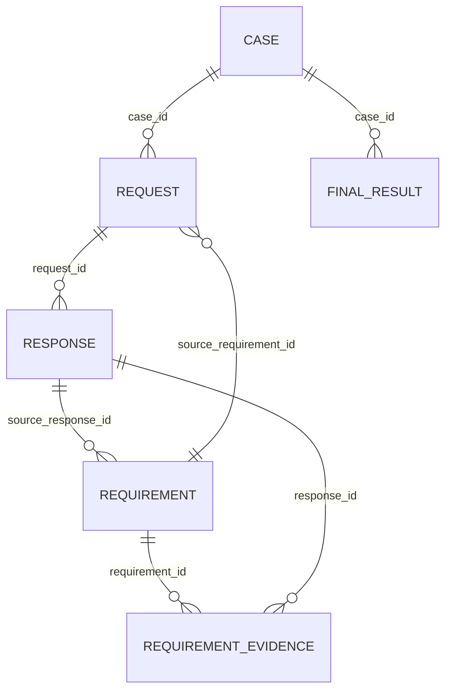

# RCS — Domain Model

**Status:** Draft v1 (design only — no schema, no migrations, no code)
**Target database:** PostgreSQL
**Scope:** Fully local / on-premise LAN case management and interagency workflow system for a municipal urban-planning department (~13 users).

---

## Source-of-truth note (must be read first)

This document was to be derived from `/docs/PROJECT.md` as the authoritative source of truth.
**`/docs/PROJECT.md` does not exist in this repository** (checked on `main`, on this branch, and on
the filesystem; the repository currently contains only `README.md`).

This model was therefore built from the project context supplied in the task description, which
restates the domain principles, core entities and constraints in detail. Nothing here is intended to
contradict `PROJECT.md`. **When `PROJECT.md` is added, this document must be re-checked against it**,
and any divergence resolved in favour of `PROJECT.md`. See Open Question OQ-0.

Everything that could not be answered from the supplied context is recorded in
[10. Open Questions](#10-open-questions) rather than guessed.

---

## 1. Domain Overview

### 1.1 What this model is

RCS records the **official paper trail** of an urban-planning department: what was asked of it, whom
it asked in turn, what came back, what extra conditions were imposed along the way, which files prove
it, who was responsible at each moment, and what was finally decided.

The model is built around one central dossier — the **Case** — and four kinds of fact hanging off it:

| Layer | Entities | Nature |
|---|---|---|
| **Master data** | `organization`, `organization_alias`, `user`, `role`, lookup tables | Slowly changing reference data. Never duplicated per-transaction, never deleted. |
| **The dossier** | `case`, `assignment`, `case_state_change`, `internal_record`, `final_result` | The administrative container and its responsibility/lifecycle history. |
| **The workflow spine** | `request`, `response`, `requirement` | Causality. Why anything happened. This is where the branching, non-linear process lives. |
| **The paper** | `correspondence`, `document`, `document_version`, `document_link` | Official communication events and the files that evidence them. |
| **Accountability** | `audit_event` | Append-only record of who did what, when, to which row, with what before/after state. |

### 1.2 Four ideas that shape everything else

**(a) Tracking units are separate from paper.**
A `request` is an *obligation we are tracking* ("Architecture Authority owes us an opinion, due 14
April"). A `correspondence` is a *physical official letter* that went out or came in. They are not the
same thing and their cardinality is not 1:1 in either direction:

- one outgoing letter may carry **several** requests (we asked one authority for two things at once);
- one incoming letter may constitute **several** responses (one authority answered two of our
  requests, possibly across two cases, in a single letter).

So `request → correspondence` and `response → correspondence` are both **N:1**. This is the single
most important structural decision in the model — it removes the need for a `case ↔ correspondence`
M:N junction in V1 (see §2.8) and keeps deadlines, statuses and requirements attached to the thing
they actually belong to (the tracked obligation), not to a sheet of paper.

**(b) The database stores meaning, not letter text.**
The authoritative wording of any official act is the **signed document** (PDF/scan) in
`document_version`. The database stores structured, queryable *business meaning* around it (who, whom,
when, what kind, what outcome, what deadline). The model must never be read as an attempt to replace
the document with database columns.

**(c) Append, do not overwrite.**
Responses, document versions, assignments, decisions and state changes are **appended**. Records leave
active use through a state (`WITHDRAWN`, `SUPERSEDED`, `VOID`, `INACTIVE`, `ENDED`) plus a
**who/when/why triple**, never through `DELETE` and never by overwriting the previous value.

**(d) Operational progress is derived, not typed in.**
The only stored lifecycle values are small, closed state machines that a human genuinely decides
(`case`, `request`, `requirement`, `document_version`, `final_result`). Everything an observer would
call "progress" — *"waiting for Architecture Authority"*, *"2 of 3 responses received"*, *"1 open
requirement"*, *"ready for final result"* — is **computed** from those rows at read time. See §9.

### 1.3 Entity decisions: what was kept, split, merged, or not created

| Decision | Outcome | Why |
|---|---|---|
| `Correspondence` vs `Document` | **Kept separate** | One official letter legitimately carries a main PDF plus Excel, map, drawing, annexes. Merging them would force one row per file and destroy the identity of the communication event (its letter number, its date, its sender). |
| `Document` vs `DocumentVersion` | **Kept separate** | `document` is the stable business identity ("the utility communication map from the Utility Authority"); `document_version` is an immutable stored file. A revision must not destroy the original. |
| `DocumentLink` | **Added (new entity)** | The same file may legitimately belong to an incoming letter *and* be evidence for a requirement *and* be re-sent as an annex of our outgoing letter. Without a link table the only options are attaching everything to the Case (forbidden) or duplicating files (forbidden). |
| `Response` vs `ResponseVersion` | **`ResponseVersion` NOT created** | Each incoming letter is its own official act with its own number and date. A "revised response" is a *new letter*, not a new version of an old one. Modelled as immutable `response` rows plus a `supersedes_response_id` chain. Full rationale in §5.3. |
| `Requirement` | **Kept as a first-class entity** | It is the branch point of the whole workflow: it is raised by a response, it owns a deadline and a lifecycle, and it spawns child requests. Flattening it into a request field would make "why does this request exist?" unanswerable. |
| `RequirementEvidence` | **Added (new entity)** | A requirement may be satisfied by a response, by a supplied document, or by an internal act — and the same evidence may satisfy two requirements from two authorities. M:N is real here. |
| `Assignment` | **Kept as a table, not an FK** | `case.responsible_user_id` would destroy reassignment history. Temporal assignment rows preserve it and additionally model temporary absence cover. |
| Requester / Supplier / Authority tables | **NOT created** | A single `organization` master table. The role an organization plays is *contextual*, determined by which column references it (`case.requesting_organization_id`, `request.target_organization_id`, `correspondence.sender_organization_id`, …). The department itself is an `organization` row flagged `is_own_organization`. |
| `FinalResult` vs `Case` fields | **Kept separate** | A decision has its own approval metadata, its own dispatch letter, its own documents, and can be superseded (correction, appeal outcome). Inlining it would bloat `case` and make revision history impossible. |
| `Decision` vs `FinalResult` | **Merged into one entity** (`final_result`) | The supplied context names them as alternatives, not as two distinct things. One entity with a `decision_type` vocabulary covers approval, refusal, partial approval, termination. |
| `CaseStateChange` | **Added (recommended)** | Business reporting (time in `ON_HOLD`, reopening, cycle time) should not depend on parsing `audit_event` JSONB. Audit exists for accountability; this exists for business questions. |
| `InternalRecord` | **Added** | The context list for documents includes "supporting records" — internal notes, phone calls, site visits, internal memos. Without this entity such files would have no lawful home other than the Case, which is forbidden. |
| `OrganizationAlias` | **Added** | Authorities are renamed and reorganised; old letters must stay findable under the old name without creating a second organization row. |
| `UserRole` (temporal) | **Added** | Role grants change; the audit trail must be able to say what role someone held at the time they acted. |
| Workflow engine / JSON graph | **NOT created** | Causality is expressed with explicit foreign keys (`request.source_requirement_id`, `requirement.source_response_id`, `response.request_id`). See §6. |

### 1.4 Modelling conventions

These conventions apply to every entity in §2 and are not repeated there.

**Identifiers**
- Every table has `id uuid PRIMARY KEY`, generated as **UUIDv7** (time-ordered, so it behaves well in
  B-tree indexes and keeps insert locality; a random UUIDv4 would fragment indexes for no benefit
  here). If the deployed PostgreSQL version lacks native `uuidv7()`, generate it in the application or
  via a small SQL function — the *format* is the commitment, not the generator.
- Rejected alternative: `bigint GENERATED ALWAYS AS IDENTITY`. It is cheaper, but sequential integers
  leak volume and make record identity guessable in URLs on a shared LAN, and they complicate any
  future export/merge of dossiers between systems. If it is ever chosen, a separate public `uuid`
  column becomes mandatory.
- Foreign keys are named `<referenced_entity>_id`, with role prefixes where a table references the
  same entity twice (`sender_organization_id`, `recipient_organization_id`).

**Business numbers are never primary keys**
- `case.case_number`, `correspondence.registry_number`, `correspondence.letter_number`,
  `request.request_number`, `final_result.result_number` are human-facing identifiers with their own
  unique constraints. They are **never** used as foreign keys. Their format and their yearly reset
  rules may change by decree without touching a single relationship. (Numbering rules themselves are
  OQ-7.)
- `letter_number` is the *counterparty's* number as printed on their letter; `registry_number` is
  *our* internal registration number. They are different columns and neither is unique on its own
  across all time (OQ-7).

**Time: business time vs system time**
- All timestamps are `timestamptz`. Dates that exist on paper without a time (a letter's own date) are
  `date`.
- `occurred_at`-family columns record **when the business fact happened** (letter signed, letter
  received at the front desk, opinion given, responsibility handed over). They are entered by a human
  and may be in the past.
- `recorded_at`-family columns record **when the system learned about it** (`DEFAULT now()`, never
  editable).

| Entity | Business time (`occurred_at` family) | System time (`recorded_at` family) |
|---|---|---|
| `case` | `registered_at`, `closed_at` | `created_at`, `updated_at` |
| `correspondence` | `letter_date`, `sent_at`, `received_at` | `registered_at`, `created_at` |
| `request` | `sent_at` (from dispatch letter), `due_at` | `created_at` |
| `response` | `received_at`, `response_date` | `recorded_at` |
| `requirement` | `raised_at`, `due_at`, `resolved_at` | `created_at` |
| `document_version` | `document_date` (date on the file, if any) | `uploaded_at` |
| `assignment` | `valid_from`, `valid_until` | `recorded_at` |
| `final_result` | `decided_at`, `issued_at` | `created_at` |
| `audit_event` | `occurred_at` | `recorded_at` |

**Vocabularies: `CHECK`-constrained text vs lookup table**

A deliberate rule, applied consistently:

- **Closed state machines the application branches on** → `text` column + `CHECK (col IN (…))`.
  These are `case.lifecycle_state`, `request.status`, `requirement.status`, `response.status`,
  `document_version.status`, `final_result.status`, `correspondence.status`, `assignment.status`,
  `correspondence.direction`. Adding a value is a code change anyway, so a lookup table would give
  false flexibility; `text` + `CHECK` keeps dumps readable and avoids native-enum ordering and
  drop-value pitfalls.
- **Open vocabularies that clerks classify with and that will evolve** → **lookup tables**
  (`code`, `label`, `description`, `sort_order`, `is_active`, `valid_from`, `valid_to`).
  These are: `correspondence_kind`, `response_type`, `response_outcome`, `requirement_origin_type`,
  `document_link_role`, `document_kind`, `organization_type`, `case_type`, `closure_type`,
  `assignment_role`, `assignment_end_reason`, `decision_type`, `deadline_basis`,
  `internal_record_type`, `void_reason`, `withdrawal_reason`.
  Lookup rows are **deactivated, never deleted** — historical rows must keep resolving.

**No hard delete**
- No business row is ever physically deleted. Retirement is a state plus a who/when/why triple:
  `*_at`, `*_by_user_id`, `*_reason_code`, `*_note`.
- All business foreign keys are `ON DELETE RESTRICT` (or `NO ACTION`). **No `ON DELETE CASCADE`
  anywhere in the business schema.** Physical deletion, if ever permitted, is a retention-policy
  operation outside this model (OQ-9).

**Common columns on every business table**
`created_at timestamptz`, `created_by_user_id uuid`, `updated_at timestamptz`,
`updated_by_user_id uuid`, `row_version integer` (optimistic concurrency; also written into
`audit_event.entity_version` so an audit entry can be tied to an exact row state).

**Exclusive arcs instead of generic polymorphism**
Three tables (`document_link`, `assignment`, `requirement_evidence`) attach to one of several possible
parents. They do **not** use `entity_type text + entity_id uuid`. They use several nullable, real
foreign-key columns plus `CHECK (num_nonnulls(a_id, b_id, …) = 1)` and a `scope`/`role` discriminator.
This keeps real referential integrity, real indexes and real joins. The **only** place generic
`entity_type + entity_id` is permitted is `audit_event`, and that exception is justified in §2.18.

**Denormalised scope columns**
`requirement.case_id` and `audit_event.case_id` are denormalised for permission filtering and
dashboards. They are caches of an authoritative path and must never contradict it; the invariant is
stated with the entity. No other denormalisation is authorised in V1.

---

## 2. Entity List

Each entity is described as **Purpose / Key fields / Owns / References / Invariants**.
"Owns" = rows that have no meaning without this row. "References" = master data or peers it points at.

### 2.1 `organization`

**Purpose.** Master data for every external (and one internal) party: state authorities, utility
companies, municipal departments, legal entities — and the department itself. An organization's *role*
is never stored on the organization; it is implied by the relationship that references it.

**Key fields.**
`id`, `official_name`, `short_name`, `organization_type_id` → `organization_type`,
`registration_code` (national registry/tax code, nullable, unique when present),
`parent_organization_id` (nullable self-FK — a directorate inside an authority),
`is_own_organization boolean NOT NULL DEFAULT false`,
`postal_address`, `email`, `phone` (nullable — contact detail, not identity),
`is_active boolean NOT NULL DEFAULT true`, `deactivated_at`, `deactivated_by_user_id`,
`deactivation_reason_note`, `notes`.

**Owns.** `organization_alias` rows.
**References.** `organization_type`, itself (`parent_organization_id`).
**Invariants.**
- Exactly one row may have `is_own_organization = true` → partial unique index. This row is the
  department; it is the sender of every outgoing letter and the recipient of every incoming one.
- Deactivation (`is_active = false`) blocks *new* references only. Existing cases, letters and requests
  keep pointing at it forever.
- No duplicate rows per role. The Architecture Authority that answers a request is the *same row* as
  the Architecture Authority that later raises a requirement.
- Whether private individuals are ever a party (which would make this a *party* master table) is
  **OQ-1**.

### 2.2 `organization_alias`

**Purpose.** Former names, abbreviations, transliterations and common misspellings, so a letter filed
in 2019 under an old authority name is still findable and is not re-keyed as a new organization.

**Key fields.** `id`, `organization_id`, `alias`, `alias_type` (`FORMER_NAME` | `ABBREVIATION` |
`TRANSLITERATION` | `MISSPELLING`), `valid_from date`, `valid_to date` (nullable), `is_active`.

**References.** `organization`.
**Invariants.** An alias never migrates to a different organization; if an authority is split, the new
organization gets its own row and the alias records the historical relationship on the old one.

### 2.3 `user`

**Purpose.** An employee of the department who can act in the system. Users are **deactivated, never
deleted**, so that every audit entry, upload, assignment and decision keeps resolving to a real
identity.

**Key fields.**
`id`, `username` (unique, login identity), `employee_number` (nullable, unique),
`full_name`, `display_name`, `job_title`, `email_internal`, `phone_internal`,
`status` (`ACTIVE` | `SUSPENDED` | `DEACTIVATED`),
`deactivated_at`, `deactivated_by_user_id`, `deactivation_reason_note`,
`created_at`, `created_by_user_id`.

**Owns.** `user_role` rows.
**References.** itself (`deactivated_by_user_id`).
**Invariants.**
- `DEACTIVATED` users cannot receive new assignments and cannot authenticate, but remain referenced by
  history.
- Authentication secrets (password hash, lockout counters, session records) are **deliberately not
  modelled here**; they belong to the security design and must live in a separate table so that this
  table can be read freely for display purposes.

### 2.4 `role` and `user_role`

**Purpose.** Conceptual roles only: `WORKER`, `CHIEF`, `HEAD`, `TECH_ADMIN`. No permission engine is
designed here — permissions belong to `/docs/PERMISSIONS.md`.

**`role` key fields.** `id`, `code` (unique), `name`, `description`, `rank smallint`, `is_active`.
**`user_role` key fields.** `id`, `user_id`, `role_id`, `valid_from`, `valid_until` (nullable = current),
`granted_by_user_id`, `revoked_by_user_id`, `revocation_reason_note`, `recorded_at`.

**Invariants.**
- Role grants are **temporal**, so audit can answer "what role did this person hold when they acted?".
- A user may hold more than one role at a time (a Chief who also acts as a Worker on their own cases).
- **What future authorization will need, and which this model already provides:** the acting user's
  roles at time *t* (`user_role`), whether the user is currently assigned to the case
  (`assignment`), whether the case is restricted (`case.is_restricted`), the case's owning
  organizational context, and the entity's own lifecycle state. Nothing in this model forces
  permissions to be role-only.

### 2.5 `case`

**Purpose.** The **dossier**. One official incoming request from one requesting organization, and
everything the department did about it. It is a thin administrative header — deliberately small.

**What belongs directly on `case`.**

| Field | Notes |
|---|---|
| `id` | UUIDv7 PK |
| `case_number` | business-facing, unique, never an FK |
| `title` | short human label for lists and screens |
| `subject` | what is actually being asked for (longer, searchable) |
| `case_type_id` | → `case_type` lookup (nullable if the department does not classify) |
| `requesting_organization_id` | → `organization`; **required**, the party the case is for |
| `applicant_reference` | the requester's own reference, if they quote one |
| `lifecycle_state` | `REGISTERED` \| `ACTIVE` \| `ON_HOLD` \| `CLOSED` \| `CANCELLED` — the only stored status |
| `hold_reason_note`, `hold_until` | meaningful only while `ON_HOLD` |
| `registered_at` | business time the case was opened |
| `statutory_due_at` | the department's own deadline for the whole case (nullable; see OQ-5) |
| `is_restricted` | boolean; restricted dossier flag |
| `restriction_reason_note`, `restricted_by_user_id`, `restricted_at`, `restriction_lifted_at` | restriction metadata |
| `closed_at`, `closed_by_user_id`, `closure_type_id`, `closure_note` | closure metadata |
| `merged_into_case_id` | nullable self-FK, set only with `closure_type = MERGED` |
| `created_at`, `created_by_user_id`, `updated_at`, `updated_by_user_id`, `row_version` | conventions |

**What must never live directly on `case`.**

| Anti-field | Correct home | Why |
|---|---|---|
| `responsible_user_id` | `assignment` | A mutable FK destroys reassignment history (principle 13) |
| `architecture_response_status`, `utility_response_status`, … | `request` + `response` rows | Per-authority columns make the schema change every time a new authority is involved |
| `open_requirements_count`, `progress_text`, `percent_complete` | derived at read time (§9) | Stored progress drifts and becomes a lie |
| `file_path`, `main_document_id`, `attachments` | `document_link` | Files must carry their real business context (principle 9) |
| `requesting_organization_name` (text) | `organization` FK | Free-text org names are forbidden (principle 12) |
| `final_decision_text`, `decision_date` | `final_result` | Decisions are supersedable and separately approved |
| `deadline_for_architecture`, … | `request.due_at` | Deadlines belong to the obligation they constrain |
| the incoming letter's text/attachments | `correspondence` + `document` | The letter is an event with its own identity |

**Does the case need an "original incoming correspondence"?** Yes, but **not as a column on `case`**.
It is `correspondence` with `direction = 'IN'`, `correspondence_kind = 'INITIATING'` and
`case_id = this case`, constrained by a **partial unique index on `correspondence(case_id) WHERE
correspondence_kind = 'INITIATING'`**. This guarantees *at most one* initiating letter per case without
creating a circular `case ↔ correspondence` foreign-key pair that every insert would have to defer.

**Does the case need a "final result" pointer?** Same treatment: no column on `case`. `final_result`
rows point at the case, with a **partial unique index on `final_result(case_id) WHERE status =
'ISSUED'`**, so at most one result is in force while superseded ones remain.

**Owns.** `assignment`, `case_state_change`, `request`, `requirement`, `correspondence`,
`internal_record`, `final_result` rows.
**References.** `organization` (requester), `case_type`, `closure_type`, `user` (closer), itself (merge).
**Invariants.**
- `CLOSED` requires closure metadata and no `request` or `requirement` in a non-terminal state
  (see §5.1); `CANCELLED` is the escape hatch that does not require that.
- `is_restricted` is the case-level flag only; whether individual documents can be separately
  restricted is **OQ-4**.

### 2.6 `case_state_change`

**Purpose.** Business-readable lifecycle history of a case: time spent `ON_HOLD`, reopening after
closure, who cancelled and why. Deliberately separate from `audit_event`, which exists for
accountability and stores JSONB — unsuitable for routine business reporting.

**Key fields.** `id`, `case_id`, `from_state`, `to_state`, `reason_code`, `note`,
`occurred_at`, `recorded_at`, `actor_user_id`.
**Invariants.** Append-only. `case.lifecycle_state` always equals the `to_state` of the latest row.

### 2.7 `assignment`

**Purpose.** *Who is responsible, for what, from when, until when, and why it changed.* Replaces every
mutable "responsible employee" foreign key in the model.

**Key fields.**
`id`, `scope` (`CASE` | `REQUEST` | `REQUIREMENT`),
`case_id`, `request_id`, `requirement_id` — nullable, **exclusive arc**:
`CHECK (num_nonnulls(case_id, request_id, requirement_id) = 1)` and `scope` must match the non-null one,
`assignee_user_id`, `assignment_role_id` → `assignment_role`
(`RESPONSIBLE` | `CO_WORKER` | `SUPERVISOR` | `TEMPORARY_COVER` | `OBSERVER`),
`covers_assignment_id` (nullable self-FK — the assignment this cover stands in for),
`assigned_by_user_id`, `valid_from timestamptz NOT NULL`, `valid_until timestamptz` (NULL = current),
`end_reason_id` → `assignment_end_reason` (`REASSIGNED` | `ABSENCE_COVER_ENDED` | `CASE_CLOSED` |
`USER_DEACTIVATED` | `CORRECTION`), `reason_note`, `ended_by_user_id`,
`status` (`ACTIVE` | `ENDED` | `VOID`), `recorded_at`.

**References.** `case` / `request` / `requirement`, `user` (assignee, assigner, ender), `assignment_role`.
**Invariants.**
- **Never updated to reassign.** Reassignment = close the current row (`valid_until`, `end_reason`)
  and insert a new one. The old row stays forever.
- At most one `ACTIVE` `RESPONSIBLE` assignment per scoped entity at any instant. Enforced with an
  `EXCLUDE` constraint over `(case_id WITH =, tstzrange(valid_from, valid_until) WITH &&)` filtered to
  `assignment_role = RESPONSIBLE AND status = 'ACTIVE'` (requires `btree_gist`). This enforces
  *non-overlapping history*, which a simple partial unique index on `valid_until IS NULL` would not.
- **Temporary cover does not end the responsible assignment.** A `TEMPORARY_COVER` row coexists with
  it and points at it via `covers_assignment_id`, so the record still shows who the substantive owner
  was during an absence. Whether cover carries the owner's authority is a permissions question, not a
  domain one.
- `request` and `requirement` inherit the case's responsible user by default; they only get their own
  `assignment` row when a *different* person chases them. There is no responsible-user column on
  either.

### 2.8 `correspondence`

**Purpose.** One **official communication event** — a letter that left the department or arrived at
it. It is the registry-level record of the paper, not of the obligation.

**Key fields.**
`id`, `case_id` (owning case; `NOT NULL` in V1 — see **OQ-10**), `direction` (`IN` | `OUT`), `correspondence_kind_id` →
`correspondence_kind` (`INITIATING` | `OUTGOING_REQUEST` | `INCOMING_RESPONSE` | `REMINDER` |
`WITHDRAWAL` | `FINAL_RESULT_DISPATCH` | `INFORMATIONAL` | `INTERNAL_MEMO`),
`sender_organization_id`, `recipient_organization_id`,
`letter_number` (counterparty's number as printed), `letter_date date`,
`registry_number` (our registration number), `registered_at`, `registered_by_user_id`,
`sent_at` (OUT), `received_at` (IN), `delivery_method_id` (nullable; courier, post, hand, e-doc),
`subject`, `summary`,
`parent_correspondence_id` (nullable self-FK — the letter this one answers or chases),
`status` (`DRAFT` | `REGISTERED` | `SENT` | `RECEIVED` | `WITHDRAWN` | `SUPERSEDED` | `VOID`),
`supersedes_correspondence_id`, withdrawal/void who-when-why triples,
`created_at`, `created_by_user_id`, `row_version`.

**Owns.** Its `document_link` rows with role `PRIMARY_LETTER` / `ATTACHMENT` / `ANNEX`.
**References.** `case`, `organization` ×2, itself (parent, supersedes), `correspondence_kind`.
**Invariants.**
- `direction = 'OUT'` ⟹ `sender_organization_id` = the `is_own_organization` row;
  `direction = 'IN'` ⟹ `recipient_organization_id` = that row. Both columns are `NOT NULL` — modelling
  the department as an organization removes every nullable-party special case.
- `sender_organization_id <> recipient_organization_id`.
- `sent_at` required once `status = 'SENT'`; `received_at` required once `status = 'RECEIVED'`.
- A letter is **withdrawn** (we recalled it) or **superseded** (a corrected letter replaced it) — never
  edited into a different letter and never deleted.

**Should `correspondence` be M:N with `case`, or keep one primary case relation?**

**Decision for V1: one owning `case_id` (`NOT NULL`), plus a designed-but-not-built escape hatch.**

*Why one owning case:*
- The registry model of a public body is "each registered letter is filed in exactly one dossier".
  The owning case is what the registry number, the paper file and the archive copy follow.
- Every permission check, every list screen and every restricted-case filter becomes a single
  indexed column instead of an EXISTS over a junction.
- "Print the case file" has an unambiguous definition.

*What M:N would buy, and why we do not need it yet:* the genuine multi-case letter is *"one authority
answered two of our requests in one letter"*. That is already handled **without** a junction, because
`response` is per-`request` and `response → correspondence` is N:1: the clerk registers the letter once
and records two `response` rows, which may belong to requests in two different cases. Registering it
once means the attached map is stored once and linked, never copied.

*The residual gap:* a letter that concerns a second case but generates no response there (a pure
cross-reference). For that, `correspondence_case_link (correspondence_id, case_id, relation_type,
note, linked_by_user_id, linked_at)` is specified in Appendix C and left unbuilt in V1.

*Cost of full M:N from day one:* the junction would still need a `is_primary` flag for numbering and
filing, so we would pay for both models at once; every query gains a join; restricted-case filtering
becomes an aggregate. Not worth it before the requirement is proven. Note the deliberate consequence:
`correspondence.case_id` (where the paper is filed) may differ from `response.request.case_id` (which
obligation it discharges). That is allowed and intended.

### 2.9 `request`

**Purpose.** An official request **sent by the department to an external authority**, tracked as an
obligation with a deadline and an expected answer. Both top-level and requirement-driven requests are
the same entity.

**Key fields.**
`id`, `case_id` **NOT NULL**, `request_number` (business-facing),
`target_organization_id` **NOT NULL** → `organization`,
`source_requirement_id` **NULLABLE** → `requirement`
&nbsp;&nbsp;• `NULL` = **top-level** request created directly from the case
&nbsp;&nbsp;• set = **child** request created to satisfy that requirement,
`dispatch_correspondence_id` **NULLABLE** → `correspondence` (the outgoing letter that carried it;
NULL while the request is still `DRAFT`),
`subject`, `requested_items_note`,
`due_at` (current response deadline), `original_due_at`, `deadline_basis_id` → `deadline_basis`
(`STATUTORY` | `INTERNAL` | `AGREED`), `deadline_note`,
`status` (`DRAFT` | `SENT` | `ANSWERED` | `CLOSED` | `WITHDRAWN` | `VOID`),
`closed_at`, `closed_by_user_id`, `closure_note`,
withdrawal/void who-when-why triples,
`created_at`, `created_by_user_id`, `row_version`.

**Owns.** `response` rows; its own `assignment` rows (if separately assigned).
**References.** `case`, `organization`, `requirement` (source), `correspondence` (dispatch).
**Invariants.**
- `source_requirement_id IS NOT NULL ⟹ requirement.case_id = request.case_id` (a requirement cannot
  spawn a request in someone else's dossier).
- `dispatch_correspondence_id IS NOT NULL ⟹` that correspondence has `direction = 'OUT'` and
  `recipient_organization_id = request.target_organization_id` and the same `case_id`.
- **N:1 to the dispatch letter is intentional.** Two requests to the same authority may share one
  letter. Deadlines and statuses stay on the request, so each tracked item can be answered and closed
  independently even though one envelope carried both.
- `status = 'SENT'` requires a dispatch correspondence with a `sent_at`.
- **No responsible-employee column** — see §2.7.
- `OVERDUE` is **not** a stored status (see §9).

**Closure rule.** A request may move to `CLOSED` only when *all* of the following hold:
1. it has at least one `ACTIVE` `response` flagged `is_conclusive` (or it is being closed as
   `WITHDRAWN` / `VOID`, which are different states, not closure); **and**
2. every `requirement` whose `source_response_id` belongs to this request is in a terminal state
   (`FULFILLED`, `WAIVED`, `VOID`, `FAILED`); **and**
3. a user with the right to close it records `closed_by_user_id` and `closed_at`.

Condition 2 is the rule that keeps the branching workflow honest: an authority's "final opinion" does
not close our tracking while the conditions it attached are still open.

### 2.10 `response`

**Purpose.** One **official answer event** against one request. Append-only. Several responses to the
same request over time are normal and expected.

**Key fields.**
`id`, `request_id` **NOT NULL**, `correspondence_id` **NOT NULL** (the incoming letter carrying it),
`response_type_id` → `response_type` (`ACKNOWLEDGEMENT` | `INITIAL` | `PARTIAL` | `CLARIFICATION` |
`REVISION` | `ADDITIONAL_DOCUMENT` | `FINAL_OPINION` | `REFUSAL` | `DEADLINE_EXTENSION`),
`response_outcome_id` → `response_outcome` (`POSITIVE` | `NEGATIVE` | `CONDITIONAL` | `INFORMATIONAL` |
`REFUSED` | `NOT_APPLICABLE`),
`is_conclusive boolean NOT NULL` — does this answer discharge the request?
(defaulted from `response_type.is_conclusive_default`, stored on the row because it drives lifecycle),
`summary` (the clerk's structured reading of the letter; **not** a copy of the letter),
`response_date date` (date on the letter), `received_at`, `recorded_at`, `recorded_by_user_id`,
`supersedes_response_id` (nullable self-FK),
`status` (`ACTIVE` | `SUPERSEDED` | `VOID`), `void_reason_id`, `void_note`, `voided_by_user_id`,
`voided_at`.

**Owns.** `requirement` rows it raises.
**References.** `request`, `correspondence`, itself (supersession), lookups, `user`.
**Invariants.**
- **Business facts are immutable.** After insert, only the status transitions
  (`ACTIVE → SUPERSEDED`, `ACTIVE → VOID`) and their who/when/why columns may be written. Every such
  write is audited.
- `supersedes_response_id` ⟹ same `request_id`, and the superseded row moves to `SUPERSEDED`
  (it is never deleted, never edited, and remains fully readable).
- `correspondence.direction = 'IN'`.
- **N:1 to correspondence is intentional** — one incoming letter may carry several responses, possibly
  against requests in different cases. This is the mechanism that makes a `case ↔ correspondence`
  M:N junction unnecessary (§2.8).
- A `VOID` response's requirements are **not** auto-voided. The application must surface them for
  human review; silently cascading business meaning is exactly the kind of hidden rule this model
  avoids. No database cascade exists.

### 2.11 `requirement`

**Purpose.** Something that must happen before a workflow branch can continue: *provide a communication
map*, *provide an additional reference*, *obtain another authority's opinion*, *submit a supporting
document*. This is the entity that makes the workflow non-linear.

**Key fields.**
`id`, `case_id` **NOT NULL** (denormalised scope — see invariants),
`requirement_origin_type_id` → `requirement_origin_type`
(`RESPONSE` | `INCOMING_REQUEST` | `INTERNAL` | `REGULATION`),
`source_response_id` **NULLABLE** → `response` (**required when origin = `RESPONSE`**),
`raised_by_organization_id` (nullable — the authority demanding it; NULL for internally raised),
`addressed_to_organization_id` (nullable — who is expected to supply it: another authority, or the
requesting organization),
`title`, `description`,
`is_blocking boolean NOT NULL DEFAULT true` — does it block the final result?
`raised_at`, `due_at`, `deadline_basis_id`,
`status` (`OPEN` | `IN_PROGRESS` | `FULFILLED` | `WAIVED` | `VOID` | `FAILED`),
`started_at`,
`resolved_at`, `resolved_by_user_id`, `resolution_note`,
`waiver_authorised_by_user_id`, `waiver_reason_id` (waiver accountability),
`void_reason_id`, `voided_by_user_id`,
`failure_reason_note`,
`created_at`, `created_by_user_id`, `row_version`.

**Owns.** `requirement_evidence` rows; child `request` rows point back at it.
**References.** `case`, `response` (source), `organization` ×2, lookups, `user`.
**Invariants.**
- `requirement_origin_type = 'RESPONSE' ⟹ source_response_id IS NOT NULL`, and
  `source_response.request.case_id = requirement.case_id`. The denormalised `case_id` is justified
  because (a) internally raised requirements have no response path to the case at all, and (b) every
  dashboard and permission filter needs it; it must never contradict the source path.
- **One source response per requirement.** If two authorities independently demand the same map, that
  is **two** requirements — each is separately waivable, separately fulfillable and separately owed to
  a different authority. They may share the *same evidence*, because `requirement_evidence` is M:N.
- A requirement may exist with **no** child request (the requester supplies the document directly) and
  with **several** child requests (the first authority could not supply it, so a second was asked).

**`WAIVED` vs `VOID` — the distinction, stated precisely.**

| | `WAIVED` | `VOID` |
|---|---|---|
| Was the requirement ever real? | **Yes.** It was validly raised and genuinely owed. | **No.** It should never have existed, or its basis disappeared. |
| What ended it? | A **decision** by an authorised person to release the obligation ("the map is unnecessary for this site"). | A **correction**: entered in error, duplicate, or the source response was itself voided/superseded so the demand no longer applies. |
| Required metadata | `waiver_authorised_by_user_id`, `waiver_reason_id`, `resolution_note`. Accountability is the point. | `void_reason_id`, `voided_by_user_id`, `void note`. Data-quality trail is the point. |
| Does it count as an obligation in history/statistics? | **Yes** — it was owed and released. It appears in "requirements raised" reports. | **No** — it is excluded from business statistics, but the row and its audit trail remain visible. |
| Evidence | None needed; the justification *is* the waiver. | None; evidence, if any was attached, stays linked but is no longer proof of anything. |

`FAILED` is a third terminal state and is neither: the requirement was real, was **not** released, and
could **not** be satisfied (the authority refused, or the deadline passed with no path forward). It is
the state that legitimately drives a negative or partial final result, so it must not be blurred into
`WAIVED`.

### 2.12 `requirement_evidence`

**Purpose.** What actually proves a requirement was met. Separate table because evidence is M:N: one
map may satisfy two authorities' requirements, and one requirement may need several pieces.

**Key fields.**
`id`, `requirement_id` **NOT NULL**,
`evidence_type` (`RESPONSE` | `DOCUMENT` | `INTERNAL_ACT`),
`response_id`, `document_id`, `internal_record_id` — nullable **exclusive arc**,
`document_version_id` (nullable — pins the exact version that was accepted as proof; see §7),
`note`, `is_primary boolean`,
`recorded_by_user_id`, `recorded_at`,
`status` (`ACTIVE` | `RETRACTED`), `retracted_by_user_id`, `retracted_at`, `retraction_note`.

**Invariants.**
- `CHECK (num_nonnulls(response_id, document_id, internal_record_id) = 1)` and matching `evidence_type`.
- `document_version_id IS NOT NULL ⟹ document_version.document_id = document_id`.
- Evidence is **retracted**, never deleted — a requirement that was wrongly marked fulfilled must show
  that it once was, and why that was withdrawn.
- `requirement.status = 'FULFILLED'` requires at least one `ACTIVE` evidence row **or** an explicit
  `resolution_note` (some fulfilments are self-evident from a child request's response, which is
  itself recorded as evidence of type `RESPONSE`).

### 2.13 `document`

**Purpose.** The **stable business identity of a file** — "the utility communication map issued by the
Utility Authority for case 2026/114". It is not the bytes and it is not the letter. It survives
revision.

**Key fields.**
`id`, `document_kind_id` → `document_kind` (`LETTER_BODY` | `MAP` | `DRAWING` | `SPREADSHEET` |
`PHOTO` | `CERTIFICATE` | `PERMIT` | `OTHER`),
`title`, `description`,
`issuing_organization_id` (nullable — who produced it, when that is known and matters),
`document_reference` (the issuer's own reference/number on the file, nullable),
`status` (`ACTIVE` | `WITHDRAWN` | `VOID`), withdrawal/void who-when-why triples,
`created_at`, `created_by_user_id`, `row_version`.

**Owns.** `document_version` rows (its content history) and `document_link` rows (its contexts).
**References.** `document_kind`, `organization` (issuer).
**Invariants.**
- **`document` has no `case_id` and no `correspondence_id`.** All business context comes from
  `document_link`. This is the structural guarantee that "everything is attached to the case" cannot
  happen by accident.
- Every `document` must have **at least one `ACTIVE` `document_link`**, exactly one of which is flagged
  `is_origin` (where the file entered the system). This is an application-enforced invariant with a
  deferred-constraint or trigger option; it cannot be expressed as a plain `NOT NULL`.
- A document with no `ACTIVE` version is still a valid historical row (everything was withdrawn); it is
  not deleted.

### 2.14 `document_version`

**Purpose.** One **immutable stored file**. Metadata in PostgreSQL, **bytes on the local filesystem**.

**Key fields.**
`id`, `document_id` **NOT NULL**, `version_no integer NOT NULL` (1, 2, 3 … per document),
`original_filename` (exactly as the user or authority supplied it),
`stored_relative_path` (path under the managed storage root — never an absolute host path),
`storage_volume_code` (which configured storage root, so the root can be moved without rewriting rows),
`content_hash` **NOT NULL** + `hash_algorithm` (`SHA256` default),
`byte_size bigint`, `mime_type`, `page_count` (nullable),
`document_date date` (the date printed on the file, if any — business time),
`uploaded_at`, `uploaded_by_user_id` (system time + actor),
`supersedes_version_id` (nullable self-FK),
`status` (`ACTIVE` | `SUPERSEDED` | `WITHDRAWN`),
`withdrawn_at`, `withdrawn_by_user_id`, `withdrawal_reason_id`, `withdrawal_note`,
`integrity_checked_at` (nullable — last time bytes were verified against `content_hash`).

**References.** `document`, `user`, itself.
**Invariants.**
- **No binary column.** No `bytea`, no large object. PostgreSQL stores metadata only.
- A version row is **never updated** except for its status transition and integrity-check timestamp.
  A corrected file is a **new version**, so the original remains retrievable.
- `UNIQUE (document_id, version_no)`.
- At most one `ACTIVE` version per document at a time → partial unique index on
  `document_version(document_id) WHERE status = 'ACTIVE'`. Superseded and withdrawn versions remain,
  with their bytes.
- `content_hash` is recorded at upload and is what `audit_event.document_hash` refers to, so an audit
  entry can be tied to exact bytes.
- *Optional, deferred:* if byte-level deduplication is ever wanted, split a `storage_object` table
  keyed by `content_hash` and let versions reference it. Not needed at this scale; noted so it is not
  reinvented badly later.

### 2.15 `document_link`

**Purpose.** Attaches a document to its **real business context** — and allows the same file to serve
several contexts without being copied.

**Key fields.**
`id`, `document_id` **NOT NULL**,
`document_version_id` **NULLABLE** — NULL means "follows the document's current active version";
set means "pinned to exactly this version" (used for evidence and issued results),
`correspondence_id`, `requirement_id`, `request_id`, `response_id`, `final_result_id`,
`internal_record_id`, `case_id` — nullable **exclusive arc**,
`document_link_role_id` → `document_link_role` (`PRIMARY_LETTER` | `ATTACHMENT` | `ANNEX` |
`REQUIREMENT_EVIDENCE` | `FINAL_RESULT_DOCUMENT` | `SUPPORTING` | `WORKING_COPY`),
`is_origin boolean NOT NULL DEFAULT false`,
`ordinal smallint` (display order within a letter),
`linked_by_user_id`, `linked_at`,
`status` (`ACTIVE` | `REMOVED`), `removed_by_user_id`, `removed_at`, `removal_reason_note`.

**Invariants.**
- `CHECK (num_nonnulls(correspondence_id, requirement_id, request_id, response_id, final_result_id,
  internal_record_id, case_id) = 1)`.
- `case_id` as a link target is permitted **only** with role `SUPPORTING` or `WORKING_COPY` — it is the
  narrow, explicitly-labelled exception, not the default dumping ground. A scanned letter attached
  straight to the case with no correspondence is a data-entry error, and the model is arranged so that
  it looks like one.
- At most one `ACTIVE` link per document with `is_origin = true` → partial unique index.
- At most one `ACTIVE` `PRIMARY_LETTER` link per correspondence → partial unique index.
- Links are **removed** (status), never deleted, so "this map used to be filed under that letter" stays
  answerable.
- Permission scoping for a document resolves *through* its links; if that ever becomes slow, add a
  materialised `document_case_visibility` view — never a denormalised `document.case_id`.

### 2.16 `final_result`

**Purpose.** The department's **decision / final result** for a case: what was decided, by whom,
approved by whom, and which letter conveyed it to the requester.

**Key fields.**
`id`, `case_id` **NOT NULL**, `result_number` (business-facing),
`decision_type_id` → `decision_type` (`APPROVAL` | `REFUSAL` | `PARTIAL_APPROVAL` |
`RETURNED_WITHOUT_REVIEW` | `TERMINATED`),
`summary`, `reasoning`,
`decided_at`, `decided_by_user_id`, `approved_by_user_id`, `approved_at`,
`issued_at`, `dispatch_correspondence_id` (nullable → the outgoing letter to the requester),
`status` (`DRAFT` | `ISSUED` | `SUPERSEDED` | `REVOKED` | `VOID`),
`supersedes_final_result_id` (nullable self-FK),
`revoked_at`, `revoked_by_user_id`, `revocation_reason_note`,
`created_at`, `created_by_user_id`, `row_version`.

**Owns.** Its `document_link` rows (the signed decision and its annexes).
**References.** `case`, `decision_type`, `correspondence`, `user` ×3, itself.
**Invariants.**
- At most one `ISSUED` result per case at a time (partial unique index). Superseded and revoked results
  stay, fully readable.
- A correction or appeal outcome is a **new row** with `supersedes_final_result_id` set — never an edit.
- `case.lifecycle_state = 'CLOSED'` does not *require* an issued result (a case may be cancelled or
  withdrawn); whether it should is **OQ-6**.

### 2.17 `internal_record`

**Purpose.** Internal, non-correspondence business events that nevertheless carry documents or
justify decisions: file notes, phone calls, meetings, site visits, internal memos. Without this
entity, such files would have no lawful context except the case, which principle 9 forbids.

**Key fields.**
`id`, `case_id` **NOT NULL**, `internal_record_type_id` → `internal_record_type`
(`NOTE` | `PHONE_CALL` | `MEETING` | `SITE_VISIT` | `INTERNAL_MEMO` | `CALCULATION`),
`subject`, `body`, `occurred_at`, `recorded_at`, `author_user_id`,
`related_request_id`, `related_requirement_id` (both nullable — soft context, not an arc),
`status` (`ACTIVE` | `VOID`), void triple.

**Invariants.** Append-only in practice; corrections are new rows referencing the old one in `body` or
via `audit_event`.

### 2.18 `audit_event`

**Purpose.** Append-only accountability record: *who did what, to which row, when, from what value to
what value*. Designed in from the start, as required.

**Key fields.**
`event_seq bigint GENERATED ALWAYS AS IDENTITY` — **the monotonic event sequence**, the ordering
authority for the whole log,
`id uuid` (stable external identifier),
`occurred_at`, `recorded_at`,
`actor_user_id` (nullable — NULL only for `SYSTEM` actions), `actor_kind` (`USER` | `SYSTEM` | `JOB`),
`actor_username_snapshot`, `actor_display_name_snapshot`, `actor_roles_snapshot text[]` — **identity as
it was at the time**, so later renames or role changes cannot rewrite history,
`session_id`, `client_host` (workstation/IP on the LAN),
`action_code` (`CREATE` | `UPDATE` | `STATE_CHANGE` | `LINK` | `UNLINK` | `UPLOAD` | `DOWNLOAD` |
`WITHDRAW` | `VOID` | `ASSIGN` | `LOGIN` | `LOGOUT` | `EXPORT` | `PRINT` | `PERMISSION_DENIED`),
`entity_type`, `entity_id uuid`, `entity_version integer` (the `row_version` **after** the change),
`case_id` (nullable denormalised scope, so "show this dossier's full history" is one indexed query),
`before_state jsonb`, `after_state jsonb`, `changed_fields text[]`,
`document_hash` (nullable — the `content_hash` of the version involved, for upload/download events),
`reason_note`, `correlation_id uuid` (groups every row written by one user action).

**Invariants.**
- **Append-only**: no `UPDATE`, no `DELETE` granted to the application role.
- `entity_type` + `entity_id` is a **deliberate, documented exception** to the no-polymorphism rule.
  It is justified because: audit must cover *every* entity including ones not yet designed; a real FK
  would make the log depend on business tables and could block archival or retention operations; and
  audit rows must remain meaningful even if an entity type is retired. The exception is confined to
  this one table, and `case_id` is a real FK so the common scoped query stays sound.
- JSONB here is also a deliberate exception to "no giant JSON blobs": this is a log of shapes, not the
  workflow. Workflow causality lives in real foreign keys (§6).
- **Cryptographic chaining is out of scope here** (security design owns it). The table is arranged so
  it can be added without restructuring: `event_seq` provides the total order and the payload columns
  are already immutable. Do not invent a hash-chain format in this document.
- What is **not** in audit: business lifecycle history that staff query routinely — that lives in
  `case_state_change`, `assignment`, `response`, `document_version`, which are business tables.

### 2.19 Lookup tables

All lookups share the same shape: `id`, `code` (unique, stable, uppercase), `label`, `description`,
`sort_order`, `is_active`, `valid_from`, `valid_to`, plus audit columns. **Rows are deactivated, never
deleted.**

`organization_type`, `case_type`, `closure_type`, `correspondence_kind`, `delivery_method`,
`response_type` (+ `is_conclusive_default boolean`), `response_outcome`, `requirement_origin_type`,
`deadline_basis`, `assignment_role`, `assignment_end_reason`, `document_kind`, `document_link_role`,
`decision_type`, `internal_record_type`, `void_reason`, `withdrawal_reason`, `waiver_reason`.

---

## 3. Relationship Map

Cardinalities below are the designed ones, not the example ones in the brief. Deviations from the
examples are marked **[changed]** and explained underneath.

```
ORGANIZATION  (master data — one row per real party, roles are contextual)
 ├── 1:N  ORGANIZATION_ALIAS
 ├── 0:N  CASE                 (as requesting_organization)
 ├── 0:N  CORRESPONDENCE       (as sender_organization)
 ├── 0:N  CORRESPONDENCE       (as recipient_organization)
 ├── 0:N  REQUEST              (as target_organization)
 ├── 0:N  REQUIREMENT          (as raised_by_organization)
 ├── 0:N  REQUIREMENT          (as addressed_to_organization)
 └── 0:N  DOCUMENT             (as issuing_organization)

USER
 ├── 1:N  USER_ROLE   ──N:1──▶ ROLE          (temporal grants)
 ├── 0:N  ASSIGNMENT  (as assignee, as assigner, as ender)
 ├── 0:N  AUDIT_EVENT (as actor)
 └── 0:N  DOCUMENT_VERSION (as uploader)

CASE  (the dossier)
 ├── 0:1  CORRESPONDENCE            initiating letter  [partial unique index, not an FK on CASE]
 ├── 1:N  ASSIGNMENT                temporal; ≤1 ACTIVE RESPONSIBLE at any instant
 ├── 1:N  CASE_STATE_CHANGE
 ├── 1:N  CORRESPONDENCE            every registered letter filed in this dossier
 ├── 0:N  INTERNAL_RECORD
 ├── 0:N  FINAL_RESULT              append-only; ≤1 ISSUED at a time
 ├── 0:N  REQUIREMENT               denormalised scope (incl. internally raised requirements)
 └── 0:N  REQUEST
      ├── N:1  ORGANIZATION         target authority
      ├── N:1  CORRESPONDENCE       dispatch letter      **[changed: N:1, not 1:1]**
      ├── N:1  REQUIREMENT          source_requirement_id — NULL ⇒ top-level request
      ├── 0:N  ASSIGNMENT
      └── 0:N  RESPONSE
           ├── N:1  CORRESPONDENCE  incoming letter      **[changed: N:1, not 1:1]**
           ├── 0:1  RESPONSE        supersedes_response_id
           └── 0:N  REQUIREMENT
                ├── N:1  RESPONSE           source_response_id (exactly one source)
                ├── 0:N  REQUEST            child requests    **[changed: 0:N, may be zero]**
                ├── 0:N  ASSIGNMENT
                └── 0:N  REQUIREMENT_EVIDENCE
                     ├── N:1 RESPONSE   | 
                     ├── N:1 DOCUMENT   |  exclusive arc (+ optional pinned DOCUMENT_VERSION)
                     └── N:1 INTERNAL_RECORD

CORRESPONDENCE  (the paper)
 ├── N:1  CASE                       owning dossier (V1: exactly one)
 ├── 0:1  CORRESPONDENCE             parent_correspondence_id (reply-to / chaser thread)
 ├── 0:1  CORRESPONDENCE             supersedes_correspondence_id
 ├── 0:N  REQUEST                    requests dispatched by this letter
 ├── 0:N  RESPONSE                   responses carried by this letter
 └── 0:N  DOCUMENT_LINK ──▶ DOCUMENT its main body + attachments

DOCUMENT
 ├── 1:N  DOCUMENT_VERSION           immutable; ≤1 ACTIVE
 └── 1:N  DOCUMENT_LINK              M:N to business contexts; exactly one ACTIVE is_origin

DOCUMENT ◀──M:N──▶ { CORRESPONDENCE | REQUIREMENT | REQUEST | RESPONSE | FINAL_RESULT |
                     INTERNAL_RECORD | CASE(SUPPORTING only) }      via DOCUMENT_LINK

AUDIT_EVENT
 ├── N:1  USER    actor (real FK; plus immutable identity snapshot)
 ├── N:1  CASE    optional denormalised scope (real FK)
 └── ──   entity_type + entity_id   (no FK — documented exception, §2.18)
```

### Why the example cardinalities were changed

| Brief's example | This model | Reason |
|---|---|---|
| `Request 1 → 1 Correspondence` (implied) | **`Correspondence 1 → N Request`** | One outgoing letter may legitimately carry two requests to the same authority. Keeping the deadline/status on the request lets each be answered and closed independently. |
| `Correspondence 1 → 1 Response` (implied) | **`Correspondence 1 → N Response`** | One incoming letter may answer several of our requests — including requests in different cases. This is what removes the need for `Case ↔ Correspondence` M:N in V1. |
| `Requirement 1 → N child Request` | **`Requirement 0 → N child Request`** | Many requirements are satisfied by the requester handing in a document; no child request ever exists. Forcing ≥1 would produce fake requests. |
| `Correspondence 1 → N Document` | **`Correspondence M ↔ N Document` via `document_link`** | The same map may be an attachment of the incoming letter, evidence for a requirement, and an annex of our next outgoing letter. Copying the file three times is forbidden. |
| `Response 1 → N Requirement` | unchanged, but **`Requirement N → 1 Response`, and the source is optional by origin type** | Requirements can also arise internally or from the original incoming request, so the source FK is nullable with a `CHECK` tied to `requirement_origin_type`. |
| `Case 1 → N Request` | unchanged | Correct, and it is what makes parallel authority branches possible. |
| `Request 1 → N Response` | unchanged | Correct, and it is what preserves response history. |

**Where M:N is genuinely required, and why:**
1. `document ↔ business context` (`document_link`) — the same file serves several contexts; duplicating
   bytes or rows would break provenance and hashes.
2. `requirement ↔ evidence` (`requirement_evidence`) — one document can satisfy two authorities'
   requirements; one requirement can need several pieces of proof.
3. `user ↔ role` (`user_role`) — plus temporal validity, so it is M:N *over time*.
4. `case ↔ correspondence` — **not** implemented as M:N in V1 (§2.8); the escape hatch is specified in
   Appendix C.

---

## 4. Mermaid ER Diagram

### 4.1 Full model

Lookup tables are omitted from the diagram for readability; every `*_id` ending in a vocabulary name
(`_kind_id`, `_type_id`, `_role_id`, `_outcome_id`, `_reason_id`, `_basis_id`) references the
corresponding lookup table listed in §2.19.

```mermaid
erDiagram
    ORGANIZATION ||--o{ ORGANIZATION_ALIAS : "is known as"
    ORGANIZATION |o--o{ ORGANIZATION : "is parent of"
    ORGANIZATION ||--o{ CASE : "is requester of"
    ORGANIZATION ||--o{ CORRESPONDENCE : "sends"
    ORGANIZATION ||--o{ CORRESPONDENCE : "receives"
    ORGANIZATION ||--o{ REQUEST : "is asked in"
    ORGANIZATION ||--o{ REQUIREMENT : "raises"
    ORGANIZATION ||--o{ REQUIREMENT : "is expected to supply"
    ORGANIZATION ||--o{ DOCUMENT : "issues"

    USER ||--o{ USER_ROLE : "holds"
    ROLE ||--o{ USER_ROLE : "granted as"
    USER ||--o{ ASSIGNMENT : "is assignee of"
    USER ||--o{ DOCUMENT_VERSION : "uploads"
    USER ||--o{ AUDIT_EVENT : "acts as"
    USER ||--o{ INTERNAL_RECORD : "authors"

    CASE ||--o{ CASE_STATE_CHANGE : "has history"
    CASE ||--o{ ASSIGNMENT : "is assigned through"
    CASE ||--o{ CORRESPONDENCE : "files"
    CASE ||--o{ REQUEST : "raises"
    CASE ||--o{ REQUIREMENT : "scopes"
    CASE ||--o{ INTERNAL_RECORD : "contains"
    CASE ||--o{ FINAL_RESULT : "is decided by"
    CASE |o--o{ CASE : "is merged into"

    CORRESPONDENCE |o--o{ CORRESPONDENCE : "is replied to by"
    CORRESPONDENCE |o--o{ CORRESPONDENCE : "is superseded by"
    CORRESPONDENCE ||--o{ REQUEST : "dispatches"
    CORRESPONDENCE ||--o{ RESPONSE : "carries"
    CORRESPONDENCE ||--o{ FINAL_RESULT : "conveys"
    CORRESPONDENCE ||--o{ DOCUMENT_LINK : "attaches"

    REQUEST ||--o{ RESPONSE : "receives"
    REQUEST ||--o{ ASSIGNMENT : "is assigned through"
    REQUEST ||--o{ DOCUMENT_LINK : "references"

    RESPONSE |o--o{ RESPONSE : "supersedes"
    RESPONSE ||--o{ REQUIREMENT : "raises"
    RESPONSE ||--o{ REQUIREMENT_EVIDENCE : "proves"
    RESPONSE ||--o{ DOCUMENT_LINK : "references"

    REQUIREMENT ||--o{ REQUEST : "is satisfied by child"
    REQUIREMENT ||--o{ REQUIREMENT_EVIDENCE : "is proven by"
    REQUIREMENT ||--o{ ASSIGNMENT : "is assigned through"
    REQUIREMENT ||--o{ DOCUMENT_LINK : "is evidenced by"

    DOCUMENT ||--|{ DOCUMENT_VERSION : "has versions"
    DOCUMENT ||--|{ DOCUMENT_LINK : "is placed by"
    DOCUMENT_VERSION |o--o{ DOCUMENT_VERSION : "supersedes"
    DOCUMENT_VERSION ||--o{ DOCUMENT_LINK : "is pinned by"
    DOCUMENT ||--o{ REQUIREMENT_EVIDENCE : "is evidence in"

    FINAL_RESULT |o--o{ FINAL_RESULT : "supersedes"
    FINAL_RESULT ||--o{ DOCUMENT_LINK : "is documented by"

    INTERNAL_RECORD ||--o{ DOCUMENT_LINK : "carries"
    INTERNAL_RECORD ||--o{ REQUIREMENT_EVIDENCE : "is evidence in"

    ASSIGNMENT |o--o{ ASSIGNMENT : "is covered by"

    ORGANIZATION {
        uuid id PK
        text official_name
        text short_name
        uuid organization_type_id FK
        text registration_code UK
        uuid parent_organization_id FK
        boolean is_own_organization "exactly one true"
        boolean is_active "deactivated never deleted"
        timestamptz deactivated_at
    }

    ORGANIZATION_ALIAS {
        uuid id PK
        uuid organization_id FK
        text alias
        text alias_type
        date valid_from
        date valid_to
    }

    USER {
        uuid id PK
        text username UK
        text employee_number UK
        text full_name
        text job_title
        text status "ACTIVE SUSPENDED DEACTIVATED"
        timestamptz deactivated_at
    }

    ROLE {
        uuid id PK
        text code UK "WORKER CHIEF HEAD TECH_ADMIN"
        text name
        smallint rank
    }

    USER_ROLE {
        uuid id PK
        uuid user_id FK
        uuid role_id FK
        timestamptz valid_from
        timestamptz valid_until "null means current"
        uuid granted_by_user_id FK
    }

    CASE {
        uuid id PK
        text case_number UK "business number never an FK"
        text title
        text subject
        uuid case_type_id FK
        uuid requesting_organization_id FK
        text lifecycle_state "REGISTERED ACTIVE ON_HOLD CLOSED CANCELLED"
        timestamptz registered_at "business time"
        timestamptz statutory_due_at
        boolean is_restricted
        timestamptz closed_at
        uuid closed_by_user_id FK
        uuid closure_type_id FK
        uuid merged_into_case_id FK
        integer row_version
    }

    CASE_STATE_CHANGE {
        uuid id PK
        uuid case_id FK
        text from_state
        text to_state
        text reason_code
        timestamptz occurred_at
        timestamptz recorded_at
        uuid actor_user_id FK
    }

    ASSIGNMENT {
        uuid id PK
        text scope "CASE REQUEST REQUIREMENT"
        uuid case_id FK "exclusive arc"
        uuid request_id FK "exclusive arc"
        uuid requirement_id FK "exclusive arc"
        uuid assignee_user_id FK
        uuid assignment_role_id FK "RESPONSIBLE COVER SUPERVISOR"
        uuid covers_assignment_id FK
        uuid assigned_by_user_id FK
        timestamptz valid_from
        timestamptz valid_until "null means current"
        uuid end_reason_id FK
        text status "ACTIVE ENDED VOID"
    }

    CORRESPONDENCE {
        uuid id PK
        uuid case_id FK "owning dossier"
        text direction "IN or OUT"
        uuid correspondence_kind_id FK
        uuid sender_organization_id FK
        uuid recipient_organization_id FK
        text letter_number "counterparty number"
        date letter_date "business date on paper"
        text registry_number UK "our registration number"
        timestamptz sent_at
        timestamptz received_at
        timestamptz registered_at "system time"
        text subject
        uuid parent_correspondence_id FK
        uuid supersedes_correspondence_id FK
        text status "DRAFT REGISTERED SENT RECEIVED WITHDRAWN SUPERSEDED VOID"
    }

    REQUEST {
        uuid id PK
        uuid case_id FK
        text request_number UK
        uuid target_organization_id FK
        uuid source_requirement_id FK "null means top level"
        uuid dispatch_correspondence_id FK "several requests may share one letter"
        text subject
        timestamptz due_at
        timestamptz original_due_at
        uuid deadline_basis_id FK
        text status "DRAFT SENT ANSWERED CLOSED WITHDRAWN VOID"
        timestamptz closed_at
        uuid closed_by_user_id FK
    }

    RESPONSE {
        uuid id PK
        uuid request_id FK
        uuid correspondence_id FK "one letter may carry several responses"
        uuid response_type_id FK
        uuid response_outcome_id FK
        boolean is_conclusive "drives request closure"
        text summary
        date response_date
        timestamptz received_at "business time"
        timestamptz recorded_at "system time"
        uuid recorded_by_user_id FK
        uuid supersedes_response_id FK
        text status "ACTIVE SUPERSEDED VOID"
    }

    REQUIREMENT {
        uuid id PK
        uuid case_id FK "denormalised scope"
        uuid requirement_origin_type_id FK
        uuid source_response_id FK "required when origin is RESPONSE"
        uuid raised_by_organization_id FK
        uuid addressed_to_organization_id FK
        text title
        text description
        boolean is_blocking
        timestamptz raised_at
        timestamptz due_at
        text status "OPEN IN_PROGRESS FULFILLED WAIVED VOID FAILED"
        timestamptz resolved_at
        uuid resolved_by_user_id FK
        uuid waiver_authorised_by_user_id FK
    }

    REQUIREMENT_EVIDENCE {
        uuid id PK
        uuid requirement_id FK
        text evidence_type "RESPONSE DOCUMENT INTERNAL_ACT"
        uuid response_id FK "exclusive arc"
        uuid document_id FK "exclusive arc"
        uuid internal_record_id FK "exclusive arc"
        uuid document_version_id FK "optional pinned version"
        boolean is_primary
        text status "ACTIVE RETRACTED"
        uuid recorded_by_user_id FK
        timestamptz recorded_at
    }

    DOCUMENT {
        uuid id PK
        uuid document_kind_id FK
        text title
        uuid issuing_organization_id FK
        text document_reference
        text status "ACTIVE WITHDRAWN VOID"
    }

    DOCUMENT_VERSION {
        uuid id PK
        uuid document_id FK
        integer version_no
        text original_filename
        text stored_relative_path "bytes live on the filesystem"
        text storage_volume_code
        text content_hash
        text hash_algorithm
        bigint byte_size
        text mime_type
        date document_date
        timestamptz uploaded_at
        uuid uploaded_by_user_id FK
        uuid supersedes_version_id FK
        text status "ACTIVE SUPERSEDED WITHDRAWN"
    }

    DOCUMENT_LINK {
        uuid id PK
        uuid document_id FK
        uuid document_version_id FK "null follows current version"
        uuid correspondence_id FK "exclusive arc"
        uuid requirement_id FK "exclusive arc"
        uuid request_id FK "exclusive arc"
        uuid response_id FK "exclusive arc"
        uuid final_result_id FK "exclusive arc"
        uuid internal_record_id FK "exclusive arc"
        uuid case_id FK "exclusive arc SUPPORTING only"
        uuid document_link_role_id FK
        boolean is_origin
        smallint ordinal
        text status "ACTIVE REMOVED"
    }

    FINAL_RESULT {
        uuid id PK
        uuid case_id FK
        text result_number UK
        uuid decision_type_id FK
        text summary
        text reasoning
        timestamptz decided_at
        uuid decided_by_user_id FK
        uuid approved_by_user_id FK
        timestamptz issued_at
        uuid dispatch_correspondence_id FK
        uuid supersedes_final_result_id FK
        text status "DRAFT ISSUED SUPERSEDED REVOKED VOID"
    }

    INTERNAL_RECORD {
        uuid id PK
        uuid case_id FK
        uuid internal_record_type_id FK
        text subject
        text body
        timestamptz occurred_at
        timestamptz recorded_at
        uuid author_user_id FK
        uuid related_request_id FK
        uuid related_requirement_id FK
    }

    AUDIT_EVENT {
        bigint event_seq PK "monotonic event sequence"
        uuid id UK
        timestamptz occurred_at
        timestamptz recorded_at
        uuid actor_user_id FK
        text actor_username_snapshot "identity frozen at event time"
        text action_code
        text entity_type "no FK by design"
        uuid entity_id "no FK by design"
        integer entity_version
        uuid case_id FK "denormalised scope"
        jsonb before_state
        jsonb after_state
        text document_hash
        uuid correlation_id
    }
```



### 4.2 The causality spine, isolated

The same model, reduced to the chain that answers *"why does this exist?"*. Every arrow is a real
foreign key; nothing here is stored as a graph blob.



The loop `REQUIREMENT → REQUEST → RESPONSE → REQUIREMENT` is what makes the workflow non-linear:
it supports arbitrary depth and any number of parallel branches, while each individual step stays a
plain row with plain foreign keys.

---

## 5. Lifecycle Notes

Every lifecycle below is a **small stored state machine**. Anything that could be computed from other
rows is not a state — it is derived (§9).

### 5.1 Case lifecycle

```
              ┌──────────────┐
              │  REGISTERED  │  letter registered, dossier opened, not yet worked
              └──────┬───────┘
                     │ first request sent, or work started
                     ▼
   ┌────────────▶┌────────┐◀───────────┐
   │             │ ACTIVE │            │ hold lifted
   │             └───┬────┘            │
   │       reopened  │ hold        ┌───┴──────┐
   │       (OQ-8)    ├────────────▶│ ON_HOLD  │
   │                 │             └──────────┘
   │                 │ final result issued / work complete
   │                 ▼
   │           ┌──────────┐
   └───────────┤  CLOSED  │
               └──────────┘
                     ▲
               ┌─────┴──────┐
               │ CANCELLED  │  ← from any non-closed state
               └────────────┘
```

- **`REGISTERED` → `ACTIVE`** happens on the first substantive action; it is not a separate approval.
- **`ON_HOLD`** requires `hold_reason_note` and optionally `hold_until`. Deadlines are not silently
  suspended by it — whether a hold pauses statutory clocks is **OQ-5**.
- **`CLOSED`** requires closure metadata (`closed_at`, `closed_by_user_id`, `closure_type_id`) and, by
  rule, no `request` or `requirement` left in a non-terminal state. A case that must be closed with
  open branches is `CANCELLED`, not `CLOSED` — the distinction is what keeps "open work" reports
  truthful.
- **`CANCELLED`** is the administrative escape hatch (withdrawn by applicant, duplicate, merged). It
  requires a `closure_type` and does not require clean branches, but the open requests and
  requirements must each be explicitly `WITHDRAWN` or `VOID` — they are not swept up by a cascade.
- Every transition writes a `case_state_change` row **and** an `audit_event`. `case.lifecycle_state`
  is a cache of the newest `case_state_change.to_state`.
- **Reopening after closure** is not decided here — see **OQ-8** (reactivate the same case vs open a
  successor case with a link). The model supports either; the arrow above is drawn conditionally.

### 5.2 Request lifecycle

```
  DRAFT ──dispatch letter sent──▶ SENT ──conclusive ACTIVE response──▶ ANSWERED ──all source
                                   │                                      │       requirements
                                   │                                      │       terminal──▶ CLOSED
                                   ├──we recall the request──▶ WITHDRAWN  │
                                   └──entered in error──────▶ VOID ◀──────┘
```

- `DRAFT` → `SENT` requires a `dispatch_correspondence` with `sent_at` set.
- `SENT` → `ANSWERED` requires at least one `ACTIVE` response with `is_conclusive = true`.
  Non-conclusive responses (acknowledgement, partial answer, clarification, deadline extension) leave
  the request in `SENT` and are visible as *derived* "partially answered".
- `ANSWERED` → `CLOSED` is the closure rule in §2.9: **every requirement raised by any response to
  this request must be terminal**. This is what stops a branch being declared finished while its
  conditions are outstanding.
- `WITHDRAWN` needs a withdrawal reason, an actor and normally a withdrawal letter (a
  `correspondence` of kind `WITHDRAWAL` whose `parent_correspondence_id` is the original dispatch).
- `VOID` is for data-entry errors only — the request never really existed.
- **Not states:** `OVERDUE`, `REMINDED`, `AWAITING_RESPONSE`, `PARTIALLY_ANSWERED`. All derived.

### 5.3 Response history — and why there is no `ResponseVersion`

**Decision: each `response` row is immutable; there is no `response_version` table.**

Reasoning:

1. **Each incoming letter is its own official act.** It has its own letter number, its own date, its own
   signatory. A "revised response" from an authority is not a new version of an old letter — it is a
   *new letter that supersedes an older one*. Modelling it as a version would falsify what happened.
2. **Versioning belongs where the artefact is genuinely re-issued in place** — that is the *file*
   (`document_version`), not the *communication event*.
3. **Supersession is a business relationship, not a revision counter.** `supersedes_response_id` keeps
   both rows first-class and independently referenceable: requirements raised by the *old* response
   still point at the old response, which is exactly what is needed to explain why a child request was
   sent before the revision arrived.
4. A `response_version` table would duplicate what `audit_event` (for correction of clerical fields)
   and supersession (for business revision) already cover, and would create the ambiguity of "which
   version raised this requirement?".

How each case in the brief is represented:

| Situation | Representation |
|---|---|
| First response | `response` #1, `response_type = INITIAL`, `is_conclusive` as appropriate |
| Acknowledgement of receipt | `response` with `response_type = ACKNOWLEDGEMENT`, `is_conclusive = false` |
| Clarification asked/given | `response` with `response_type = CLARIFICATION`, new row, old row untouched |
| Revised response | new `response` row with `supersedes_response_id` → old row; old row becomes `SUPERSEDED` (not deleted, not edited) |
| Additional document only | `response` with `response_type = ADDITIONAL_DOCUMENT`; the file is a `document` linked to that response's correspondence |
| Final opinion | `response` with `response_type = FINAL_OPINION`, `is_conclusive = true` — the trigger for `ANSWERED` |
| Superseded response | the old row, `status = SUPERSEDED`, still queryable, still the source of any requirements it raised |
| Clerical mistake at data entry | `status = VOID` + who/when/why, then a corrected new row; never an in-place rewrite of business facts |

The only writable columns after insert are the status transition and its who/when/why triple, and every
one of those writes produces an `audit_event` with `before_state`/`after_state`.

### 5.4 Requirement lifecycle

```
            ┌────────┐  work started / child request sent  ┌──────────────┐
            │  OPEN  │────────────────────────────────────▶│ IN_PROGRESS  │
            └───┬────┘                                     └──────┬───────┘
                │                                                 │
                │      evidence accepted                          │ evidence accepted
                ├─────────────────────────────────────────────────┤
                │                                                 ▼
                │                                          ┌────────────┐
                │                                          │ FULFILLED  │
                │                                          └────────────┘
                │  authorised release          ┌─────────┐
                ├─────────────────────────────▶│ WAIVED  │
                │                              └─────────┘
                │  genuinely unobtainable      ┌─────────┐
                ├─────────────────────────────▶│ FAILED  │
                │                              └─────────┘
                │  never valid / basis removed ┌─────────┐
                └─────────────────────────────▶│  VOID   │
                                               └─────────┘
```

- `OPEN` → `IN_PROGRESS` is triggered by real work: a child request reaching `SENT`, or a caseworker
  explicitly starting it. It is a convenience state, not a decision.
- `FULFILLED` requires at least one `ACTIVE` `requirement_evidence` row (or an explicit
  `resolution_note`), plus `resolved_at` and `resolved_by_user_id`.
- `WAIVED` requires `waiver_authorised_by_user_id` and `waiver_reason_id`. *Who* may waive is a
  permissions question (**OQ-3** covers whether the raising authority's agreement is also required).
- `FAILED` requires `failure_reason_note`. It is a real, unmet obligation and should normally push the
  case toward a negative or partial `final_result` rather than being quietly waived.
- `VOID` requires `void_reason_id`. Voiding the source response does **not** cascade: the application
  must present the affected requirements for human decision (`VOID` if the demand disappeared,
  unchanged if the revised response repeats it).
- All four terminal states are final; a requirement that must come back is a **new requirement**
  (optionally noting the previous one in `description`), so the historical record of the first one
  stays intact.

### 5.5 Correspondence lifecycle (supporting)

`DRAFT → REGISTERED → SENT` (outgoing) or `REGISTERED → RECEIVED` (incoming); then optionally
`WITHDRAWN` (recalled) or `SUPERSEDED` (a corrected letter replaced it, linked by
`supersedes_correspondence_id`). `VOID` is reserved for registration errors. A registered letter is
never edited into a different letter and its `registry_number` is never reused.

### 5.6 Document version lifecycle

```
   upload ──▶ ACTIVE ──new version uploaded──▶ SUPERSEDED   (bytes retained)
                 │
                 └──uploaded in error / recalled──▶ WITHDRAWN (bytes retained, reason recorded)
```

- Version rows are **immutable**; a correction is `version_no + 1`, never an overwrite of the file or
  the row.
- At most one `ACTIVE` version per document; superseded versions remain downloadable to anyone
  entitled to the history.
- `WITHDRAWN` needs `withdrawal_reason_id`, `withdrawn_by_user_id`, `withdrawn_at`.
- Bytes are **never** deleted by ordinary business operations. Any physical removal is a retention
  action outside this model (**OQ-9**), and it must leave the metadata row and its hash in place.
- Links are unaffected by versioning: a `document_link` with `document_version_id = NULL` follows the
  current active version, while an evidence link with a pinned `document_version_id` keeps pointing at
  the exact file that was accepted as proof.

### 5.7 Assignment and final result (supporting)

- **Assignment**: `ACTIVE` (`valid_until IS NULL`) → `ENDED` (with `end_reason_id`); `VOID` only for
  assignments recorded in error. Reassignment never updates the assignee column of an existing row.
- **Final result**: `DRAFT → ISSUED` (requires `decided_by`, `approved_by`, `issued_at`); then
  `SUPERSEDED` by a newer result, or `REVOKED` with reason. `VOID` for entry errors.

---

## 6. Causality / Dependency Model

### 6.1 The three pointers that carry all causality

| Pointer | Meaning | Nullability |
|---|---|---|
| `response.request_id` | this answer belongs to that obligation | `NOT NULL` |
| `requirement.source_response_id` | this condition was imposed by that answer | `NULL` only when `requirement_origin_type <> 'RESPONSE'` |
| `request.source_requirement_id` | this request exists **in order to satisfy** that condition | `NULL` ⟺ top-level request |

Nothing else is needed. There is no workflow table, no step table, no JSON graph. Depth is unbounded
and branching is free, because the three pointers form a cycle at the *type* level
(`REQUEST → RESPONSE → REQUIREMENT → REQUEST`) while every individual row is an ordinary record.

### 6.2 Worked example (the scenario from the brief, as rows)

Case `C-2026/114` — requester: *Applicant Org*; department = the `is_own_organization` row.

| # | Row | Key columns |
|---|---|---|
| 1 | `correspondence` **K-IN-001** | `direction=IN`, `kind=INITIATING`, `sender=Applicant Org`, `case_id=C-2026/114`, `letter_number=55/2026`, `letter_date=2026-03-02`, `received_at=2026-03-03` |
| 2 | `case` **C-2026/114** | `requesting_organization_id=Applicant Org`, `lifecycle_state=REGISTERED → ACTIVE` |
| 3 | `assignment` A1 | `scope=CASE`, `case_id=C-2026/114`, `assignee=Worker 1`, `role=RESPONSIBLE`, `valid_from=2026-03-03`, `valid_until=NULL` |
| 4 | `correspondence` **K-OUT-010** | `direction=OUT`, `kind=OUTGOING_REQUEST`, `recipient=Architecture Authority`, `sent_at=2026-03-05` |
| 5 | `request` **REQ-A** | `case_id=C-2026/114`, `target_organization_id=Architecture Authority`, **`source_requirement_id=NULL` (top-level)**, `dispatch_correspondence_id=K-OUT-010`, `due_at=2026-03-26`, `status=SENT` |
| 6 | `request` **REQ-R** (parallel branch) | `target_organization_id=Roads Authority`, `source_requirement_id=NULL`, `dispatch_correspondence_id=K-OUT-011`, `status=SENT` |
| 7 | `correspondence` **K-IN-020** | `direction=IN`, `kind=INCOMING_RESPONSE`, `sender=Architecture Authority`, `parent_correspondence_id=K-OUT-010`, `received_at=2026-03-20` |
| 8 | `response` **RSP-A1** | `request_id=REQ-A`, `correspondence_id=K-IN-020`, `response_type=CLARIFICATION`, `outcome=CONDITIONAL`, **`is_conclusive=false`**, `status=ACTIVE` |
| 9 | `requirement` **REQ'T-1** | `case_id=C-2026/114`, `origin_type=RESPONSE`, **`source_response_id=RSP-A1`**, `raised_by_organization_id=Architecture Authority`, `addressed_to_organization_id=Utility Authority`, `title='Utility communication map'`, `is_blocking=true`, `due_at=2026-04-10`, `status=OPEN` |
| 10 | `correspondence` **K-OUT-030** | `direction=OUT`, `kind=OUTGOING_REQUEST`, `recipient=Utility Authority`, `sent_at=2026-03-23` |
| 11 | `request` **REQ-U** (child) | `case_id=C-2026/114`, `target_organization_id=Utility Authority`, **`source_requirement_id=REQ'T-1`**, `dispatch_correspondence_id=K-OUT-030`, `status=SENT` → `REQ'T-1.status=IN_PROGRESS` |
| 12 | `correspondence` **K-IN-040** | `direction=IN`, `sender=Utility Authority`, `parent_correspondence_id=K-OUT-030`, `received_at=2026-04-02` |
| 13 | `document` **DOC-MAP** + `document_version` v1 | `document_kind=MAP`, `issuing_organization_id=Utility Authority`, `content_hash=…`, `uploaded_by=Worker 1` |
| 14 | `document_link` L1 | `document_id=DOC-MAP`, `correspondence_id=K-IN-040`, `role=ATTACHMENT`, **`is_origin=true`** |
| 15 | `response` **RSP-U1** | `request_id=REQ-U`, `correspondence_id=K-IN-040`, `response_type=FINAL_OPINION`, `outcome=POSITIVE`, **`is_conclusive=true`** |
| 16 | `requirement_evidence` E1 | `requirement_id=REQ'T-1`, `evidence_type=RESPONSE`, `response_id=RSP-U1`, `is_primary=true` |
| 17 | `requirement_evidence` E2 | `requirement_id=REQ'T-1`, `evidence_type=DOCUMENT`, `document_id=DOC-MAP`, **`document_version_id=v1` (pinned)** |
| 18 | `REQ'T-1` | `status=FULFILLED`, `resolved_at=2026-04-03`, `resolved_by_user_id=Worker 1` |
| 19 | `REQ-U` | `status=ANSWERED → CLOSED` (its own responses raised no requirements) |
| 20 | `correspondence` **K-OUT-050** | `direction=OUT`, `kind=INFORMATIONAL`, `recipient=Architecture Authority`, `parent_correspondence_id=K-OUT-010` |
| 21 | `document_link` L2 | `document_id=DOC-MAP` (**the same document — the file is not copied**), `correspondence_id=K-OUT-050`, `role=ANNEX`, `is_origin=false` |
| 22 | `correspondence` **K-IN-060** + `response` **RSP-A2** | `request_id=REQ-A`, `response_type=FINAL_OPINION`, `outcome=POSITIVE`, `is_conclusive=true` |
| 23 | `REQ-A` | `status=ANSWERED`; closure permitted because `REQ'T-1` is terminal → `CLOSED` |
| 24 | `final_result` **FR-1** | `case_id=C-2026/114`, `decision_type=APPROVAL`, `decided_by=Chief`, `approved_by=Head`, `status=ISSUED`, `dispatch_correspondence_id=K-OUT-070` |
| 25 | `case` | `lifecycle_state=CLOSED`, `closure_type=COMPLETED_POSITIVE` |

Note rows 13/14/21: one file, one hash, one set of bytes — attached to the incoming letter where it
arrived, cited as pinned evidence for the requirement, and re-sent as an annex of an outgoing letter.
Three business contexts, zero duplication.

### 6.3 Reconstructing "why does this exist?"

**Upward (origin chain).** Given any request, walk:

```
request.source_requirement_id
   → requirement.source_response_id
       → response.request_id
           → request.source_requirement_id …
```

repeating until a request with `source_requirement_id IS NULL` is reached. That request is the **root**
of the branch, and its `case_id` is the dossier. The walk is a recursive traversal over indexed foreign
keys; it terminates because every step moves to a strictly earlier row in the causal order.

Applied to **REQ-U** in the example, the answer is fully reconstructable and human-readable:

> **REQ-U** exists because **REQ'T-1** ("utility communication map") had to be satisfied.
> **REQ'T-1** exists because **RSP-A1** (Architecture Authority's letter of 2026-03-20, carried by
> **K-IN-020**) imposed it.
> **RSP-A1** answers **REQ-A**, which is a top-level request of case **C-2026/114**, itself opened by
> incoming letter **K-IN-001** from the Applicant Org.

The same walk answers *"why does this requirement exist?"* — start one step in, at
`requirement.source_response_id`.

**Downward (impact chain).** From a case: its requests → their responses → the requirements those
raised → the child requests satisfying them → recursively. This is the query behind "what is this case
still waiting for" (§9).

**Sideways (the paper trail).** For any node, its letters are reachable through
`request.dispatch_correspondence_id`, `response.correspondence_id`, and the
`parent_correspondence_id` thread, and every letter's files through `document_link`.

### 6.4 Rules that keep the chain sound

1. **`source_requirement_id` is never back-filled or cleared.** A request's reason for existing is
   established when it is created; if it was wrong, the request is `VOID` and a new one is created.
2. **A requirement has exactly one source.** Two authorities demanding the same thing is two
   requirements (§2.11) that may share evidence.
3. **No cycles.** A requirement may not, directly or transitively, be its own ancestor. The database
   cannot express this cheaply, so it is an application check performed on creation of a child request
   (walk the ancestry, reject if the target requirement is already in it). It is listed here so it is
   not forgotten.
4. **Same-case constraint.** `request.source_requirement_id` must reference a requirement in the same
   case. Cross-case dependencies, if ever needed, are a deliberate future feature — not an accident.
5. **Optional cached columns** (`request.root_request_id`, `request.chain_depth`) may be added later
   purely as read caches for display. They must be derived from the pointers above, never authored by
   users, and never treated as the source of truth.

---

## 7. Document Relationship Model

### 7.1 Four concepts, stated plainly

| Concept | It is… | It is **not**… | Example |
|---|---|---|---|
| **Case** | the **dossier** — the administrative container for one incoming matter | a folder of files, and not the default home of documents | "Case 2026/114 — connection of site X to utilities" |
| **Correspondence** | one **official communication event**: a letter that left or arrived, with its own number, date, sender and recipient | a file, and not one row per attachment | "Our letter №12-45 of 2026-03-05 to the Architecture Authority" / "Their reply №7/119 of 2026-03-20" |
| **Document** | the **business identity of a file** — what it *is*, independent of revision | the bytes, and not the letter that carried it | "Utility communication map for site X, issued by the Utility Authority" |
| **DocumentVersion** | one **immutable stored file**: exact bytes, hash, size, MIME type, original filename, uploader, upload time | a business concept — it has no opinion about *why* the file exists | "map_v1.pdf, 4.2 MB, sha256 ab12…, uploaded by Worker 1 on 2026-04-02" |
| **DocumentLink** | a **placement** of a document into one business context, with a role, optionally pinned to a version | ownership — a document may have several placements | "DOC-MAP is an ATTACHMENT of letter K-IN-040" + "DOC-MAP v1 is REQUIREMENT_EVIDENCE for REQ'T-1" |

### 7.2 How they compose

```
CASE  ─┬─▶ CORRESPONDENCE ──▶ DOCUMENT_LINK ──▶ DOCUMENT ──▶ DOCUMENT_VERSION (bytes on disk)
       │       (letter)          (role=PRIMARY_LETTER)          v1  ACTIVE
       │                    ──▶ DOCUMENT_LINK ──▶ DOCUMENT ──▶ v1  SUPERSEDED
       │                         (role=ATTACHMENT)              v2  ACTIVE
       ├─▶ REQUIREMENT ────▶ DOCUMENT_LINK ──▶ (same DOCUMENT, version-pinned)
       ├─▶ FINAL_RESULT ───▶ DOCUMENT_LINK ──▶ DOCUMENT  (signed decision)
       ├─▶ INTERNAL_RECORD ▶ DOCUMENT_LINK ──▶ DOCUMENT  (site-visit photos)
       └─▶ DOCUMENT_LINK (role=SUPPORTING only) ──▶ DOCUMENT
             ↑ the deliberately narrow exception; everything else must name a real context
```

**The rule the brief demands, made structural:** `document` has **no** `case_id` and **no**
`correspondence_id`. There is literally no column on which "just attach it to the case" could be
implemented. Reaching the case from a document always goes *through* a business context, and the one
direct `case_id` path in `document_link` is restricted by `CHECK` to the `SUPPORTING`/`WORKING_COPY`
roles, so its use is visible and auditable rather than invisible and universal.

### 7.3 One letter, many files

An official letter arriving with a main PDF, an Excel annex, a map and two drawings is:

- **1** `correspondence` row (the event, its number and its dates);
- **5** `document` rows (each has its own identity, kind and possibly its own issuer);
- **5** `document_version` rows (v1 of each, with hash, size, MIME type and original filename);
- **5** `document_link` rows to that correspondence — one with role `PRIMARY_LETTER` (partial-unique
  per correspondence), four with `ATTACHMENT`/`ANNEX`, ordered by `ordinal`, each with
  `is_origin = true` for its own document.

### 7.4 One file, several business contexts

The scenario in §6.2 rows 13/14/17/21: the map arrives as an attachment, becomes pinned evidence for a
requirement, and is later re-sent as an annex of an outgoing letter. That is **one** `document`, **one**
`document_version`, **one** file on disk, **one** hash — and **three** `document_link` rows with
different roles and different parents. Duplicating the file instead would create three hashes for one
artefact and make "is this the same map the Utility Authority sent us?" unanswerable.

### 7.5 A revised file

The Utility Authority sends a corrected map. Two facts must both be true afterwards: the new map is in
force, and the old map is still retrievable as what was relied on earlier.

- **If the correction arrives as a new letter** (the normal case): a new `correspondence`, a new
  `response` on the same request (`response_type = REVISION`, `supersedes_response_id` → the old
  response), and a **new `document_version` (v2)** on the same `document` if it is genuinely the same
  artefact re-issued — otherwise a new `document` entirely. v1 becomes `SUPERSEDED`; its bytes stay.
- **Evidence stays honest**: `requirement_evidence` E2 pinned `document_version_id = v1`, so the record
  still says *"this requirement was closed on the strength of v1"*. A caseworker who accepts v2 as the
  new proof adds a second evidence row; they do not rewrite the first.
- **Display links stay current**: links with `document_version_id = NULL` (e.g. the attachment link on
  the letter) automatically show v2.

### 7.6 Storage split

`metadata → PostgreSQL`, `bytes → local filesystem`. `document_version` stores
`storage_volume_code` + `stored_relative_path` rather than an absolute path, so the storage root can be
relocated by configuration without an `UPDATE` across history. `content_hash` makes the two halves
verifiable against each other (`integrity_checked_at`), and it is what `audit_event.document_hash`
records for upload and download events. No `bytea`, no large objects, no base64 columns.

---

## 8. Historical Integrity

What the design guarantees, and the mechanism that guarantees it.

| What must not be lost | Mechanism | Consequence |
|---|---|---|
| **Old responses** | `response` rows are immutable and append-only; a revision is a *new row* with `supersedes_response_id`; the old row becomes `SUPERSEDED`, never deleted, never edited | The record still shows what the authority said on 20 March, which is what justified the requirement raised that day |
| **Old document versions** | `document_version` rows are immutable; a correction is `version_no + 1`; the previous version becomes `SUPERSEDED` and its bytes are retained | "What exactly did we rely on when we closed that requirement?" is answerable byte-for-byte, via the pinned `document_version_id` |
| **Old assignments** | `assignment` is temporal (`valid_from`/`valid_until`); reassignment closes a row and inserts another; an `EXCLUDE` constraint enforces non-overlap rather than allowing an in-place update | "Who was responsible on 12 April?" is a single range query; nobody's past responsibility is erased by a handover |
| **Withdrawn records** | Every entity has a withdrawal/void state with a **who/when/why triple** (`*_at`, `*_by_user_id`, `*_reason_id`, `*_note`) instead of a delete | A recalled letter, a retracted piece of evidence and a mistaken request all remain visible, with the reason attached |
| **Superseded correspondence** | `supersedes_correspondence_id` + `status = SUPERSEDED`; `registry_number` is never reused | The registry stays continuous; a corrected letter does not silently overwrite the one the authority actually received first |
| **Requirements that were released** | `WAIVED` (with authoriser) and `FAILED` are distinct terminal states from `VOID`; only `VOID` is excluded from business statistics | Released obligations remain part of the history of the case, with the name of whoever released them |
| **Identity of people** | Users are `DEACTIVATED`, never deleted; `audit_event` additionally stores `actor_username_snapshot`, `actor_display_name_snapshot` and `actor_roles_snapshot` | Renaming or deactivating a user cannot retroactively change who did what, or in what capacity |
| **Master data over time** | Organizations are deactivated, not deleted; renames create `organization_alias` rows; lookup rows are deactivated with `valid_from`/`valid_to` | Historical letters keep resolving to the party and vocabulary that existed at the time |
| **Business vs system time** | `occurred_at` and `recorded_at` families are separate columns (§1.4) | Back-dated registration is representable honestly: the letter is dated 2 March, we learned of it on 3 March, we recorded it on 4 March |
| **Referential history** | No `ON DELETE CASCADE` anywhere; all business FKs are `RESTRICT`/`NO ACTION`; `audit_event` deliberately has no FK to business entities | No single delete can unravel a causal chain, and the audit log cannot be pruned as a side effect of business operations |
| **Accountability for every change** | `audit_event` is append-only (no UPDATE/DELETE grants), ordered by `event_seq`, carrying `before_state`/`after_state`, `entity_version` and `correlation_id` | Every state transition described in §5 leaves a record of who made it and what it replaced |

**Corrections vs history.** The model distinguishes two different things that both look like "editing":

- A **business change** (a new opinion, a new map, a new responsible officer) → **append** a new row and
  mark the old one superseded/ended.
- A **clerical correction** (wrong letter date typed in) → the field is updated in place *only* where
  the entity permits it, and the `audit_event` `before_state`/`after_state` preserves what was there.
  Where the entity is immutable (`response`, `document_version`), correction means `VOID` + a new row.

---

## 9. Derived Progress Support

Case progress is **computed**, never typed in. The stored `case.lifecycle_state` has five values; the
rich operational messages come from queries over rows that staff are already obliged to create.

### 9.1 Message → required inputs

| Message to display | Data it is derived from |
|---|---|
| *"Waiting for response from Architecture Authority"* | `request.status = 'SENT'`, `request.target_organization_id` → `organization.short_name`, absence of an `ACTIVE` `is_conclusive` response, `correspondence.sent_at` |
| *"2 of 3 external responses received"* | count of `request` rows in the case with `status NOT IN ('VOID','WITHDRAWN')` (denominator) vs those with at least one `ACTIVE` `is_conclusive` response (numerator) |
| *"1 open requirement"* | count of `requirement` rows with `status IN ('OPEN','IN_PROGRESS')` for the case |
| *"Waiting for communication map"* | `requirement.title` of the open requirement(s), plus `requirement.addressed_to_organization_id` for "from whom" |
| *"Overdue: Utility Authority, 6 days"* | `request.due_at < now()` with no `ACTIVE` conclusive response — computed at read time, **never stored** as a status |
| *"Requirement overdue"* | `requirement.due_at < now()` and `status IN ('OPEN','IN_PROGRESS')` |
| *"Partially answered (2 letters received, no final opinion)"* | count of `ACTIVE` responses on the request vs `is_conclusive` flag |
| *"Ready for final result"* | no `requirement` in the case with `is_blocking = true` and `status IN ('OPEN','IN_PROGRESS')`; every `request` terminal (`CLOSED`/`WITHDRAWN`/`VOID`); no `final_result` with `status = 'ISSUED'` |
| *"Blocked — awaiting Utility Authority (child request of requirement R-1)"* | the causality walk of §6.3 from the open requirement down to its child request's `target_organization_id` and `status` |
| *"On hold until 2026-05-01 — awaiting applicant"* | `case.lifecycle_state = 'ON_HOLD'`, `hold_until`, `hold_reason_note` |
| *"Responsible: Worker 1 (covered by Worker 2 until 2026-04-20)"* | `assignment` rows: `ACTIVE` `RESPONSIBLE` + any `ACTIVE` `TEMPORARY_COVER` pointing at it |
| *"Awaiting approval of final result"* | `final_result.status = 'DRAFT'`, `approved_by_user_id IS NULL` |
| *"Case cycle time: 47 days, 9 of them on hold"* | `case.registered_at`, `case.closed_at`, `case_state_change` intervals in `ON_HOLD` |

### 9.2 What makes this possible

Every derived message above needs only four kinds of fact, all of which are already recorded as a
by-product of doing the work:

1. **Existence and target** of each tracked obligation — `request` rows with
   `target_organization_id`.
2. **Whether the obligation is discharged** — the existence of an `ACTIVE`, `is_conclusive` response
   (a single boolean on a row a clerk must create anyway when registering the reply).
3. **Whether anything is blocking** — `requirement.status` + `is_blocking`.
4. **Time** — `due_at` on requests and requirements, compared with `now()` at read time.

`is_conclusive` and `is_blocking` are the two deliberately-stored derived-ish flags in the whole model.
They are stored because they are *judgements a human makes when reading a letter*, not values a
computer can infer from the text — and each is defaulted from its vocabulary row so the clerk usually
only confirms it.

### 9.3 Rules for whoever implements the derivation later

- **Do not add stored counters** (`open_requirements_count`, `responses_received`). If profiling ever
  demands it, use a **materialised view** or a read model refreshed from the base tables — clearly
  labelled as a cache, never writable by users, and rebuildable at any time.
- **Do not add manual statuses** to carry these messages. Every message above is already implied by
  existing rows; adding a status would create a second, divergent truth that staff must maintain.
- **Do not compute progress from `audit_event`.** Audit is for accountability; business state lives in
  business tables.
- Derivation itself is **out of scope for this document** — only the data it needs is designed here.

---

## 10. Open Questions

Only decisions that genuinely need a product owner are listed. Implementation details are not parked
here — they are decided in §1.4 and elsewhere. Each item states the question, what changes in the
model depending on the answer, and what was assumed in the meantime.

**OQ-0 — `PROJECT.md` is missing.**
This model was built from the project context in the task brief because `/docs/PROJECT.md` does not
exist in the repository. *Impact:* none if the two agree; `PROJECT.md` wins wherever they do not.
*Assumed:* the brief's PROJECT CONTEXT is faithful. **Action: re-review this document against
`PROJECT.md` when it is added.**

**OQ-1 — Can a private individual (a citizen) be the requesting party?**
*Impact:* if yes, `organization` is really a *party* master table and should probably be named so, and
personal-data handling (retention, restriction, who may see names) becomes a first-class concern. If
no, `organization` stays as-is and individuals only ever appear as contact persons.
*Assumed:* every party is an organization; `organization_type` includes an `INDIVIDUAL` code as a
placeholder so the answer does not require a structural change.

**OQ-2 — Does a Case need a structured physical subject (address, cadastral parcel, project object)?**
For an urban-planning department this is likely, but the brief does not state it, so nothing was
invented. *Impact:* adds `case_subject_property` (1:N — one case may cover several parcels) plus
possible master data for parcels; it also changes how cases are searched and how duplicates are
detected. *Assumed:* the free-text `case.subject` carries it for now.

**OQ-3 — Who may waive a requirement, and is the raising authority's agreement required?**
*Impact:* if an authority's written agreement is needed, a waiver must reference evidence (a letter),
which means `requirement.waiver_evidence_id` or a `requirement_evidence` row with a waiver role — a
small but real addition. *Assumed:* an internal authorised user may waive, recording authoriser and
reason; no external agreement is modelled.

**OQ-4 — Is confidentiality a case-level flag only, or can individual documents and letters be
restricted separately?**
*Impact:* if per-document restriction is required, `document.is_restricted` /
`correspondence.is_restricted` plus a restriction level lookup are needed, and document visibility can
no longer be resolved purely through the case. *Assumed:* case-level only (`case.is_restricted`), as
stated in the brief.

**OQ-5 — How are deadlines computed, and does `ON_HOLD` pause them?**
Calendar days or working days? Counted from the letter date, the dispatch date, or the receipt date?
Does a hold suspend the case's statutory clock, and do holidays matter? *Impact:* determines whether
`due_at` can be a plain stored timestamp (current design) or needs a working-day calendar table and a
suspension log. *Assumed:* `due_at` is stored as an absolute timestamp entered or defaulted by the
user, and `ON_HOLD` does **not** silently alter it.

**OQ-6 — Final result: mandatory, dispatched, and does it expire?**
Can a case be closed without an issued `final_result` (e.g. withdrawn by the applicant)? Must every
issued result be sent to the requester as an outgoing letter? Do issued results have a validity period
(a permit that expires)? *Impact:* the first two are `CHECK`-level rules; the third adds
`final_result.valid_until` and a whole class of expiry reporting. *Assumed:* result optional for
`CANCELLED` cases, dispatch letter optional (`dispatch_correspondence_id` nullable), no expiry.

**OQ-7 — Numbering rules.**
Format, yearly reset, who assigns, and the uniqueness scope of `case_number`, `registry_number` and
`request_number`. Is the counterparty's `letter_number` ever required to be unique on our side (it
cannot be guaranteed)? Are separate incoming and outgoing registries kept? *Impact:* determines
uniqueness constraints and whether a `number_sequence` table with per-year counters is needed.
*Assumed:* each business number is unique within the system; `letter_number` is free text and not
unique.

**OQ-8 — Can a closed case be reopened?**
An appeal or newly discovered circumstances may require it. *Impact:* either `CLOSED → ACTIVE` is a
legal transition (with a mandatory `case_state_change` reason), or a successor case must be opened with
a `predecessor_case_id` link. The two produce very different reporting. *Assumed:* reopening is
allowed and recorded as a state change; no successor-case relationship is modelled.

**OQ-9 — Retention: how long must documents and audit events be kept, and is physical deletion ever
permitted?**
*Impact:* the model forbids deletion outright; a legal retention rule would introduce an archival
process that must still leave metadata and hashes in place. *Assumed:* nothing is ever physically
deleted.

**OQ-10 — Is there a central mail registry that registers incoming letters *before* they are attached
to a case?**
*Impact:* if yes, `correspondence.case_id` must become nullable (an "unassigned mail" tray) and a
registration-to-case workflow is needed. *Assumed:* no — registration of an initiating letter and
creation of its case happen in one act, so `case_id` is `NOT NULL`. This is a one-line migration if the
answer is yes.

**OQ-11 — Must an authority's request for more time be tracked formally?**
*Impact:* if deadline extensions must be reportable ("how often does Authority X ask for extensions?"),
a `request_deadline_change` history table is needed. *Assumed:* the extension letter is registered as a
`response` of type `DEADLINE_EXTENSION`, `due_at` is updated and `original_due_at` preserved, and the
change is visible in `audit_event`.

**OQ-12 — Can one official letter be filed against more than one case?**
This is the registry rule behind §2.8. *Impact:* if the registry genuinely requires multi-case filing,
build `correspondence_case_link` (Appendix C) now rather than later. *Assumed:* one owning case, with
cross-case answers already handled through multiple `response` rows on one letter.

---

## 11. Risks — the five modelling mistakes that must not be made

**R1. Attaching files to the Case instead of to their business context.**
*How it shows up:* a `document.case_id` column "for convenience"; an "Attachments" tab on the case
screen that becomes the only place anyone uploads anything; the same map uploaded three times because
nobody could link the existing one.
*Consequence:* provenance dies. "Which letter did this map arrive with?" and "what exactly proved this
requirement?" become unanswerable, and the file count per case grows into an unsearchable heap.
*Rule:* `document` has no `case_id` and no `correspondence_id`. Context comes from `document_link`
only, and the `case_id` arc in `document_link` is restricted by `CHECK` to `SUPPORTING` /
`WORKING_COPY`. Never relax that `CHECK` to "make uploads easier".

**R2. Overwriting history with mutable "current value" fields.**
*How it shows up:* `request.latest_response_text`; `case.responsible_user_id` updated on reassignment;
`UPDATE` on a `response` when a revised letter arrives; replacing the file behind a
`document_version`; editing a registered letter's number "because it was typed wrong".
*Consequence:* the system can no longer explain decisions that were correct at the time. A requirement
raised by the old response now appears to have come from nowhere.
*Rule:* append. New response row + `supersedes_response_id`; new assignment row + `valid_until` on the
old; new `document_version`; `VOID` + new row for immutable entities. The only in-place writes are
status transitions with a who/when/why triple, and every one is audited.

**R3. Manual status sprawl, and the workflow-as-JSON temptation.**
*How it shows up:* `case.status` growing to fifteen values ("waiting for architecture", "waiting for
map", "ready for signature"); a `workflow_state jsonb` column holding the branch tree; staff being
asked to keep a progress field in sync by hand.
*Consequence:* the stored status and the actual rows diverge within weeks, reporting becomes
untrustworthy, and the JSON graph makes "all cases waiting on the Utility Authority" impossible to
query or index.
*Rule:* five stored case states; causality in real foreign keys; everything else derived at read time
(§9). If performance ever demands caching, use a rebuildable materialised view, clearly marked as a
cache.

**R4. Breaking the causality chain.**
*How it shows up:* `ON DELETE CASCADE` on `case → request → response → requirement` "to clean up test
data"; making `request.source_requirement_id` nullable-and-optional in practice so nobody fills it;
letting a requirement be created without recording which response raised it; back-filling or clearing
`source_requirement_id` later; allowing a child request in a different case.
*Consequence:* the system stops being able to answer *"why does this exist?"* — which is the reason it
is being built. A single cascading delete can silently remove an entire branch of a dossier.
*Rule:* no `ON DELETE CASCADE` anywhere in the business schema; `source_response_id` mandatory whenever
`requirement_origin_type = 'RESPONSE'`; causal pointers are write-once; ancestry is checked for cycles
on creation.

**R5. Confusing identity: business numbers as keys, and parties as text.**
*How it shows up:* `case_number` as the primary key (then the numbering format changes by decree, or a
number must be corrected, and every foreign key has to be rewritten); `organization_name` as free text
on correspondence, producing "Architecture Authority", "Arch. Authority" and "ARCHITECTURE AUTHORITY"
as three different counterparties; a separate `authorities` table next to `suppliers` and `requesters`
so the same body exists three times and can never be reported on as one.
*Consequence:* renumbering becomes impossible, per-authority statistics become fiction, and
deduplicating master data later means rewriting history.
*Rule:* UUID primary keys; business numbers are separate unique columns and never foreign keys; exactly
one `organization` row per real party, with the role implied by the referencing column and renames
handled by `organization_alias`.

---

## Appendix A — Self-review against the acceptance questions

| # | Question | Answer | Mechanism |
|---|---|---|---|
| 1 | Can one Case contain several parallel authority requests? | **Yes** | `case 1:N request`, each with its own `target_organization_id`, `due_at` and status; §6.2 rows 5–6 show two parallel branches |
| 2 | Can a Response create a Requirement? | **Yes** | `requirement.source_response_id`, `1:N`, with `requirement_origin_type = 'RESPONSE'`; §6.2 row 9 |
| 3 | Can that Requirement create a child Request to another Organization? | **Yes** | `request.source_requirement_id` + a different `target_organization_id`; §6.2 row 11 |
| 4 | Can the system reconstruct **why** that child Request exists? | **Yes** | The upward walk `request → requirement → response → request …` in §6.3, ending at a root request with `source_requirement_id IS NULL`; all real indexed foreign keys |
| 5 | Can one Request receive multiple responses without overwriting history? | **Yes** | `request 1:N response`, rows immutable and append-only, revision via `supersedes_response_id`, old row `SUPERSEDED` not deleted; §5.3 |
| 6 | Can one correspondence contain several files? | **Yes** | `correspondence 1:N document_link → document`, one `PRIMARY_LETTER` plus any number of attachments/annexes with `ordinal`; §7.3 |
| 7 | Can a revised file exist without deleting the original? | **Yes** | `document_version` v2 `ACTIVE`, v1 `SUPERSEDED` with bytes retained; evidence links pin the exact version relied on; §7.5 |
| 8 | Can responsibility for a Case change without losing history? | **Yes** | Temporal `assignment` rows with `valid_from`/`valid_until`, `assigned_by`, `end_reason`, non-overlap enforced by an `EXCLUDE` constraint; temporary cover coexists with the responsible row; §2.7 |
| 9 | Can an Organization act in multiple roles without duplicate records? | **Yes** | One `organization` master row; the role is implied by the referencing column (requester / recipient / target / requirement raiser); no Requester/Supplier/Authority tables; §2.1 |
| 10 | Can Case progress be derived without staff maintaining 15 statuses? | **Yes** | Five stored case states; everything operational derived from `request.status` + conclusive-response existence + `requirement.status`/`is_blocking` + `due_at`; §9 |

No answer is "no", so no revision of the model was required by this review.

---

## Appendix B — Glossary

| Term | Meaning in this model |
|---|---|
| **Case** | The dossier for one incoming official matter. Administrative container, not a folder of files. |
| **Correspondence** | One official communication event — a letter sent or received, with its own numbers and dates. |
| **Request** | An obligation the department is tracking against an external authority. Not the letter that carried it. |
| **Response** | One official answer event against one request. Immutable. |
| **Requirement** | A condition that must be met before a branch can continue. The branch point of the workflow. |
| **Document** | The business identity of a file, independent of its revisions. |
| **DocumentVersion** | One immutable stored file: bytes on disk, metadata in PostgreSQL. |
| **DocumentLink** | A placement of a document into one business context, with a role, optionally version-pinned. |
| **Conclusive response** | A response that discharges its request (`is_conclusive = true`), typically a final opinion or refusal. |
| **Blocking requirement** | A requirement that prevents the case from reaching a final result (`is_blocking = true`). |
| **Own organization** | The department itself, held as the single `organization` row with `is_own_organization = true`. |
| **Who/when/why triple** | The `*_at` + `*_by_user_id` + `*_reason_id`/`*_note` columns that must accompany any retirement of a record. |
| **Exclusive arc** | Several nullable real foreign keys plus `CHECK (num_nonnulls(...) = 1)` — used instead of generic polymorphism. |

---

## Appendix C — Deferred entities (designed, deliberately not built in V1)

These are specified so that, if they become necessary, they are added as designed rather than
improvised.

| Entity | Purpose | Trigger to build it |
|---|---|---|
| `correspondence_case_link` | `(correspondence_id, case_id, relation_type, note, linked_by_user_id, linked_at, status)` — additional, non-owning case references for a letter, making `case ↔ correspondence` effectively M:N while `correspondence.case_id` remains the owning/filing relation | **OQ-12** answered "a letter can be officially filed against several cases", or repeated real need for cross-references that generate no response |
| `case_subject_property` | Structured physical subject of a case: address, cadastral parcel, coordinates; `1:N` so one case may cover several sites | **OQ-2** answered yes |
| `storage_object` | Byte-level deduplication: `content_hash` unique, path, size, MIME — `document_version` would reference it instead of holding the path directly | Storage volume becomes a real constraint, or identical files are demonstrably stored many times |
| `request_deadline_change` | History of deadline extensions with reason and the letter that requested them | **OQ-11** answered yes |
| `number_sequence` | Per-year, per-register counters for `case_number`, `registry_number`, `request_number` | **OQ-7** answered with a rule the application must generate rather than a human typing the number |
| `reminder` / `task` | Internal follow-up prompts ("chase the Utility Authority on 12 April") | Only if staff need prompts the derived-progress queries in §9 cannot provide |
| `organization_contact` | Named contact persons at an authority, with position and phone | Contact details on `organization` prove insufficient |

Nothing in the V1 model blocks any of these; each is additive.

---

*End of document. No application code, schema migrations, API endpoints or UI decisions are contained
in or implied by this design beyond the explicitly stated PostgreSQL modelling conventions.*
